# EP01 — Where Secure Development Begins

Full spoken English script. Author: Vitaliy Pikov. Prepared: 2026-09-06.
Target: 53:10, including pauses and slide changes. Timings are rehearsal targets, not a measured recording. Text after `Speech:` is spoken; metadata and `Cue:` are not. `Visual:` and the adjacent image identify the SVG replacing the on-screen list; `Items:` remain its text alternative. Visual labels and source notes are maintained in [EP01-visuals.md](EP01-visuals.md).
Working translations of GOST clauses are the author's, not an official English translation.

An introduction to the history of secure development, the two editions of GOST R 56939, and practical process planning. Historical accounts are attributed; requirements refer to the stated editions of the standards.

## 01 | Where secure development begins
Seconds: 65
Section: Welcome
Layout: cover
Lead: History, GOST and a working process
Items:
- EP01 / 25 | Planning secure software development processes
Sources: G24
Speech:
Hello, and welcome. I'm Vitaliy Pikov. I work with secure software development processes, and I teach the engineering ideas behind them.

This is the first episode of Secure Software Development in Practice. We'll explore twenty-five processes from a Russian national standard, GOST R 56939-2024. And we'll compare them with international approaches.

Our question is simple. What can a development team actually use?

Today we'll do three things. We'll look at the history behind the subject. We'll learn how to read this standard. And we'll build a small example of a security process plan. You do not need previous knowledge of Russian standards. Just bring your own experience: building software, reviewing it, or helping a team deliver it safely.
Cue: Улыбка, короткая пауза после вопроса. Не читать цифровой номер слишком быстро.

## 02 | One process. One useful result.
Seconds: 95
Section: The series
Layout: cards
Lead: A practical question for every episode
Items:
- Understand | What problem does the process address?
- Compare | Where do international practices overlap or differ?
- Apply | What can a team do and verify?
Sources: G24
Speech:
This series builds on an earlier project. I made a set of Russian-language webinars together with PVS-Studio. For this English series, I want to take that work further. And I want to compare it with international practices in a systematic way.

Each episode will focus on one process. We'll ask three questions. What problem does it address? How do other approaches address a similar problem? And what evidence would show that a team has put the process into practice?

The audience includes developers, AppSec practitioners, and technical leaders. Maybe you write code. Maybe you design a delivery pipeline. Maybe you decide where the team should invest its limited time. Each of those perspectives matters.

I'm also using this project to develop my professional English and to go deeper in my own research. I'll explain new terms. I'll name the sources. And when something needs a correction, I'll say so openly.

By the end of an episode, you should have something useful to discuss with your team. A small checklist. A decision record. Or an example you can adapt to your own work.
Cue: Личный мотив произнести спокойно, без извинений за английский. Архивное происхождение подтверждено презентацией 2025 года.

## 03 | Twenty-five processes, connected
Seconds: 95
Section: The series
Layout: steps
Visual: slide-03
Lead: EP01 ↔ clause 5.1 · EP25 ↔ clause 5.25
Items:
- Organize | Plan the work, develop skills and assign responsibility
- Engineer | Address threats, design, code, dependencies and builds
- Verify | Review, analyse and test
- Sustain | Deliver updates, handle weaknesses and improve
Sources: G24
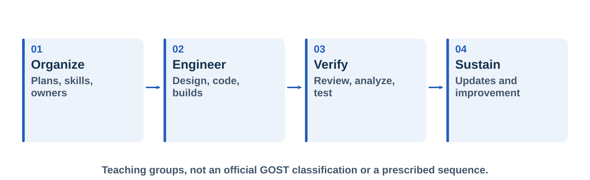

*An author's teaching guide to the connections between the 25 processes.*

Speech:
The standard gives us the structure of the series: twenty-five processes, and twenty-five core episodes. Episode one follows section five point one. Episode twenty-five follows section five point twenty-five.

The four groups on this slide are my teaching guide. They are not additional categories defined by the standard. They help us see how four things connect: planning, engineering, verification, and continued support.

Here's an example. A static analysis result is useful only when we know three things. What code was analysed. Who reviews the findings. And how a correction reaches a release. A dependency list is the same. It is useful only when somebody keeps it current and acts on the changes that matter.

We'll keep coming back to those connections. Some episodes will include a guest who can explain one practice from direct experience. Every core episode will still have its own practical result.

You can follow the whole series. Or pick an episode that matches a problem you have now. Today we set up the vocabulary and a planning example that later episodes can extend.
Cue: Показать четыре группы. Уточнение «my teaching guide» важно: это не новая классификация ГОСТ. Визуальная опора: Four connected teaching groups: Organize, Engineer, Verify and Sustain. These are the author's guide to the series, not categories defined by GOST.

## 04 | Friday's release is blocked
Seconds: 120
Section: The engineering problem
Layout: cards
Visual: slide-04
Lead: Illustrative case · a C++ engineering-file importer
Items:
- A warning | A parser issue appears just before release
- A gap | Nobody agreed who investigates it
- A decision | The release owner lacks reliable evidence
Sources: EX
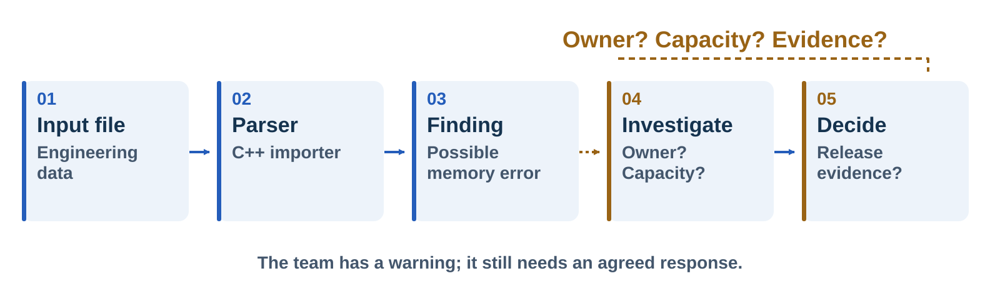

*Illustrative case: a finding is useful only when the team can act on it.*

Speech:
Let's start with a small team. The team is fictional. It develops a C++ tool that imports engineering files. The product also has a small service API. It uses third-party components and ships regular updates.

On Friday afternoon, an analysis tool reports a possible memory error in the file parser. The developer says the finding needs investigation. The security specialist asks if the affected parser is part of the release. The release owner asks if there is time to fix it.

Look at the break between the finding and the investigation. The tool produced information. But the team has not agreed how to use it. The scope is not clear. Nobody set aside time to investigate. And nobody wrote down how the decision is made.

We cannot solve all of that by buying another tool. We need people who understand their responsibilities. We need suitable tools. We need a way of working we can repeat. And we need evidence that connects those elements to the actual product version.

An organization may already use an analyzer, and still need to check what it covers, how it is set up, and what happens after a finding. Before proposing another purchase, find out what the team already does and where the actual gap is.

Keep this team in mind. At the end of the episode, we'll return to Friday's release with a more useful set of questions.
Cue: История вымышленная. Не говорить, что это конкретный проект заказчика или реальный инцидент. Визуальная опора: A file reaches the C++ parser, analysis produces a finding, and the path toward investigation and a release decision is interrupted by unclear ownership and capacity.

## 05 | Three documents before the methodologies
Seconds: 135
Section: Foundations
Layout: timeline
Lead: Trusted-systems research predates the vendor methodologies by decades
Items:
- 1970 | Ware report · Security Controls for Computer Systems · RAND R-609
- 1972 | Anderson · Computer Security Technology Planning Study · ESD-TR-73-51
- 1975 | Saltzer and Schroeder · eight design principles · Proceedings of the IEEE
- The pattern | Government and academic reports, not vendor programmes
Sources: WARE, AND72, SS75
Speech:
Our subject is older than the two thousands. Its roots are in government and academic work on trusted systems.

A Defense Science Board task force worked on computer security. Willis Ware chaired it. It finished its report on the eleventh of February, nineteen seventy. The title is Security Controls for Computer Systems. RAND published it, and it was classified confidential. The Defense Advanced Research Projects Agency declassified it on the tenth of October, nineteen seventy-five. RAND then reissued the report for wider distribution.

The covering memo makes a careful claim. It calls this the first attempt to codify the principles and details of the problem.

In October nineteen seventy-two, James Anderson wrote the Computer Security Technology Planning Study. He wrote it for the United States Air Force. The report number is on the slide. It introduced the reference monitor. Anderson names three requirements for the mechanism that implements it. It must be tamper proof. It must always be invoked. And it must be small enough to analyse and test.

Then came Saltzer and Schroeder. In September nineteen seventy-five they published The Protection of Information in Computer Systems. It appeared in Proceedings of the IEEE. The paper lists eight design principles. Least privilege and fail-safe defaults are two of them. We still apply them today.

Look at what these three documents are. They are research and defence reports about building systems you can trust. They are not vendor methodologies.
Cue: Произношение: Ware — Уэр, Anderson — Андерсон, Saltzer — Солтцер, Schroeder — Шрёдер. Первоисточники: титул скана даёт «11 FEBRUARY 1970», уведомление — «it is classified CONFIDENTIAL overall», подпись меморандума — Willis H. Ware, Chairman. Предисловие RAND: рассекречивание DARPA 10.10.1975 и переиздание «for wider distribution». ВАЖНО про номер: на слайде R-609 — каноническая ссылка на отчёт 1970 года («was subsequently published as Rand Report R-609»); R-609-1 — переиздание 1979 года, оно уже описано в примечании к источнику WARE. На самом скане R-номера нет нигде — отсутствие номера не повод «вернуть» R-609-1. У Андерсона ловушка: обложка датирована октябрём 1972, а номер ESD-TR-73-51 выглядит как 1973; номер только на слайде, вслух не читать. Три требования (раздел 3.2.2, с.9–10) относятся к reference validation mechanism, сноска 3: «that combination of hardware and software which implements the reference monitor concept» — поэтому вслух «the mechanism that implements it», а не «требования к reference monitor». У Солтцера и Шрёдера дословно «Here are eight examples of design principles that apply particularly to protection mechanisms»; дальше в статье ещё два с оговоркой «apply only imperfectly» — говорим ровно «eight», не «ten». Мировое первенство от своего лица не утверждаем: только формулировка сопроводительного меморандума и описательный вывод в конце слайда.
## 06 | From evaluating systems to building them
Seconds: 140
Section: Foundations
Layout: cards
Lead: The assurance question moves from the finished product to the work behind it
Items:
- 1983 and 1985 | TCSEC, the Orange Book · CSC-STD-001-83, then DoD 5200.28-STD
- 1996 | Common Criteria version 1.0 · first ISO/IEC 15408 edition in 1999
- 2002 | Microsoft launches Trustworthy Computing
- 2004 | SDL integral at Microsoft · the review's selection window opens
Sources: TCSEC, CC21, MSH, MLR
Speech:
The next stage is about evaluation. How do we judge whether a system deserves trust?

The United States answered with the Trusted Computer System Evaluation Criteria. People call it the Orange Book. The first version is dated the fifteenth of August, nineteen eighty-three. The better known version is the Department of Defense standard. Its date is the twenty-sixth of December, nineteen eighty-five. It replaced the nineteen eighty-three version. Both document numbers are on the slide.

Then the work became international. Canadian, European and American criteria were brought together in the Common Criteria project. Version one point zero was completed in January nineteen ninety-six. ISO approved it in April that year for distribution as a committee draft. The first ISO edition, ISO slash IEC fifteen thousand four hundred eight, followed in nineteen ninety-nine.

Notice what these documents do. They evaluate a product, and they also ask for evidence about how it was built.

In January two thousand two, Microsoft launched its Trustworthy Computing initiative. In two thousand four, the SDL became an integral part of development at Microsoft.

That is where our next slide starts. It uses a twenty twenty-three review. The review gives two dates. The first systematic studies of how to build secure software appeared in two thousand one. From two thousand four onward, organizations began putting security processes into the lifecycle. So two thousand four opens the review's selection window. It does not open the subject.
Cue: Обозначения 5200.28-STD и CSC-STD-001-83 только на слайде; вслух — «первая версия 1983 года» и «стандарт Министерства обороны 1985 года». Проверено по самому документу: «Supersedes CSC-STD-001-83, dtd 15 Aug 83» и «December 26, 1985». Издающий орган версии 1983 не называем и «промежуточной» её не называем — не проверено. Common Criteria: январь 1996 и одобрение ISO в апреле 1996 — Annex A.2, пункт 185 части 1 версии 2.1 (август 1999); июнь 1993 (старт CC Project) — пункт 184; более ранние национальные критерии — пункты 181–183 в Annex A.1. Предисловие той же части подтверждает «aligns it with International Standard ISO/IEC 15408:1999» и «CC 2.0 was issued in May, 1998» — версию 2.0 вслух сознательно не даём, слайд и так плотный. ВНИМАНИЕ: страница истории на портале Common Criteria пишет «version 1.0 was issued in 1994» — это расходится с самим документом критериев; слайд не «исправлять». Тезис «they also ask for evidence about how it was built» опирается на разделы Life-Cycle Assurance в TCSEC и на пункт 131 CC («constraints on the rigour of the development process»); при этом пункт 105 прямо говорит, что CC не предписывает методологию разработки, — поэтому вслух только «ask for evidence about», никогда «prescribe how to build». Microsoft: на странице SDL именно «launched its Trustworthy Computing initiative» и «integral part … in 2004» — не говорить «memo» и не говорить «mandatory». Даты 2001 и 2004 — собственная рамка отбора обзора (с.1), а не дата рождения дисциплины.
## 07 | A landscape of secure development methods
Seconds: 105
Section: The methodology landscape
Layout: timeline
Visual: slide-05
Lead: Selected publication / edition dates in a 28-methodology review
Items:
- 2004 | Lifecycle research · Jones and Rastogi
- 2006 | SDL · Touchpoints · CLASP
- 2012 | Microsoft SDL guidance v5.2 / SDL-Agile
- 2017 | Singapore Security-by-Design framework
- 2020 | OWASP SAMM v2.0
- 2022 | NIST SSDF v1.1
Sources: MLR, MSH, SAMM20, N11
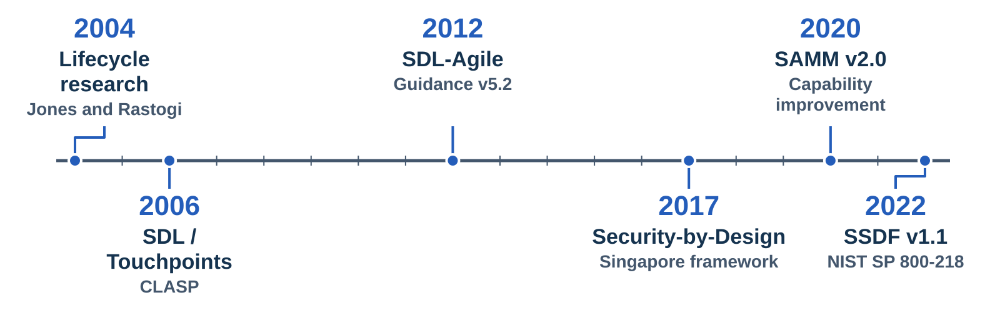

*Selected publications and editions from the methodology landscape; the review covers 28 approaches.*

Speech:
The history of secure development has several parallel approaches. One useful map is the twenty twenty-three review by Arina Kudriavtseva and Olga Gadyatskaya. It examines twenty-eight methodologies. It uses publications from two thousand four to twenty twenty-two. They come from industry, government, and academic research.

Follow the timeline from left to right. We selected six milestones for this slide: publications and editions. First comes early lifecycle research. Then come the SDL, Touchpoints, and CLASP publications. Later examples include guidance for agile development, Singapore's Security-by-Design framework, version two of OWASP SAMM, and NIST's SSDF, version one point one.

These are the dates of the publications or editions we are discussing. They are not all dates when the underlying ideas first appeared. Take Microsoft. It made SDL integral to its development process in two thousand four. But the SDL book discussed in the review appeared in two thousand six.

So the picture is a landscape. It shows different ways to organize secure development. We should examine what each approach contributes. We should not assume that the newest publication replaces every earlier idea.
Cue: Все годы на шкале — выбранные публикации/редакции. В локальном PDF Figure 2 и Table II имеют расхождения; наша шкала собрана по Table II с явными подписями. Не переносить рисунок целиком. Визуальная опора: Selected publication and edition milestones: lifecycle research in 2004; SDL, Touchpoints and CLASP publications in 2006; SDL-Agile guidance v5.2 in 2012; Singapore Security-by-Design in 2017; SAMM v2.0 in 2020; SSDF v1.1 in 2022.

## 08 | Different ways to organize the work
Seconds: 95
Section: The methodology landscape
Layout: cards
Lead: What the reviewed approaches emphasize
Items:
- Microsoft SDL | A coordinated engineering programme
- Touchpoints | Risk management, architecture and code review
- CLASP | Activities connected to roles
- SDL-Agile | One-time · every-sprint · bucket activities
Sources: MLR
Speech:
The review helps us look past the names. Each approach gives a team a different way to organize its security work.

Microsoft SDL joins engineering practices with management support and training. Touchpoints, from Gary McGraw, focuses on risk management. That includes architecture analysis and code review. CLASP connects activities to roles. The agile SDL guidance sorts activities into three kinds: done once, repeated in every sprint, or placed in a bucket, a group that comes back on a regular cycle.

That last idea is practical. A team needs a reasoned schedule for security work. Repeating every activity in every sprint is not automatically the best design.

The review also looks at maturity approaches. SAMM helps an organization plan how its capability grows. BSIMM describes practices observed in organizations. Those purposes are different from telling a developer the next task to build.

For our importer team, the shared questions are familiar. Which activity do we need? Who does it? And when? Each approach answers at its own level. We still have to work out what each activity means for our real product and team.
Cue: Это характеристика рассмотренных в обзоре редакций, не исчерпывающее описание современных frameworks. Bucket объяснить как группу периодических работ; не как произвольное пропускание проверок.

## 09 | Before the standard: a practical problem
Seconds: 95
Section: The origins of GOST R 56939
Layout: cards
Lead: The practical problem behind the national standard
Items:
- Around 2009 | Discussions with colleagues and regulators
- The engineering gap | Product assessment also needs confidence in development work
- The intended result | A common reference usable by different development teams
Sources: TRANS, GOSTH
Speech:
Why did Russia develop a national standard for secure software development? According to Vitaliy Varenitsa, who took part in that work, talks with colleagues and regulators began around two thousand nine. The practical concern was this. Assessing a finished product did not, by itself, explain how security work was organized all the way through development.

The proposed standard would make that work more visible. Developers needed one shared reference. It would name the activities, who is responsible, and what evidence supports a claim that the activities were done.

It was meant to be useful beyond the in-house development method of one large software vendor. Other organizations, including smaller teams, should be able to understand the expectations. Each team should then be able to adapt its implementation to its own products.

These early talks came before any formal drafting. The national standard would be approved several years later.

For our series, the useful question is the problem the authors were trying to solve. How do we turn good security intentions into work that other people can understand and check?
Cue: TRANS 00:08:01–00:14:32. Около 2009 — воспоминание участника, не дата утверждённого документа. Не объявлять отсутствие требований во всём мире.

## 10 | The route from research to publication
Seconds: 105
Section: The origins of GOST R 56939
Layout: timeline
Visual: slide-08
Lead: Research start, working drafts, approval and effective date are distinct events
Items:
- 2013 | April: research project starts · August: first draft
- 2014–2015 | Draft review and revision
- 2016 | Approved 1 June · Rosstandart order 458-st
- 2017 | Effective from 1 June
Sources: TRANS, GOSTH, G16

*From research to an effective standard: different events, different dates.*

Speech:
Varenitsa dates the start of the research project to April twenty thirteen. It began after the first discussions, once the author team was formed.

The history presentation puts the first draft in August twenty thirteen. More drafts and revisions followed in twenty fourteen and twenty fifteen. It describes a discussion with twenty-two organizations, and around two hundred comments and proposals.

Those numbers describe the consultation reported in the history presentation. They do not mean that twenty-two organizations are named as developers in the final standard.

Rosstandart approved GOST R five six nine three nine, edition twenty sixteen, on the first of June twenty sixteen. The approval came under order four five eight, s t. It became effective on the first of June twenty seventeen.

Keep the four events separate. Research began. Drafts were discussed. The standard was approved. And the standard became effective. The year in a standard's name does not replace that order of events.

This also helps us read later revisions. A working draft can hold valuable ideas without being an adopted edition of the national standard.
Cue: TRANS 00:17:33–00:20:19; PDF истории с.4; предисловие ГОСТ 2016 и карточка Росстандарта. В речи не повторять «принят Минюстом» и ошибочный май 2016. Визуальная опора: GOST development milestones: research began in April 2013 and a first draft followed in August; review and revision continued in 2014–2015; Rosstandart approved the standard on 1 June 2016; it became effective on 1 June 2017. Project milestones come from Varenitsa's historical account, while the final two dates are formal publication facts.

## 11 | Who wrote it, and who was it for?
Seconds: 140
Section: The origins of GOST R 56939
Layout: cards
Lead: Formal authorship, consultation and intended users play different roles
Items:
- 2016 development | NPO Echelon · submitted by Technical Committee 362
- 2024 development | FSTEC of Russia with nine organisations, including Kaspersky, ISP RAS and Positive Technologies · again submitted by Technical Committee 362
- Consultation | Other organizations reviewed and commented on drafts
- Primary users | Developers, architects, security specialists and team leaders
- Additional users | Independent assessors reviewing implementation evidence
Sources: G16, G24, TRANS
Speech:
The foreword of the twenty sixteen edition names NPO Echelon as the developer. Technical Committee three six two is named as the submitting committee.

The twenty twenty-four edition has a different foreword. It names the Federal Service for Technical and Export Control, FSTEC, together with nine organizations. Among them are Kaspersky, the Institute for System Programming of the Russian Academy of Sciences, Positive Technologies and NPO Echelon. Technical Committee three six two submitted it again. That change is worth a moment. One developer in twenty sixteen. The regulator and a group of product companies in twenty twenty-four.

Varenitsa describes a small author group that prepared the main text. Other organizations reviewed the drafts and raised comments. Writing the document and taking part in its consultation were distinct contributions.

He also stresses the intended audience. The standard was primarily for the people who develop software: architects, programmers, security specialists, and the people who organize their work. Independent assessors were a second audience, because they needed to judge how those practices were put in place.

That's a useful tension in the design. The material has to guide engineering work. It also has to make those results clear to a reviewer outside the team.

Think of our importer example. A procedure should help the developer look into a finding. It should also help a reviewer understand what happened. A document written only to satisfy a filing rule misses much of that practical purpose.

The standard, a team's implementation, and a particular certification scheme are three different things. We should first be clear about the actual assessment context. Then we can discuss which form of confirmation is required.
Cue: TRANS 00:19:00–00:24:25, 01:14:03–01:17:27. Формальное авторство — предисловия обеих редакций: 2016 — НПО «Эшелон», 2024 — ФСТЭК России и девять организаций (с.2 стандарта). Не превращать целевую аудиторию в обещание универсальной сертификационной процедуры.

## 12 | A wider plan than one published document
Seconds: 95
Section: The origins of GOST R 56939
Layout: compare
Lead: The original ambition and the published record answer different questions
Items:
- Original ambition | A family of documents covering several perspectives on development
- Published baseline | GOST R 56939-2016, followed by GOST R 56939-2024
- Working material | Recalled drafts and revisions do not establish adopted editions
Sources: TRANS, G16, G24
Speech:
The original idea went further than a single document.

Varenitsa recalls talks about a family of standards. Together they would cover secure development from several angles, and across the software lifecycle. The number of those documents, and the way they were arranged, changed during discussion. The twenty sixteen standard was the first published result of that wider idea.

The same difference applies to versions. Varenitsa recalls working material from twenty eighteen, twenty nineteen, twenty twenty, and twenty twenty-two. These were steps in ongoing revision work. They were not published national standards with those edition years.

The two adopted editions for this episode are twenty sixteen and twenty twenty-four. For each one, we can point to a final text and an official approval record.

For a development team, here's the practical difference. An adopted requirement is one thing. A proposal that may still change is another. An implementation plan needs to say which published edition it follows.
Cue: TRANS 00:09:41–00:11:06, 00:18:19–00:20:19, 00:29:25. Не называть внутренние версии 2018/2019/2020/2022 опубликованными редакциями ГОСТ.

## 13 | GOST in the international context
Seconds: 125
Section: The origins of GOST R 56939
Layout: compare
Visual: slide-11
Lead: Earlier international work informed the context; chronology limits ancestry claims
Items:
- Design context | Common Criteria · ISO/IEC 27034 · lifecycle standards
- GOST R 56939 | Approved in 2016
- NIST SSDF | Public draft 2019 · final 1.0 in 2020 · final 1.1 in 2022
Sources: TRANS, GOSTH, G16, N19, N20, N11
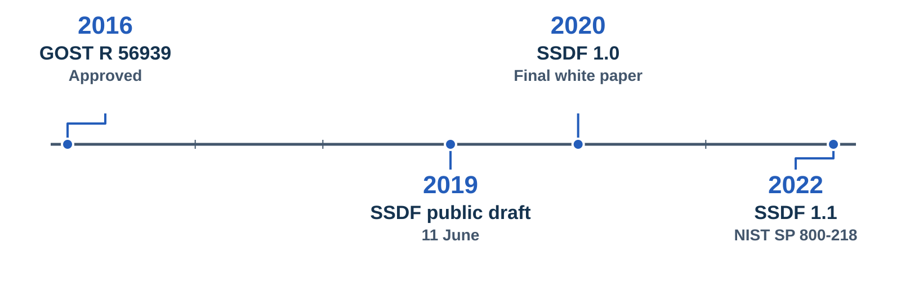

*Chronology helps test an ancestry claim; similarity alone cannot establish one.*

Speech:
A national standard can be original and still use international engineering knowledge. These are compatible ideas.

Its design context included Common Criteria, information security management, and software lifecycle standards. The intended result was one common reference, usable by different development organizations.

The twenty sixteen standard itself points to other documents. It links its use to ISO slash IEC twenty-seven thousand thirty-four and to Common Criteria assurance components. It also has an informative appendix with a related mapping.

That does not prove that every practice was new. We have already seen earlier work on secure development. To show a specific borrowing, or a specific difference, we have to compare the relevant documents.

The NIST Secure Software Development Framework gives us a useful check on dates. Its public draft was announced in June twenty nineteen. Final version one point zero came in April twenty twenty. Final version one point one came in February twenty twenty-two.

So the twenty sixteen GOST cannot have been based on those later SSDF publications. At the same time, being earlier than SSDF does not prove that GOST was the first secure development approach in the world. And similarity does not prove influence in the other direction.

Our comparison asks a more useful question. Which engineering concerns are shared? How are obligations organized? And what evidence does each approach expect? That is something we can study process by process.
Cue: TRANS 00:10:19–00:14:32; PDF истории с.3/22. NIST: 11.06.2019 draft, 23.04.2020 final1.0, 03.02.2022 final1.1. Не повторять ошибку пересказа «ГОСТ основан на SSDF» и неподтверждённое мировое первенство. Визуальная опора: On a common time axis, GOST R 56939 was approved in 2016; the first public SSDF draft appeared in 2019, final SSDF 1.0 in 2020, and final SSDF 1.1 in 2022. The timeline does not assert ancestry between the documents.

## 14 | Two editions, different structures
Seconds: 105
Section: From the 2016 edition to 2024
Layout: cards
Visual: slide-12
Lead: The same source term has different normative force
Items:
- 2016 edition | Nine groups of measures · clauses 5.1–5.9
- 2024 edition | Twenty-five named processes · clauses 5.1–5.25
- A wording change | The same term: recommendation in 2016 · requirement in 2024
- Migration | Map obligations and evidence; preserve practices that work
Sources: G16, G24

*These labels compare the normative force of one term in the original text.*

Speech:
The two editions organize related engineering work in different ways.

Section five of the twenty sixteen standard has nine groups of measures. Section five of the twenty twenty-four edition has twenty-five named processes. These are different units of organization. Subtracting one number from the other does not tell us how many genuinely new practices appeared, or how much safer a product became.

There's also a concrete change in wording. Look at the Russian verb sleduet. The closest English word is should. Under clause four point two of the twenty sixteen edition, it had recommendation status. Under clause four point seven of the twenty twenty-four edition, the same verb expresses a requirement. Suppose you read an English translation and treat should as advice. Then you will do less than the current edition requires. These labels describe the force of that specific term. An English translation must preserve the force assigned by the relevant edition.

That's why it is risky to reuse an old checklist without reading the new edition. Familiar words can carry different force.

The twenty twenty-four edition was approved on the twenty-fourth of October, by order one five zero four, s t. It became effective on the twentieth of December of the same year. Moving to it needs a gap analysis. Which obligations and evidence are already covered? Which ones need adjustment? And which ones need new work? Practices that already work well are a starting point for that analysis.
Cue: Оглавление и п.4.2 ГОСТ2016; оглавление и п.4.7 ГОСТ2024. В записи «14 мер» не совпадает с девятью группами финального оглавления. 2024: утверждён24.10, действует20.12. Английский перевод модальности пояснить по конкретной редакции. Визуальная опора: The 2016 edition has nine groups of measures; clause 4.2 assigns recommendation status to a term that expresses a requirement under clause 4.7 of the 2024 edition. The 2024 edition has 25 named processes. Structural counts do not measure a change in security.

## 15 | A process continues after the first tool run
Seconds: 100
Section: From the 2016 edition to 2024
Layout: steps
Visual: slide-13
Lead: Triggers, ownership, evidence and feedback make work repeatable
Items:
- Trigger | What event starts the work?
- Ownership | Who performs it and who reviews the result?
- Evidence | Which version, findings and decisions are recorded?
- Feedback | What changes before the next cycle?
Sources: G24, EX
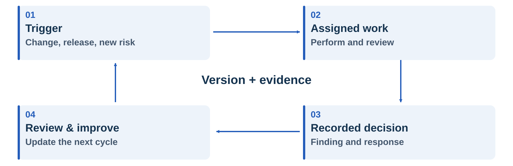

*A teaching model of repeatable work: actions, decisions and feedback remain connected.*

Speech:
A process needs more than a new heading. It organizes work that continues over time. It needs clear responsibilities, repeatable actions, and results that inform the next cycle.

Here's a memorable example. A team buys an analysis tool for a short time, just before a release. That may produce a report. It does not automatically establish a maintained process for examining changes, reviewing findings, fixing problems, and checking the result again.

Let's follow the loop for our importer team. A relevant code change triggers the analysis. A named engineer runs the check and reviews the findings. The team records a decision. Then the team reviews what should change before the next cycle. At the centre, the evidence connects the finding and the decision to the product version.

Trigger, ownership, evidence, and feedback give us a practical way to examine a process. The twenty sixteen edition already addressed lifecycle work, internal checks, and improvement.

The practical lesson is simple. A tool becomes useful inside an organized way of working. Planning gives the team the time, people, and agreements to keep that work going.
Cue: TRANS 00:49:47–00:51:26 и 01:25:22–01:27:08: позиции собеседников различаются. Четыре вопроса — авторский учебный приём; не приписывать 2016 отсутствие регулярных практик. Визуальная опора: A repeating process connects a trigger, assigned work, a recorded decision and review. Product version and evidence remain at the centre of the cycle.

## 16 | When this standard actually binds
Seconds: 140
Section: Legal force
Layout: cards
Lead: A national standard applies voluntarily until another document points at it
Items:
- Default | Applied voluntarily · the foreword names article 26 of Federal Law 162-FZ of 2015 as the rules of application
- Clause 4.14 | Regulatory acts, national and industry standards, technical specifications for research and development work, and other documents define which processes apply
- In practice | A regulator's order, a customer contract, a certification scheme, or a company's own decision
- Once it binds | Every requirement applies · except those that use the words recommended or may
- Clause 4.15 | Research and development work · only an explicit list of processes in the technical specification imposes the standard · partial lists allowed
Sources: G24, NS162
Speech:
People often ask me one question. Is this standard the law?

No. In Russia a national standard is applied voluntarily, unless the law says otherwise. The foreword of this edition points to the rules of application. They live in article twenty-six of Federal Law one six two, f z, of twenty fifteen. The standard does not make itself binding.

Clause four point fourteen tells us what makes it binding. Here is my working translation. The set of processes a developer must implement is determined by the requirements of regulatory legal acts, national and industry standards, technical specifications for research and development work, and other documents.

So something else has to point at the standard. In practice that is an order from a regulator, a customer contract, a certification scheme, or a company's own decision. The law adds one more trigger. A public claim of conformity binds you too.

The same clause adds one sharp detail. Once a document says you must conform, all the requirements apply. The only exceptions are requirements that use the words recommended or may.

Clause four point fifteen adds a special rule for research and development work. There the standard can bind only through an explicit list of processes in the technical specification. And that list may be partial.

One more point. FSTEC co-developed this edition. That is authorship, not law. A regulator writing a standard does not turn it into a legal duty.

So the useful question is not: is GOST mandatory? The useful question is: what in my situation points at it? Read that way, it is a best-practice baseline. Teams elsewhere use ISO or NIST documents the same way.
Cue: П.4.14 и 4.15 ГОСТ Р 56939-2024, предисловие (правила применения — ст.26 ФЗ-162 от 29.06.2015; ч.1 — добровольность «если иное не установлено законодательством», ч.3 — публичное заявление о соответствии). ФСТЭК — соразработчик редакции 2024, не законодатель: не говорить, что ФСТЭК делает стандарт обязательным. Только механизм, без оценок российского регулирования. Пауза после вопроса «Is this standard the law?», затем твёрдое «No». Номер закона читать медленно.
## 17 | Shared practices need evidence
Seconds: 90
Section: Our comparison method
Layout: compare
Lead: Findings and limits of the multivocal literature review
Items:
- Shared practices | Similar engineering work, organized in different ways
- Organizational work | Risk, culture, people, policy and communication matter
- Effectiveness evidence | Limited and uneven validation of complete methodologies
Sources: MLR, N11, N12
Speech:
What can we conclude from the literature review? It finds substantial overlap in practices. It also finds organizational concerns, such as risk management, culture, policies, and communication.

The review distinguishes three kinds of work. Work at the level of the organization. Work across the lifecycle. And activities linked to a project stage. So a security programme is more than a list of tools.

Evidence about complete methodologies is limited and uneven. That does not show that secure development fails. It means we have to examine the evaluation method, the context, and the result being measured.

The review selected accessible English-language material. Its omission of GOST cannot establish that the Russian standard is unique.

An expert's experience can reveal useful questions. A broader conclusion still needs evidence about the context, the method, and the result.

We'll compare specific practices and evidence, using named versions. Our NIST baseline is final SSDF one point one. As of September twenty twenty-six, version one point two is still a draft. Let's make the comparison method explicit.
Cue: Результат обзора не равен доказательству причинного снижения уязвимостей. Не говорить «доказательств вообще нет» и не интерпретировать авторскую разметку Waterfall/Agile как статистику отрасли.

## 18 | Compare obligations, not labels
Seconds: 110
Section: Our comparison method
Layout: steps
Visual: slide-15
Lead: Similar goals can still imply different work
Items:
- Read | Actor · action · scope · conditions
- Compare | Shared intent and concrete differences
- Demonstrate | One implementation example with evidence
- Conclude | Partial overlap is a useful result
Sources: G24, N11
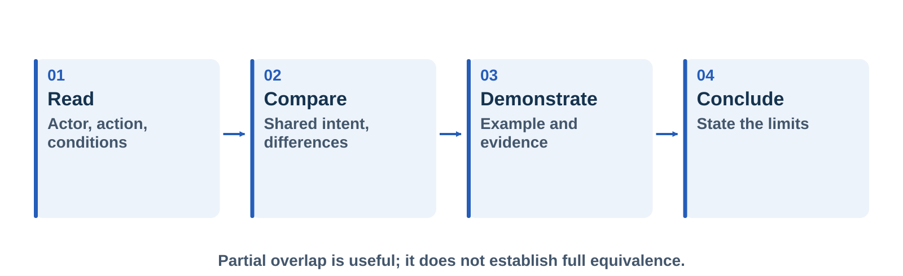

*Compare what the documents ask people to do and what would demonstrate the result.*

Speech:
Here's the method we will use. First, we take one specific requirement or practice. We record who acts, what they do, the scope, and any conditions. Second, we compare the actual work and the expected result.

We also keep the force of the original wording. Clause four point seven of the twenty twenty-four GOST defines which wording expresses a required condition. When we translate such a condition, we must convey a requirement rather than turn it into an optional recommendation. On the international side, we ask what we are reading. Is it framework guidance, a requirement, or an example of implementation? Similar wording does not automatically give two documents the same authority.

Third, we demonstrate one concrete implementation. We also name the records that would let another person verify the result.

Finally, our conclusion may be substantial overlap, partial overlap, or a complementary practice. If we have not found a counterpart, we will state which sources we reviewed.

This lets us study the main question of this series without deciding the answer in advance. A useful comparison can show shared engineering ideas. And it can still show important differences in scope, detail, and expected evidence.
Cue: Русские термины объяснить, не превращать в упражнение для зрителя. Слайд даёт метод, не формальную сертификационную оценку. Визуальная опора: The comparison method proceeds from reading actors, actions and conditions, to examining differences, demonstrating an implementation, and stating a bounded conclusion.

## 19 | What process 5.1 asks for
Seconds: 145
Section: Planning secure development
Layout: steps
Visual: slide-16
Lead: Five requirements that connect the present to the next action
Items:
- 5.1.2.1 | Periodically analyse the current state
- 5.1.2.2 | Periodically analyse resource needs
- 5.1.2.3 | Develop a process improvement plan
- 5.1.2.4 | Develop a process implementation plan
- 5.1.2.5 | Define the scope of the processes
Sources: G24
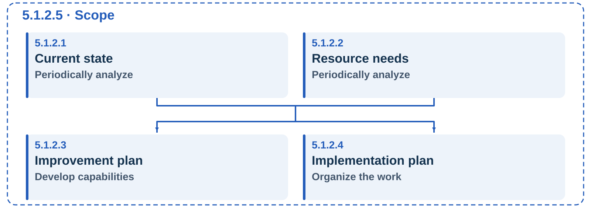

*Five planning requirements connected by their information dependencies.*

Speech:
Now we can read the first process directly. Section five point one is about planning secure software development processes.

It has five requirements. Periodically analyse the current state of the processes. Periodically analyse resource needs. Develop a plan for improving the processes. Develop a plan for implementing them. And define their scope.

The two plans must take the analyses into account. That connection matters. A plan can look good on paper. But if it ignores what the team does today, or what resources the team has, it may be impossible to carry out.

I use process improvement plan as a working English label for the plan of process development. In a moment we'll see how it differs from the implementation plan.

For our small team, the first step is to describe what already happens and what does not. Then we find the biggest gaps. We estimate the capacity needed to close them. And we assign work the team can really do.

The standard requires periodic analysis, but it does not give us a universal ninety-day schedule. The schedule later in this episode is an illustrative choice for our example.

One caution before we build the plan. The standard also carries an informative appendix A, initialisation of secure development processes. It repeats almost the same steps for a team that is only starting these processes. Analyse the current state. Analyse the resources needed. Write the result down as a plan. Its artifacts are almost word for word the same as the ones in five point one. The difference is status. Under clause four point sixteen, assessment of the appendix A processes is not mandatory during an external audit. Clause five point one is a full process, and it is assessed. So if you are deciding which of these two very similar texts to implement, that difference is what settles it.
Cue: Все пять требований на экране. Не объявлять квартал обязательной частотой ГОСТ. Приложение А (справочное) — п.4.16: оценка не обязательна при внешнем аудите, в отличие от 5.1. Визуальная опора: Within the defined scope, current-state analysis and resource analysis support both the process improvement plan and the process implementation plan. The five nodes carry clauses 5.1.2.1 through 5.1.2.5.

## 20 | Start with a defensible scope
Seconds: 100
Section: Planning secure development
Layout: table
Visual: slide-17
Lead: Name the software and explain the boundary
Items:
- Included | Importer 2.0 · parser module · service API · shipped libraries
- Connected context | Repository, CI configuration and release workflow
- Boundary to justify | Retired prototype with no code or dependency path into release
- Evidence | Versioned scope record with the selection rationale
Sources: G24, EX

*Illustrative scope: record what is included, what is connected and why an exclusion is justified.*

Speech:
What exactly does the plan cover? In our example, the scope includes version two point zero of the importer, its parser module, the small service API, and the libraries that ship with it.

The repository, the integration configuration, and the release workflow form relevant development context. We record links to them, so the plan connects to actual work.

Suppose the team also has an old prototype. It may sit outside the chosen scope. But the team needs a reason. If code or a dependency from that prototype goes into the release, the boundary needs another look.

The standard's scope artifact lists the parts the software is made of. That means versions, modules, components and functional subsystems. It also gives the reason for that selection. If we name a product but do not name its relevant parts, we leave room for misunderstanding.

This is not permission to declare inconvenient components irrelevant. The rationale must make sense for the product and for the obligations that apply to it. In a teaching example, we can keep the scope small. For a real implementation, the team needs to look at the actual relationships. And it needs to keep the boundary up to date as the product changes.
Cue: «Connected context» не смешивать с буквальным составом ПО из 5.1.3.5. Это полезные связанные записи примера. Визуальная опора: Importer 2.0 contains the parser, service API and shipped libraries. Repository, CI configuration and release workflow form connected development context. Excluding a retired prototype requires evidence that it has no code or dependency path into the release.

## 21 | Assess reality and assign owners
Seconds: 95
Section: Planning secure development
Layout: cards
Lead: Illustrative findings, with people who can act
Items:
- Engineering lead | Parser checks run manually; coverage is unclear
- AppSec lead | Review findings and agree investigation criteria
- Release owner | Record release decisions under the team's policy
- Sponsor | Resolve capacity and priority conflicts
Sources: G24, EX
Speech:
Let's start with three questions. What already works? What needs improvement? What is missing? Introducing a standard does not mean rebuilding everything from zero.

The current-state record lists which processes are in place and which are not. It assesses the existing processes against this standard, against other standards that apply, and against the team's tools and technologies.

In our example, parser checks run by hand. Coverage is unclear. The decision history is incomplete. These are fictional findings.

Now we assign responsibilities. The engineering lead owns integration. The AppSec lead helps define investigation criteria and review security evidence. The release owner records decisions under the team's policy. A sponsor resolves conflicts about capacity and priority.

One person may hold several roles. Even then, it must stay clear who is responsible and who decides.

This allocation is our implementation example. The standard's implementation-plan artifact must identify the employees responsible for implementing the processes. It does not automatically give AppSec an independent power to block every release. The organization must define that authority. And it must make the link between investigation, review, and the release decision clear.
Cue: Отличать ответственного за действие от того, кто уполномочен принимать остаточный риск.

## 22 | Resources include human attention
Seconds: 95
Section: Planning secure development
Layout: cards
Visual: slide-19
Lead: Illustrative 90-day estimate · validate it with the team
Items:
- Engineering | 60 person-hours
- AppSec | 24 person-hours
- Release and sponsor | 12 person-hours
- Total | 96 person-hours · tools and infrastructure assessed separately
Sources: G24, EX
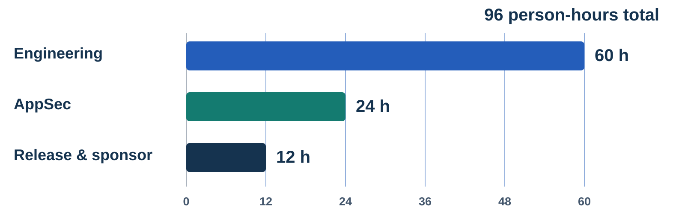

*Illustrative total effort for the 90-day plan; validate the estimates with the people doing the work.*

Speech:
Resource planning includes time. Time to set up the checks. Time to investigate findings. Time to keep the workflow running. And time to teach people how to use it.

Here's our ninety-day effort. It's fictional. We reserve sixty engineering hours, twenty-four AppSec hours, and twelve hours for release coordination and sponsor decisions. The total is ninety-six person-hours.

These figures are a teaching example. They are not a benchmark. They are not a percentage required by GOST. No universal percentage can replace an estimate of the actual work.

Tools, infrastructure, and the cost of extra training need their own assessment. Dependencies matter too. If the build engineer is not available during the first month, the schedule must show that. Assigning a task does not create capacity.

The standard's resource-analysis record may include an estimate of the material and human resources the work will need. The chart makes those assumptions open to discussion. Ask the people doing the work if the estimate is realistic. Show it to the people who set priorities. Agree when to update it. Human attention is part of the resource plan.
Cue: Сделать паузу на сумме 96. Часы для всего учебного плана, не недельная нагрузка. Визуальная опора: An illustrative 90-day effort allocates 60 person-hours to engineering, 24 to AppSec, and 12 to release coordination and sponsor decisions, for a total of 96 person-hours. Tools and infrastructure are assessed separately.

## 23 | Two plans, two questions
Seconds: 100
Section: Planning secure development
Layout: compare
Visual: slide-20
Lead: A roadmap and an execution plan can be linked in one tracker
Items:
- Improvement plan | What capability changes, in what order, with which resources?
- Implementation plan | What work happens, by whom, at which stage, and by when?
- Shared foundation | Current-state analysis and resource analysis
Sources: G24, EX
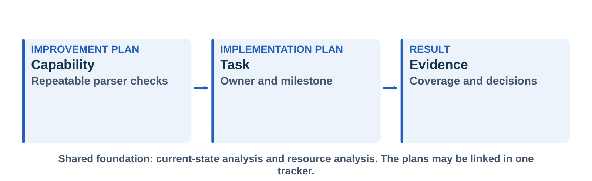

*Connect the capability in the improvement plan to executable work and its evidence.*

Speech:
Planning gives everyone a shared language: the team, its managers, and the people who ask for the product. Two related plans help them agree on the direction and the work.

The improvement plan describes how processes will develop. It sets priorities and the order of changes. It takes available resources into account. Our team might make parser analysis repeatable, improve the handling of findings, and then review the results.

The implementation plan identifies goals, stages, dates, resources, and responsible people. In the middle of the diagram, one task names the parser target, the integration milestone and the owner. On the right, the evidence records coverage and the review of findings.

The standard allows these plans to be represented in a task management system. A roadmap with linked tasks can keep their different purposes clear, and avoid documents that sit apart from the work.

Here's the practical test: traceability. Why was this change chosen? Which resource assumption supports it? Who does the work? What shows that a stage is finished? A planning page becomes useful when the team can follow those links and act on them.
Cue: Не говорить, что стандарт требует два отдельных файла или конкретный формат Jira. Визуальная опора: A process improvement goal, repeatable parser checks, is linked to an implementation task with an owner and milestone, and then to evidence of coverage and triage decisions. Current-state and resource analysis support the entire chain.

## 24 | A 90-day plan for the importer
Seconds: 135
Section: Worked example
Layout: timeline
Visual: slide-21
Lead: Illustrative implementation choices, not a GOST timetable
Items:
- Days 1–30 | Confirm scope and baseline · assign owners · agree capacity
- Days 31–60 | Connect parser checks to CI · record coverage and triage decisions
- Days 61–90 | Review two release cycles · correct gaps · update the next plan
Sources: G24, EX
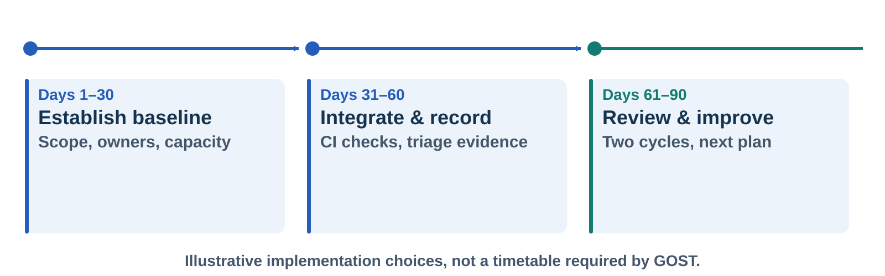

*A 90-day example for the importer: each stage produces something the team can review.*

Speech:
Let's put those parts together in a ninety-day example. The product is the engineering-file importer. Our first goal is to handle findings from parser analysis the same way every time, and to make that work easy to review.

In days one to thirty, the team confirms the software scope. It writes down the current state. It reviews the resource estimate. It names the owner of each planned action, and the person responsible for the release decision. The result is a small baseline that anyone can look at.

In days thirty-one to sixty, the engineer connects the chosen parser checks to continuous integration. The team writes down which source targets and configurations are covered. Every finding gets a review record, and the release workflow links to that record.

In days sixty-one to ninety, the team looks at evidence from two example release cycles. Did the checks run on the intended versions? Did every finding get a decision? Was the agreed capacity enough? The answers shape the next improvement plan.

The ninety-day period, the two releases, and the detailed tasks are our choices. They do not come from the standard. And finishing this example does not establish conformity with every process in the document.

For implementation of this GOST, section four point thirteen requires the following in the development environment. Version control. Continuous integration. And task management, including defect tracking. It does not say continuous deployment. That difference is useful when we explain our pipeline choices.
Cue: Здесь главная практическая пауза: провести взглядом по трём этапам. Не уходить в live demo настройки анализатора. Визуальная опора: The illustrative plan has three equal 30-day periods: establish scope, baseline and ownership; integrate parser checks and record decisions; then review two release cycles, close gaps and update the next plan.

## 25 | Five linked records of evidence
Seconds: 95
Section: Worked example
Layout: steps
Visual: slide-22
Lead: A one-page summary points to the underlying records
Items:
- 5.1.3.1 | Current-state analysis
- 5.1.3.2 | Resource analysis
- 5.1.3.3 | Process improvement plan
- 5.1.3.4 | Process implementation plan
- 5.1.3.5 | Scope and selection rationale
Sources: G24, EX
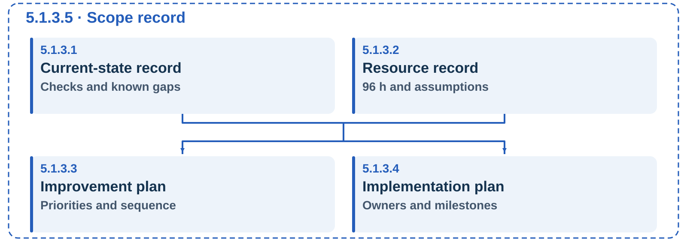

*The same planning structure, now expressed as records a reviewer can follow.*

Speech:
The standard names five matching kinds of evidence. Current-state analysis. Resource analysis. The improvement plan. The implementation plan. And the scope, with the reasons for choosing it.

These are five kinds of information, not an instruction to create five separate Word files. Existing systems can carry this work. A planning page can link to repository and task records you already keep.

In our example, the scope names the importer version and components. The baseline links to the checks that ran. The resource record holds estimates and assumptions. The improvement plan explains priorities. The implementation tasks name owners and milestones.

The standard recognizes forms such as electronic files, logs, and tool results. Choose a form that carries the required information and keeps it traceable.

A one-page template is only an entry point. It does not replace the analysis behind it, and it does not prove effectiveness. A reviewer should be able to follow the links. They should find the right version, understand the decisions, and see which questions are still open. Automation helps when it keeps those connections.
Cue: На слайде артефакты 5.1.3.1–5; подробный шаблон приложен Markdown. Не обещать «одной страницы достаточно для соответствия». Визуальная опора: Five evidence categories mirror the planning requirements: baseline checks and gaps, resource estimates and assumptions, improvement priorities, implementation owners and milestones, and the importer scope with its rationale.

## 26 | Every process is written the same way
Seconds: 150
Section: Worked example
Layout: cards
Lead: One shape for all 25 processes: name, goals, requirements, artifacts
Items:
- Name · 5.1 | Planning secure software development processes
- Goals · 5.1.1 | What the process is for · 5.1.1.1 to 5.1.1.3
- Requirements · 5.1.2 | What to do · 5.1.2.1 to 5.1.2.5
- Artifacts · 5.1.3 | What to show afterwards · 5.1.3.1 to 5.1.3.5
- In every episode | Goals to understand · then compare · requirements and artifacts to apply
Sources: G24
Speech:
Before the crosswalk, here is your reading key for the other twenty-four episodes.

Clause four point eight says every process has the same four parts. The name of the process. Its goals. Its implementation requirements. And its artifacts of requirement implementation. I will say artifacts, or evidence.

The numbering follows that shape. Five point one is the name: planning secure software development processes. Goals come first, then requirements, then artifacts. You saw the five requirements earlier, and the five records a moment ago.

So open any process and read it in that order. What is the work for? What must we do? What must we be able to show afterwards?

Two details help with the artifacts. Clause four point eleven keeps the form open. An artifact is any information, in any form, that lets someone confirm the requirement was met. A document, a report, a file, a log, the result of a tool or a process. Then read the verb. Here, four of the five records must contain the listed information. For the resource analysis, the verb is may.

In most of the later processes, the first artifact is what the standard calls a reglament. In English, a written procedure. As a rule, it must cover two things. The duties and roles of the staff, and the details of how the process is carried out. The standard sets no format for it.

This shape also gives us the plan for every episode. Goals answer our first question: what problem does the process address? Requirements and artifacts answer the third: what can a team do and verify? The second question, the comparison, is where we go next.
Cue: Ключ к чтению всех 25 процессов. П.4.8 — структура; 4.11 — что считается артефактом; 4.12 — регламент: «в общем случае» обязанности и роли сотрудников плюс сведения об особенностях реализации процесса, формат не задан. Точное число процессов с регламентом вслух не называть. 5.1.3.2 — «могут содержать», остальные четыре — «должны/должен/должно содержать». Ссылки назад: требования были на слайде про 5.1, записи — на предыдущем.
## 27 | A first international crosswalk
Seconds: 110
Section: Comparison result
Layout: compare
Visual: slide-23
Lead: Useful connections · bounded conclusions
Items:
- People | GOST 5.1.3.4 ↔ NIST SSDF PO.2.1 · partial overlap
- Improvement | GOST 5.1.2.3 ↔ SAMM Strategy & Metrics · partial overlap
- Difference | GOST explicitly identifies five planning evidence categories
Sources: G24, N11, SAMM
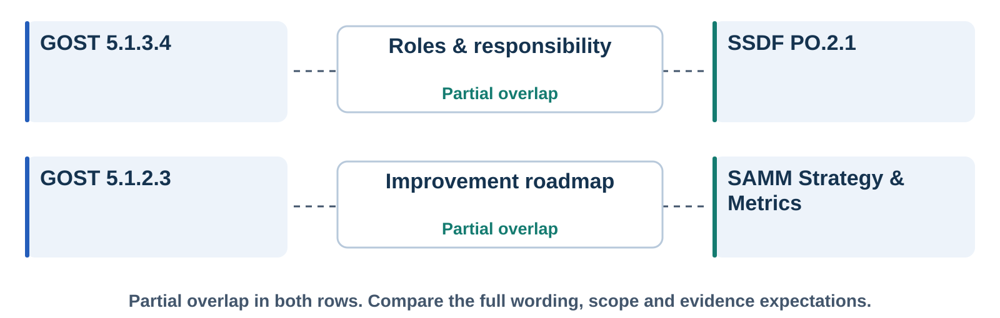

*Bounded comparison: a shared concern is useful, but does not establish full equivalence.*

Speech:
Let's make a small comparison, with clear limits. In GOST, the implementation-plan artifact identifies the employees responsible for implementing the processes. NIST SSDF task P O two point one covers roles and responsibilities for secure software development. There is a useful shared concern. People need to know which work belongs to them.

But the comparison is partial. The GOST artifact also includes goals, timing, stages, and resources. That single SSDF task does not by itself reproduce the complete artifact.

Now look at process improvement. In OWASP SAMM, the Strategy and Metrics practice gives us a useful link. It focuses on an improvement strategy and a roadmap. Again, we need to examine the details, and the purpose of the model, before we claim equivalence.

These comparisons help us read the first process in a wider engineering context. They do not establish that following one document automatically satisfies the other.

So our first conclusion is a modest one. Planning, responsibility, and improvement have international counterparts we can recognize. But the exact structure, the wording, and the expected evidence still need to be examined, requirement by requirement. The notes with this episode keep those limits and the source versions.
Cue: PO.2.1 произнести «P O, two point one». Сопоставлены узкие положения, не все пять требований полностью. Визуальная опора: Two partial overlaps are shown: GOST 5.1.3.4 and NIST SSDF PO.2.1 share a concern with roles and responsibility; GOST 5.1.2.3 and SAMM Strategy and Metrics share a concern with an improvement roadmap. Scope and evidence expectations still differ.

## 28 | Would this survive Friday's release?
Seconds: 95
Section: Apply it
Layout: cards
Visual: slide-24
Lead: A short review before calling the plan usable
Items:
- Scope | Which version and components are covered, and why?
- Capacity | Who has time and authority to act?
- Evidence | Can we trace an action to its result?
- Review | When do we revisit the assumptions?
Sources: EX, G24

*Return to Friday's release: can the team follow the finding through an owned, evidenced decision?*

Speech:
Let's go back to Friday's warning. A plan will not tell us by itself whether that warning is a real vulnerability. The plan helps organize the investigation and the decision.

We can name the affected version and component. We can find the owner of the investigation, and the person authorized to make the release decision. And we can see what evidence we have, and which results are missing.

Weak planning is easy to spot too. An analyzer with no review owner is incomplete. A roadmap with no capacity is unreliable. A scope with no rationale is hard to defend.

For this team, I would review the plan after ninety days, and after a material change, such as adding a parser. These are our own recommendations for implementation.

In a small team, one person may hold several responsibilities. Make the arrangement explicit, and check the capacity. Scaling the implementation does not establish that applicable requirements can be ignored.

Here is the practical test. Can another team member understand the next action? If only the author can explain the plan, then improve it.
Cue: Провести зрителя по пяти узлам: input file → parser → finding → investigate → decide. Сделать короткую паузу на связи расследования с решением о выпуске. Период и триггеры пересмотра — авторский пример. Визуальная опора: The importer scenario returns with a connected path: identify the input and covered parser, retain the finding evidence, assign time and ownership for investigation, and record a release decision under the team's policy. This is a review of the process, not proof that a release is safe.

## 29 | Security Training That Changes Engineering Decisions
Seconds: 115
Section: Stay in touch · Next episode
Layout: closing
Lead: Next: EP02 · Employee training · GOST R 56939-2024, clause 5.2
Contact: Vitaliy Pikov | pikov.expert | https://pikov.expert
Channels:
- LinkedIn | in/vitaliy-pikov | https://www.linkedin.com/in/vitaliy-pikov/
- Email | vitaly@pikov.expert | mailto:vitaly@pikov.expert
- Telegram | UnderLineSecurity | https://t.me/UnderLineSecurity
Items:
- Roles & skills | What each person needs to learn
- Practical learning | A short exercise before and after training
- Evidence of progress | Look beyond attendance to demonstrated skills
Sources: G24, EX
Speech:
Today we followed the Russian standard from the early discussions to the editions that were adopted. We connected that history to international work. And we used its first process to organize a practical improvement effort.

Your next step is simple. Choose one product, and start your planning page. Describe the current state. Name the next improvement. Then connect it to an owner, to the capacity you have, and to evidence someone can review. The worksheet with this episode will help you start.

I am Vitaliy Pikov. You can find me at pikov dot expert, and on LinkedIn. My email and my Telegram channel are on the slide. Please keep in touch, and share the questions you would like this series to explore.

The next episode is called Security Training That Changes Engineering Decisions. We'll look at employee training under clause five point two. What do different roles need to learn? How do we practise those skills? And what evidence can show progress beyond attendance?

We'll build a role and skills matrix, and use a short exercise before and after the training. So, which engineering decision would you most like your security training to improve? Thank you for watching. See you in episode two.
Cue: Произнести «pikov dot expert», выдержать паузу у адреса. Ссылки на LinkedIn, почту и Telegram — на слайде, вслух их не читать. Название EP02 прочитать полностью. В конце оставить слайд с контактом и анонсом на несколько секунд; дата выпуска пока не объявлена.
