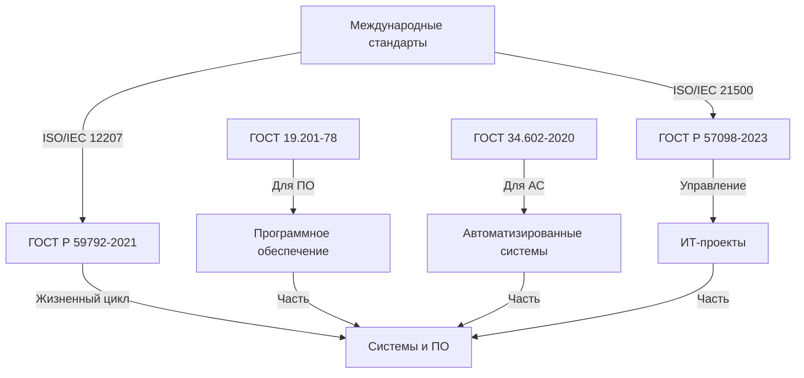

# Сравнение ГОСТов по техническим заданиям

> **Версия:** 1.0 | **Автор:** Виталий Пиков | **МАСКОМ**
> **Дата:** Июнь 2026

---

## 📚 Общее описание

Данный документ содержит сравнительный анализ основных российских стандартов, регламентирующих создание технических заданий. Это поможет выбрать подходящий стандарт для вашего проекта.

---

## 📊 Сравнительная таблица

| Критерий | ГОСТ 19.201-78 | ГОСТ 34.602-2020 | ГОСТ Р 57098-2023 | ГОСТ Р 59792-2021 |
|---------|----------------|------------------|-------------------|-------------------|
| **Название** | ЕСПД. Техническое задание | Информационные технологии. Техническое задание на создание автоматизированной системы | Информационные технологии. Системная и программная инженерия. Требования к управлению проектами | Информационные технологии. Системная и программная инженерия. Процессы жизненного цикла систем |
| **Сфера применения** | Программное обеспечение | Автоматизированные системы | Управление ИТ-проектами | Системная инженерия |
| **Тип объекта** | Программы, программные изделия | Автоматизированные системы | ИТ-проекты | Системы и ПО |
| **Год утверждения** | 1978 | 2020 | 2023 | 2021 |
| **Актуальность** | Действует | Действует | Действует | Действует |
| **Совместимость с международными стандартами** | Нет | Частично | Да (ISO/IEC) | Да (ISO/IEC) |

---

## 🔍 Подробное сравнение

### 1. Структура документа

#### ГОСТ 19.201-78

**Структура:**
```
1. Введение
   ├── Наименование программы
   ├── Основание для разработки
   └── Организации-участники
2. Назначение и цели
3. Характеристика объекта
4. Требования к программе
   ├── Функциональные характеристики
   ├── Надежность
   ├── Условия эксплуатации
   └── Composition данных
5. Требования к программной документации
6. Технико-экономические показатели
7. Стадии и этапы разработки
8. Порядок контроля и приемки
```

**Особенности:**
- ✅ Четкая, проверенная временем структура
- ✅ Подробное описание функциональных требований
- ❌ Устаревшая терминология
- ❌ Не учитывает современные методологии (Agile, DevOps)

---

#### ГОСТ 34.602-2020

**Структура:**
```
1. Общие сведения
2. Основание для создания
3. Назначение системы
4. Характеристика объектов автоматизации
5. Требования к системе
   ├── Требования к системе в целом
   ├── Требования к функциям
   └── Требования к видам обеспечения
6. Состав и содержание работ
7. Порядок контроля и приемки
8. Требования к подготовке объекта
9. Документация
10. Источники разработки
```

**Особенности:**
- ✅ Рассчитан на автоматизированные системы
- ✅ Подробное описание объектов автоматизации
- ✅ Учитывает различные виды обеспечения (информационное, программное, техническое)
- ❌ Сложная структура для малых проектов
- ❌ Меньше внимания уделяется программному обеспечению

---

#### ГОСТ Р 57098-2023

**Структура:**
```
1. Область применения
2. Нормативные ссылки
3. Термины и определения
4. Общие положения
5. Требования к управлению проектами
   ├── Инициация проекта
   ├── Планирование проекта
   ├── Исполнение проекта
   ├── Мониторинг и управление
   └── Завершение проекта
6. Требования к документации
```

**Особенности:**
- ✅ Современный стандарт (2023 год)
- ✅ Учитывает международный опыт (ISO/IEC)
- ✅ Фокус на управление проектами
- ✅ Гибкий подход к документации
- ❌ Менее детализирован для технических аспектов

---

#### ГОСТ Р 59792-2021

**Структура:**
```
1. Область применения
2. Нормативные ссылки
3. Термины и определения
4. Общие положения
5. Процессы жизненного цикла
   ├── Согласование требований
   ├── Проектирование
   ├── Разработка
   ├── Интеграция
   ├── Испытания
   └── Эксплуатация
6. Документация
```

**Особенности:**
- ✅ Современный стандарт (2021 год)
- ✅ Учитывает международный опыт (ISO/IEC 12207)
- ✅ Комплексный подход ко всему жизненному циклу
- ✅ Гибкость в применении
- ❌ Сложность для малых проектов

---

## 🎯 Сравнение по критериям

### 1. Применимость к различным типам проектов

| Тип проекта | ГОСТ 19.201-78 | ГОСТ 34.602-2020 | ГОСТ Р 57098-2023 | ГОСТ Р 59792-2021 |
|-------------|----------------|------------------|-------------------|-------------------|
| **Программное обеспечение** | ⭐⭐⭐⭐⭐ | ⭐⭐⭐ | ⭐⭐⭐ | ⭐⭐⭐⭐ |
| **Автоматизированные системы** | ⭐⭐ | ⭐⭐⭐⭐⭐ | ⭐⭐⭐⭐ | ⭐⭐⭐⭐ |
| **Малые проекты** | ⭐⭐⭐ | ⭐⭐ | ⭐⭐⭐⭐ | ⭐⭐⭐ |
| **Крупные проекты** | ⭐⭐⭐⭐ | ⭐⭐⭐⭐⭐ | ⭐⭐⭐⭐ | ⭐⭐⭐⭐⭐ |
| **Госзаказы** | ⭐⭐ | ⭐⭐⭐⭐⭐ | ⭐⭐⭐ | ⭐⭐⭐⭐ |
| **Agile-проекты** | ⭐ | ⭐⭐ | ⭐⭐⭐⭐⭐ | ⭐⭐⭐⭐ |

---

### 2. Детализация требований

| Критерий | ГОСТ 19.201-78 | ГОСТ 34.602-2020 | ГОСТ Р 57098-2023 | ГОСТ Р 59792-2021 |
|---------|----------------|------------------|-------------------|-------------------|
| **Функциональные требования** | ⭐⭐⭐⭐ | ⭐⭐⭐⭐ | ⭐⭐⭐ | ⭐⭐⭐⭐ |
| **Нефункциональные требования** | ⭐⭐ | ⭐⭐⭐⭐ | ⭐⭐⭐⭐ | ⭐⭐⭐⭐ |
| **Технические требования** | ⭐⭐⭐ | ⭐⭐⭐ | ⭐⭐ | ⭐⭐⭐ |
| **Требования к безопасности** | ⭐ | ⭐⭐⭐ | ⭐⭐⭐ | ⭐⭐⭐⭐ |
| **Требования к документации** | ⭐⭐⭐⭐ | ⭐⭐⭐⭐ | ⭐⭐⭐⭐ | ⭐⭐⭐⭐ |

---

### 3. Современность и актуальность

| Критерий | ГОСТ 19.201-78 | ГОСТ 34.602-2020 | ГОСТ Р 57098-2023 | ГОСТ Р 59792-2021 |
|---------|----------------|------------------|-------------------|-------------------|
| **Год утверждения** | 1978 | 2020 | 2023 | 2021 |
| **Актуальность для современных проектов** | ⭐⭐ | ⭐⭐⭐⭐ | ⭐⭐⭐⭐⭐ | ⭐⭐⭐⭐⭐ |
| **Совместимость с Agile** | ⭐ | ⭐⭐ | ⭐⭐⭐⭐ | ⭐⭐⭐⭐ |
| **Совместимость с DevOps** | ⭐ | ⭐⭐ | ⭐⭐⭐⭐ | ⭐⭐⭐⭐ |
| **Учет международных стандартов** | ❌ | ⚠️ | ✅ | ✅ |

---

### 4. Простота применения

| Критерий | ГОСТ 19.201-78 | ГОСТ 34.602-2020 | ГОСТ Р 57098-2023 | ГОСТ Р 59792-2021 |
|---------|----------------|------------------|-------------------|-------------------|
| **Простота понимания** | ⭐⭐⭐ | ⭐⭐ | ⭐⭐⭐⭐ | ⭐⭐⭐ |
| **Четкость структуры** | ⭐⭐⭐⭐ | ⭐⭐⭐⭐ | ⭐⭐⭐⭐ | ⭐⭐⭐ |
| **Гибкость** | ⭐⭐ | ⭐⭐⭐ | ⭐⭐⭐⭐⭐ | ⭐⭐⭐⭐ |
| **Применимость к малым проектам** | ⭐⭐⭐ | ⭐⭐ | ⭐⭐⭐⭐ | ⭐⭐⭐ |

---

## 🏆 Рекомендации по выбору стандарта

### 1. Для разработки программного обеспечения

**Рекомендуемый стандарт:** **ГОСТ 19.201-78**

**Для каких проектов:**
- Разработка программных продуктов
- Доработка существующего ПО
- Малые и средние проекты
- Проекты с четкими требованиями

**Плюсы:**
- ✅ Проверенный временем
- ✅ Четкая структура
- ✅ Подробное описание функциональных требований
- ✅ Широко используется в России

**Минусы:**
- ❌ Устаревшая терминология
- ❌ Не учитывает современные методологии

---

### 2. Для создания автоматизированных систем

**Рекомендуемый стандарт:** **ГОСТ 34.602-2020**

**Для каких проектов:**
- Создание автоматизированных систем (АС)
- Крупные ИТ-проекты
- Госзаказы
- Проекты с сложной архитектурой

**Плюсы:**
- ✅ Рассчитан на автоматизированные системы
- ✅ Учитывает различные виды обеспечения
- ✅ Современный (2020 год)

**Минусы:**
- ❌ Сложная структура
- ❌ Менее подходит для малых проектов

---

### 3. Для управления ИТ-проектами

**Рекомендуемый стандарт:** **ГОСТ Р 57098-2023**

**Для каких проектов:**
- Управление ИТ-проектами
- Agile-проекты
- Проекты с гибкой методологией
- Современные ИТ-проекты

**Плюсы:**
- ✅ Современный стандарт
- ✅ Учитывает международный опыт
- ✅ Фокус на управление проектами
- ✅ Гибкий подход

**Минусы:**
- ❌ Менее детализирован для технических аспектов

---

### 4. Для системной инженерии

**Рекомендуемый стандарт:** **ГОСТ Р 59792-2021**

**Для каких проектов:**
- Комплексные системы
- Системная инженерия
- Крупные проекты с полным жизненным циклом
- Проекты, требующие системы подхода

**Плюсы:**
- ✅ Комплексный подход
- ✅ Учитывает международный опыт
- ✅ Рассматривает весь жизненный цикл

**Минусы:**
- ❌ Сложность для малых проектов

---

## 📋 Сводная таблица выбора

| Тип проекта | Рекомендуемый стандарт | Альтернатива | Примечания |
|-------------|------------------------|-------------|------------|
| **Разработка ПО** | ГОСТ 19.201-78 | ГОСТ Р 59792-2021 | Для классических проектов |
| **Автоматизированные системы** | ГОСТ 34.602-2020 | ГОСТ Р 59792-2021 | Для госзаказов |
| **Agile-проекты** | ГОСТ Р 57098-2023 | ГОСТ Р 59792-2021 | Для гибких методологий |
| **Малые проекты** | ГОСТ 19.201-78 | ГОСТ Р 57098-2023 | Простота и четкость |
| **Крупные проекты** | ГОСТ 34.602-2020 | ГОСТ Р 59792-2021 | Комплексный подход |
| **Госзаказы** | ГОСТ 34.602-2020 | ГОСТ 19.201-78 | Соответствие требованиям |
| **Системная инженерия** | ГОСТ Р 59792-2021 | ГОСТ 34.602-2020 | Полный жизненный цикл |

---

## 🔗 Взаимосвязь стандартов



---

## 📚 Соответствие международным стандартам

| ГОСТ | Соответствующий международный стандарт | Степень соответствия |
|------|----------------------------------------|----------------------|
| ГОСТ 19.201-78 | Нет аналогичного | Не соответствует |
| ГОСТ 34.602-2020 | ISO/IEC 12207 (частично) | Частичное соответствие |
| ГОСТ Р 57098-2023 | ISO/IEC 21500 | Полное соответствие |
| ГОСТ Р 59792-2021 | ISO/IEC 12207 | Полное соответствие |

---

## 💡 Практических советы

### 1. Как совместить несколько стандартов?

Для комплексных проектов можно совмещать требования из нескольких стандартов:

**Пример для корпоративной системы:**
- **Функциональные требования:** ГОСТ 19.201-78
- **Требования к АС:** ГОСТ 34.602-2020
- **Управление проектом:** ГОСТ Р 57098-2023
- **Жизненный цикл:** ГОСТ Р 59792-2021

### 2. Как адаптировать стандарт под Agile?

Для Agile-проектов:
1. Используйте **ГОСТ Р 57098-2023** как основу
2. Дополните **ГОСТ Р 59792-2021** для технических аспектов
3. Адаптируйте структуру документации под Agile-процессы
4. Используйте гибкие форматы (User Stories, Backlog)

### 3. Как подготовить документацию для госзаказа?

Для госзаказов:
1. Используйте **ГОСТ 34.602-2020** как основу
2. Дополните требованиями из **ГОСТ 19.201-78** для программной части
3. Убедитесь в полноте документации
4. Следуйте всем формальным требованиям

---

## 📖 Полезные ресурсы

- [ГОСТ 19.201-78 на docs.cntd.ru](https://docs.cntd.ru/document/1200004073)
- [ГОСТ 34.602-2020 на docs.cntd.ru](https://docs.cntd.ru/document/1200177451)
- [ГОСТ Р 57098-2023 на docs.cntd.ru](https://docs.cntd.ru/document/1200204179)
- [ГОСТ Р 59792-2021 на docs.cntd.ru](https://docs.cntd.ru/document/1200195380)
- [ISO/IEC 12207 на ISO.org](https://www.iso.org/standard/76134.html)
- [ISO/IEC 21500 на ISO.org](https://www.iso.org/standard/50755.html)

---

## 📞 Контакты

По вопросам, связанным с сравнением стандартов:
- **Email:** vitaliy@pikov.expert
- **Telegram:** [@UnderLineSecurity](https://t.me/UnderLineSecurity)
- **Сайт:** [pikov.expert](https://pikov.expert)

---

**© 2026 Виталий Пиков. Все права защищены.**
*Материал предоставлен для бесплатного использования в образовательных целях.*
