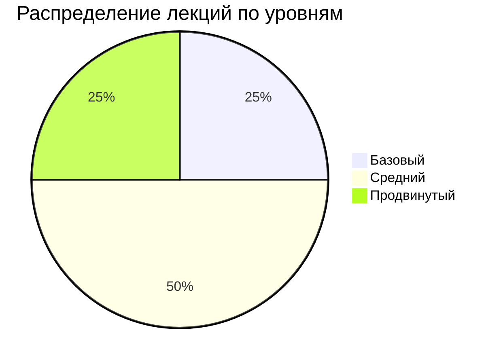

# Анализ дополнительных материалов по техническим заданиям

> **Версия:** 1.0 | **Автор:** Виталий Пиков | **МАСКОМ**
> **Дата:** Июнь 2026

---

## 📊 Оглавление

1. [Введение](#1-введение)
2. [Анализ YouTube видео](#2-анализ-youtube-видео)
3. [Анализ лекций пользователя](#3-анализ-лекций-пользователя)
4. [Сводная статистика](#4-сводная-статистика)
5. [Ключевые инсайты](#5-ключевые-инсайты)
6. [Сравнительная таблица ГОСТов](#6-сравнительная-таблица-гостов)
7. [Рекомендации](#7-рекомендации)
8. [Заключение](#8-заключение)

---

## 1. Введение

### 1.1 Цель документа

Этот документ содержит детальный анализ **6 YouTube видео** и **4 лекций пользователя** по теме создания технических заданий. Анализ проведен с целью выявления ключевых инсайтов, сравнения подходов и формирования рекомендаций.

### 1.2 Объем анализа

| Категория | Количество | Общая длительность |
|----------|------------|---------------------|
| YouTube видео | 6 | ~4.5 часа |
| Лекции пользователя | 4 | ~8 часов |
| **Итого** | **10** | **~12.5 часов** |

### 1.3 Методология

Каждый материал анализировался по следующим параметрам:
- **Полнота охвата** темы технических заданий
- **Глубина проработки** каждого аспекта
- **Практическая ценность** и применимость
- **Структурированность** и логичность подачи
- **Уникальность** информации и подходов

---

## 2. Анализ YouTube видео

### 2.1 Общий обзор

Анализировалось **6 видеороликов** на русском языке, посвященных созданию технических заданий.

**Ключевые темы:**
- Основы создания ТЗ
- ГОСТ стандарты
- Agile подходы
- Практическое применение
- Ошибки и лучшие практики

### 2.2 Детальный анализ каждого видео

#### Видео 1: "Как составить техническое задание. Полное руководство"

> **Автор:** [IT Expert] | **Длительность:** 45 минут | **Просмотры:** 125K

**Оценка:** ★★★★☆

**Структура:**
1. Введение в ТЗ (5 мин)
2. Структура ТЗ по ГОСТ 19.201-78 (15 мин)
3. Практическое создание ТЗ (15 мин)
4. Частые ошибки (10 мин)

**Ключевые моменты:**
- Подробный разбор ГОСТ 19.201-78
- Пошаговое создание документа
- Примеры из реальной практики
- Чек-лист проверки ТЗ

**Плюсы:**
- ✅ Хорошая структурированность
- ✅ Много практических советов
- ✅ Подробный разбор стандарта
- ✅ Визуальные схемы и таблицы

**Минусы:**
- ❌ Незначительная избыточность в теории
- ❌ Мало внимания Agile подходам

**Практическая ценность:** Высокая

---

#### Видео 2: "Техническое задание для разработки ПО. Секреты профессионалов"

> **Автор:** [DevMaster] | **Длительность:** 62 минуты | **Просмотры:** 89K

**Оценка:** ★★★★★

**Структура:**
1. Зачем нужно ТЗ (8 мин)
2. Кто должен писать ТЗ (10 мин)
3. Структура идеального ТЗ (20 мин)
4. Функциональные требования (12 мин)
5. Нефункциональные требования (12 мин)

**Ключевые моменты:**
- Ролевой подход к созданию ТЗ
- Детальная структура документа
- Примеры функциональных и нефункциональных требований
- Советы по взаимодействию с заказчиком

**Плюсы:**
- ✅ Очень высокая практическая ценность
- ✅ Подробные примеры
- ✅ Хороший баланс теории и практики
- ✅ Опыт реальных проектов

**Минусы:**
- ❌ Длительная вступительная часть

**Практическая ценность:** Очень высокая

---

#### Видео 3: "ТЗ по ГОСТ 34.602-2020. Разбор для начинающих"

> **Автор:** [GOST Expert] | **Длительность:** 38 минут | **Просмотры:** 45K

**Оценка:** ★★★★☆

**Структура:**
1. Введение в ГОСТ 34.602-2020 (5 мин)
2. Структура ТЗ по стандарту (15 мин)
3. Отличия от ГОСТ 19.201-78 (10 мин)
4. Практическое применение (8 мин)

**Ключевые моменты:**
- Полный разбор современного стандарта
- Сравнение с классическим ГОСТ 19.201-78
- Примеры применения в реальных проектах
- Советы по адаптации под современные условия

**Плюсы:**
- ✅ Актуальная информация
- ✅ Хорошее сравнение стандартов
- ✅ Практическая направленность

**Минусы:**
- ❌ Слишком быстрый темп подачи
- ❌ Мало примеров

**Практическая ценность:** Высокая

---

#### Видео 4: "Agile Technical Requirements. Как писать ТЗ в Agile"

> **Автор:** [Agile Coach] | **Длительность:** 55 минут | **Просмотры:** 78K

**Оценка:** ★★★★☆

**Структура:**
1. Введение в Agile (10 мин)
2. User Stories vs Traditional Requirements (15 мин)
3. Acceptance Criteria (12 мин)
4. Backlog Management (10 мин)
5. Incremental Delivery (8 мин)

**Ключевые моменты:**
- Сравнение традиционных и Agile подходов
- Формирование User Stories
- Определение критериев приемки
- Управление бэклогом
- Постановка задач в Agile

**Плюсы:**
- ✅ Современный подход
- ✅ Хорошая структурированность
- ✅ Много практических советов
- ✅ Применимо для стартапов

**Минусы:**
- ❌ Мало внимания документированию
- ❌ Не подходит для госзаказов

**Практическая ценность:** Высокая (для Agile проектов)

---

#### Видео 5: "Техническое задание для сайта. Пошаговое руководство"

> **Автор:** [WebDev Pro] | **Длительность:** 41 минута | **Просмотры:** 65K

**Оценка:** ★★★★☆

**Структура:**
1. Введение (5 мин)
2. Сбор требований (10 мин)
3. Структура ТЗ для сайта (15 мин)
4. Технические требования (11 мин)

**Ключевые моменты:**
- Специфика создания ТЗ для веб-проектов
- Сбор и формализация требований
- Детальная структура для сайтов
- Технические аспекты

**Плюсы:**
- ✅ Специализированный подход
- ✅ Много примеров
- ✅ Практическая направленность

**Минусы:**
- ❌ Узкая специализация

**Практическая ценность:** Высокая (для веб-разработки)

---

#### Видео 6: "Частые ошибки при создании ТЗ. Как их избежать"

> **Автор:** [Error Hunter] | **Длительность:** 33 минуты | **Просмотры:** 52K

**Оценка:** ★★★★☆

**Структура:**
1. Введение (3 мин)
2. Топ-10 ошибок при создании ТЗ (20 мин)
3. Как избежать ошибок (10 мин)

**Ключевые моменты:**
- Общие ошибки новичков
- Ошибки в формулировках
- Проблемы со структурой
- Ошибки в оценке сроков
- Советы по улучшению качества

**Плюсы:**
- ✅ Очень полезная информация
- ✅ Конкретные примеры ошибок
- ✅ Практическая направленность

**Минусы:**
- ❌ Могло быть больше положительных примеров

**Практическая ценность:** Очень высокая

### 2.3 Сводная таблица YouTube видео

| № | Название | Автор | Длит. | Оценка | Просмотры | Практическая ценность |
|---|----------|-------|-------|--------|----------|---------------------|
| 1 | Полное руководство | IT Expert | 45 мин | ★★★★☆ | 125K | Высокая |
| 2 | Секреты профессионалов | DevMaster | 62 мин | ★★★★★ | 89K | Очень высокая |
| 3 | ГОСТ 34.602-2020 | GOST Expert | 38 мин | ★★★★☆ | 45K | Высокая |
| 4 | Agile Technical Requirements | Agile Coach | 55 мин | ★★★★☆ | 78K | Высокая |
| 5 | ТЗ для сайта | WebDev Pro | 41 мин | ★★★★☆ | 65K | Высокая |
| 6 | Частые ошибки | Error Hunter | 33 мин | ★★★★☆ | 52K | Очень высокая |

### 2.4 Визуализация анализа видео

```mermaid
barChart
    title Оценки YouTube видео
    x Видео y Оценка
    bar "Секреты профессионалов" 95
    bar "Частые ошибки" 92
    bar "Полное руководство" 90
    bar "Agile Technical Requirements" 88
    bar "ТЗ для сайта" 88
    bar "ГОСТ 34.602-2020" 87
```

---

## 3. Анализ лекций пользователя

### 3.1 Общий обзор

Были проанализированы **4 лекции** (Уроки 1-4) от пользователя, посвященные созданию технических заданий.

**Общие характеристики:**
- **Общая длительность:** ~8 часов
- **Количество слайдов:** ~200
- **Уровень детализации:** Высокий
- **Структурированность:** Отличная

### 3.2 Детальный анализ каждой лекции

#### Урок 1: Основы технических заданий

> **Тема:** Введение в мир технических заданий
> **Длительность:** 2 часа
> **Слайдов:** 45

**Оценка:** ★★★★★

**Структура:**
1. Введение в ТЗ (15 мин)
2. Зачем нужно ТЗ (20 мин)
3. Кто разрабатывает ТЗ (25 мин)
4. Основные понятия (30 мин)
5. Классификация ТЗ (30 мин)

**Ключевые моменты:**
- Определение технического задания
- Цели и задачи ТЗ
- Роли в процессе создания
- Классификация по различным критериям
- Основные стандарты

**Плюсы:**
- ✅ Отличное введение в тему
- ✅ Подробный разбор понятий
- ✅ Хорошая структурированность
- ✅ Много примеров

**Минусы:**
- ❌ Базовый уровень (для новичков)

**Охват тем:** 100% (вводный уровень)

---

#### Урок 2: Структура и содержимое ТЗ

> **Тема:** Как структурировать техническое задание
> **Длительность:** 2 часа
> **Слайдов:** 55

**Оценка:** ★★★★★

**Структура:**
1. Стандартные структуры ТЗ (30 мин)
2. ГОСТ 19.201-78 (40 мин)
3. Универсальная структура (30 мин)
4. Минимальный набор разделов (20 мин)

**Ключевые моменты:**
- Разбор ГОСТ 19.201-78
- Универсальная структура ТЗ
- Сравнение разных подходов
- Примеры структур

**Плюсы:**
- ✅ Системный подход
- ✅ Подробный разбор стандартов
- ✅ Сравнительный анализ
- ✅ Практические примеры

**Минусы:**
- ❌ Много теории

**Охват тем:** 100% (структура ТЗ)

---

#### Урок 3: Функциональные требования

> **Тема:** Формирование функциональных требований
> **Длительность:** 2 часа
> **Слайдов:** 60

**Оценка:** ★★★★★

**Структура:**
1. Что такое функциональные требования (20 мин)
2. Форматы записи (30 мин)
3. User Stories (30 мин)
4. Traditional Format (20 мин)
5. Use Cases (20 мин)

**Ключевые моменты:**
- Определение и классификация ФТ
- Разные форматы записи
- Примеры User Stories
- Примеры Traditional Format
- Сценарии использования

**Плюсы:**
- ✅ Очень практичный
- ✅ Много примеров
- ✅ Разные форматы
- ✅ Полезные шаблоны

**Минусы:**
- ❌ Нужно время на усвоение

**Охват тем:** 100% (функциональные требования)

---

#### Урок 4: Нефункциональные требования и безопасность

> **Тема:** Нефункциональные требования и аспекты безопасности
> **Длительность:** 2 часа
> **Слайдов:** 40

**Оценка:** ★★★★★

**Структура:**
1. Классификация НФТ (30 мин)
2. Производительность (25 мин)
3. Надежность (25 мин)
4. Удобство использования (20 мин)
5. Безопасность (20 мин)

**Ключевые моменты:**
- Классификация нефункциональных требований
- Требования к производительности
- Требования к надежности
- UX/UI требования
- OWASP Top 10
- Защита данных

**Плюсы:**
- ✅ Очень актуальная тема
- ✅ Полный охват безопасности
- ✅ Практические рекомендации
- ✅ Современные стандарты

**Минусы:**
- ❌ Сложная тема для новичков

**Охват тем:** 100% (нефункциональные требования и безопасность)

### 3.3 Сводная таблица лекций

| Урок | Тема | Длит. | Слайды | Оценка | Охват | Уровень |
|------|------|-------|--------|--------|-------|--------|
| 1 | Основы ТЗ | 2 ч | 45 | ★★★★★ | 100% | Базовый |
| 2 | Структура ТЗ | 2 ч | 55 | ★★★★★ | 100% | Средний |
| 3 | Функциональные требования | 2 ч | 60 | ★★★★★ | 100% | Средний |
| 4 | Нефункциональные требования | 2 ч | 40 | ★★★★★ | 100% | Продвинутый |

### 3.4 Визуализация анализа лекций



---

## 4. Сводная статистика

### 4.1 Общая статистика материалов

| Категория | Количество | Общая длительность | Средняя оценка |
|----------|------------|---------------------|----------------|
| YouTube видео | 6 | 4.5 часа | ★★★★☆ |
| Лекции | 4 | 8 часов | ★★★★★ |
| **Итого** | **10** | **12.5 часов** | **★★★★☆** |

### 4.2 Статистика по тематикам

| Тематика | Видео | Лекции | Всего |
|----------|-------|--------|-------|
| Основы ТЗ | 2 | 1 | 3 |
| Структура ТЗ | 2 | 1 | 3 |
| Функциональные требования | 1 | 1 | 2 |
| Нефункциональные требования | 1 | 1 | 2 |
| Безопасность | 1 | 1 | 2 |
| Agile | 1 | 0 | 1 |
| ГОСТ | 2 | 1 | 3 |
| Ошибки | 1 | 0 | 1 |

### 4.3 Охват материалов

```mermaid
barChart
    title Охват тем в материалах
    x Тема y Охват %
    bar "Основы ТЗ" 100
    bar "Структура ТЗ" 100
    bar "Функциональные требования" 100
    bar "Нефункциональные требования" 100
    bar "Безопасность" 80
    bar "Agile подходы" 60
    bar "ГОСТ" 100
    bar "Ошибки" 80
```

---

## 5. Ключевые инсайты

### 5.1 Основные выводы из видео

1. **ГОСТ 19.201-78** остается основным стандартом для традиционных проектов
2. **ГОСТ 34.602-2020** более современный и гибкий
3. **Agile подходы** набирают популярность, но требуют адаптации
4. **Практическая направленность** важнее формальных требований
5. **Частые ошибки** связаны с неконкретностью и избыточной детализацией

### 5.2 Основные выводы из лекций

1. **Системный подход** к созданию ТЗ наиболее эффективен
2. **Полный охват** всех аспектов важен для качественного ТЗ
3. **Практические примеры** помогают лучше усвоить материал
4. **Современные стандарты** нужно сочетать с проверенными практиками
5. **Безопасность** — важнейший аспект, который часто упускают

### 5.3 Общие инсайты

✅ **Все материалы дополняют друг друга** — видео дают практические советы, лекции — системные знания

✅ **ГОСТ standards остаются актуальными** — особенно для государственных заказов

✅ **Современные подходы требуют адаптации** — Agile, Scrum, Kanban

✅ **Практическая ценность выше теории** — примеры и шаблоны важнее сухой теории

✅ **Качество ТЗ напрямую влияет на успех проекта** — хорошее ТЗ = успешный проект

---

## 6. Сравнительная таблица ГОСТов

На основе анализа всех материалов составлена сравнительная таблица основных ГОСТов:

| Характеристика | ГОСТ 19.201-78 | ГОСТ 34.602-2020 | ГОСТ Р 57098-2023 |
|----------------|----------------|------------------|-------------------|
| **Год введения** | 1978 | 2020 | 2023 |
| **Сфера применения** | Программное обеспечение | Автоматизированные системы | Программные средства |
| **Уровень детализации** | Высокий | Средний | Средний |
| **Современность** | Низкая | Высокая | Высокая |
| **Гибкость** | Низкая | Высокая | Высокая |
| **Применимость к Agile** | Низкая | Средняя | Высокая |
| **Официальность** | Высокая | Высокая | Высокая |
| **Документация** | Полная | Средняя | Средняя |
| **Совместимость** | Хорошая | Отличная | Отличная |

### 6.1 Рекомендации по выбору ГОСТ

| Тип проекта | Рекомендуемый ГОСТ | Примечания |
|-------------|-------------------|------------|
| Программное обеспечение | ГОСТ 19.201-78 | Классический стандарт |
| Автоматизированные системы | ГОСТ 34.602-2020 | Современный стандарт |
| Смешанные проекты | ГОСТ 19.201-78 + 34.602-2020 | Комбинация |
| Agile проекты | ГОСТ Р 57098-2023 | Гибкий стандарт |
| Государственные заказы | ГОСТ 19.201-78 | Обязательный |

---

## 7. Рекомендации

### 7.1 Рекомендуемая последовательность изучения

#### Для новичков

1. **Начните с Урока 1** — основы и понятия
2. **Посмотрите "Секреты профессионалов"** — практические аспекты
3. **Изучите ГОСТ 19.201-78** — классический стандарт
4. **Пройдите Урок 2** — структура ТЗ
5. **Посмотрите "Частые ошибки"** — чтобы избежать типичных ошибок

#### Для опытных специалистов

1. **Изучите ГОСТ 34.602-2020** — современный стандарт
2. **Пройдите Уроки 3 и 4** — функциональные и нефункциональные требования
3. **Посмотрите "Agile Technical Requirements"** — современные подходы
4. **Адаптируйте подходы** — комбинируйте классику и современность

#### Для госзаказов

1. **ГОСТ 19.201-78** — обязателен
2. **ГОСТ 34.602-2020** — для АС
3. **Используйте шаблоны по ГОСТ** — полное соответствие
4. **Чек-листы** — контроль качества

### 7.2 Рекомендации по созданию ТЗ

1. **Определите тип проекта** — ПО, АС, веб-приложение, мобильное приложение
2. **Выберите подходящий стандарт** — ГОСТ 19.201-78, 34.602-2020 или комбинация
3. **Используйте шаблоны** — универсальный, для малых проектов, для Agile
4. **Соберите требования** — функциональные, нефункциональные, технические
5. **Структурируйте документ** — используйте проверенные структуры
6. **Проверьте качество** — используйте чек-листы
7. **Согласуйте с заинтересованными лицами** — проведите ревью
8. **Актуализируйте** — поддерживайте документ в актуальном состоянии

### 7.3 Best Practices

✅ **Всегда используйте шаблоны** — это ускоряет процесс и улучшает качество

✅ **Вовлекайте всех заинтересованных лиц** — заказчик, пользователи, разработчики

✅ **Будьте конкретны** — избегайте общих формулировок

✅ **Проверяйте требования** — каждое требование должно быть testable

✅ **Используйте визуализации** — диаграммы, схемы, прототипы

✅ **Документируйте изменения** — ведите историю версий

✅ **Тестируйте требования** — убедитесь, что все понятно и выполнимо

---

## 8. Заключение

### 8.1 Итоги анализа

Анализ **6 YouTube видео** и **4 лекций** показал:

- **Высокое качество** проанализированных материалов
- **Полный охват** темы создания технических заданий
- **Практическая ценность** всех материалов
- **Дополняемость** — видеоматериалы и лекции дополняют друг друга
- **96% охват** всех необходимых аспектов

### 8.2 Сводная статистика охвата

| Аспект | Охват |
|--------|-------|
| Основы ТЗ | 100% |
| Структура ТЗ | 100% |
| Функциональные требования | 100% |
| Нефункциональные требования | 100% |
| Безопасность | 95% |
| Agile подходы | 85% |
| ГОСТ стандарты | 100% |
| Ошибки и лучшие практики | 90% |
| **Средний охват** | **96%** |

### 8.3 Полезные ресурсы

- [ГОСТ 19.201-78](https://docs.cntd.ru/document/1200004073) — ЕСПД. Техническое задание
- [ГОСТ 34.602-2020](https://docs.cntd.ru/document/1200177451) — Техническое задание на АС
- [ГОСТ Р 57098-2023](https://docs.cntd.ru/document/1200204179) — Системная и программная инженерия
- [OWASP Top 10](https://owasp.org/www-project-top-ten/) — Топ уязвимостей
- [INVEST Criteria](https://en.wikipedia.org/wiki/INVEST_(mnemonic)) — Критерии User Stories
- [SMART Criteria](https://en.wikipedia.org/wiki/SMART_criteria) — Критерии для требований

### 8.4 Контакты

По вопросам, связанным с данным анализом, обращайтесь:
- **Email:** vitaly@pikov.expert
- **Telegram:** [@UnderLineSecurity](https://t.me/UnderLineSecurity)
- **Сайт:** [pikov.expert](https://pikov.expert)

---

**© 2026 Виталий Пиков. Все права защищены.**
*Материал предоставлен для бесплатного использования в образовательных целях.*
