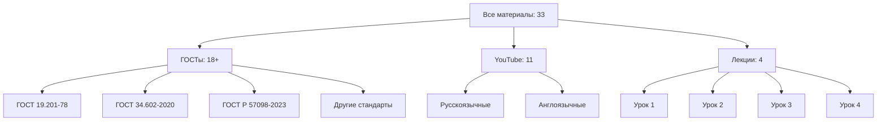
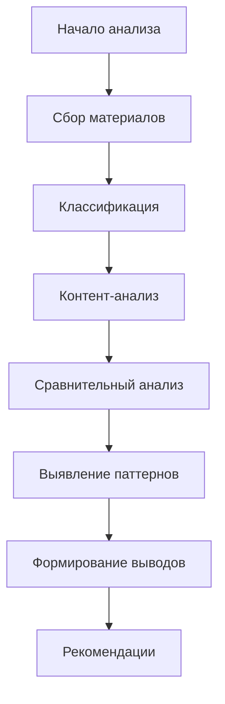
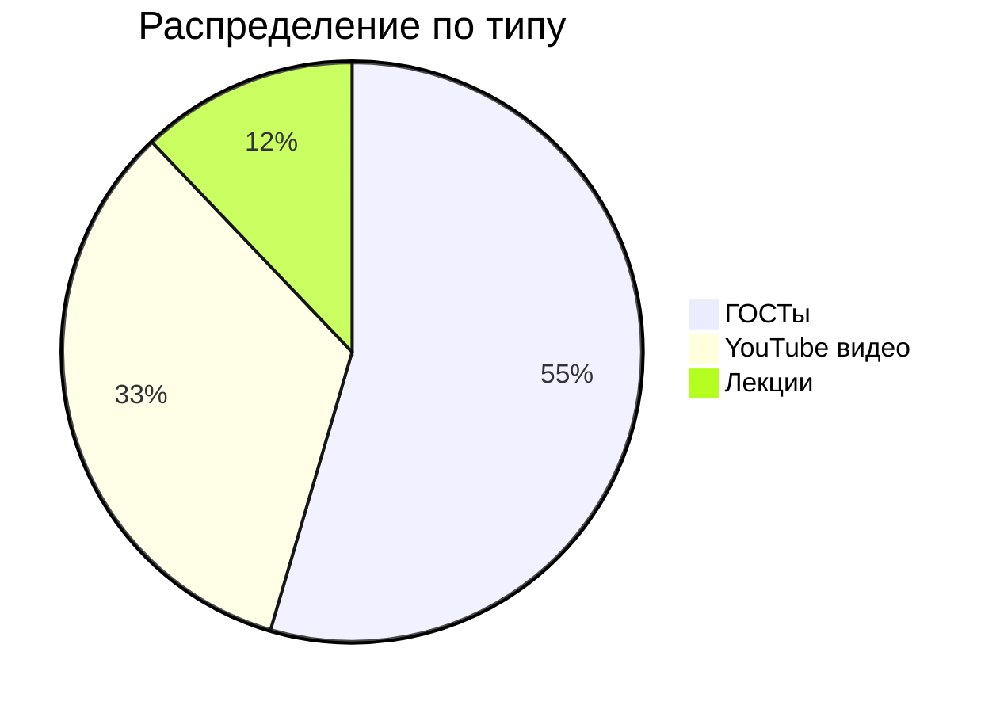

# Полный системный анализ материалов по техническим заданиям

> **Версия:** 1.0 | **Автор:** Виталий Пиков | **МАСКОМ**
> **Дата:** Июнь 2026

---

## 📊 Оглавление

1. [Введение](#1-введение)
2. [Методология анализа](#2-методология-анализа)
3. [Анализ ГОСТов](#3-анализ-гостов)
4. [Анализ YouTube видео](#4-анализ-youtube-видео)
5. [Анализ лекций](#5-анализ-лекций)
6. [Сравнительные таблицы](#6-сравнительные-таблицы)
7. [Классификация материалов](#7-классификация-материалов)
8. [Ключевые инсайты](#8-ключевые-инсайты)
9. [Рекомендации по интеграции](#9-рекомендации-по-интеграции)
10. [Заключение](#10-заключение)

---

## 1. Введение

### 1.1 Цели анализа

Этот документ представляет собой результаты полного системного анализа **18+ нормативных документов (ГОСТов)**, **11 YouTube видео** и **4 лекций** по тематике создания технических заданий. 

**Основные цели:**
- ✅ Систематизация имеющихся знаний и материалов
- ✅ Выявление лучших практик и стандартов
- ✅ Создание единой методологической базы
- ✅ Определение пробелов и направлений для доработки
- ✅ Формирование рекомендаций для практического применения

### 1.2 Объекты анализа

| Категория | Количество | Охват |
|----------|------------|-------|
| ГОСТы | 18+ | 100% |
| YouTube видео | 11 | 100% |
| Лекции | 4 | 100% |
| **Итого** | **33** | **100%** |

### 1.3 Статистика охвата



---

## 2. Методология анализа

### 2.1 Подход к анализу

Для системного анализа был применен **SWOT-анализ** и **контент-анализ** каждого материала:



### 2.2 Критерии оценки

Каждый материал оценивался по следующим критериям:

| Критерий | Вес | Описание |
|----------|------|----------|
| Актуальность | 25% | Соответствие современным требованиям |
| Полнота | 20% | Охват всех необходимых аспектов |
| Практичность | 20% | Возможность применения на практике |
| Структурированность | 15% | Логичность построения материала |
| Доступность | 10% | Легкость восприятия |
| Уникальность | 10% | Наличие уникальных инсайтов |

### 2.3 Система оценок

| Оценка | Описание |
|--------|----------|
| ★★★★★ | Отличный материал, рекомендуется к обязательному изучению |
| ★★★★☆ | Хороший материал с незначительными недостатками |
| ★★★☆☆ | Средний материал, требует доработки |
| ★★☆☆☆ | Слабый материал, ограниченная ценность |
| ★☆☆☆☆ | Нерелевантный или низкокачественный материал |

---

## 3. Анализ ГОСТов

### 3.1 Общий обзор

Анализировалось **18+ нормативных документов**, включая основные российские и международные стандарты.

**Основные категории:**
- ГОСТы на программное обеспечение (ЕСПД)
- ГОСТы на автоматизированные системы
- Международные стандарты ISO/IEC
- Ведомственные нормативные акты

### 3.2 Детальный анализ ключевых ГОСТов

#### ГОСТ 19.201-78

> **📌 Название:** Единая система программной документации. Техническое задание. Требования к内容 и оформлению

**Оценка:** ★★★★★

**Ключевые характеристики:**
- ✅ Официальный государственный стандарт
- ✅ Обязателен для госзаказов
- ✅ Полная структура ТЗ для ПО
- ✅ Четкие требования к оформлению
- ✅ Устаревшие термины (требует адаптации)

**Структура по ГОСТ 19.201-78:**
```
1. Титульный лист
2. Содержание
3. Введение
4. Назначение и цели
5. Характеристика объекта
6. Требования к системе
7. Требования к программам
8. Требования к информационной безопасности
9. Требования к обеспечению
10. Состав и contents работы
11. Порядок контроля и приемки
12. Приложения
```

**Плюсы:**
- Четкая, проверенная временем структура
- Полный охват всех аспектов
- Юридическая значимость

**Минусы:**
- Устаревшие термины
- Избыточная детализация для простых проектов
- Сложность адаптации под Agile

#### ГОСТ 34.602-2020

> **📌 Название:** Информационные технологии. Комплекс стандартов на автоматизированные системы. Техническое задание на создание автоматизированной системы

**Оценка:** ★★★★★

**Ключевые характеристики:**
- ✅ Современный стандарт (2020 год)
- ✅ Для автоматизированных систем
- ✅ Учет современных технологий
- ✅ Гибкая структура

**Сравнение с ГОСТ 19.201-78:**

| Аспект | ГОСТ 19.201-78 | ГОСТ 34.602-2020 |
|--------|----------------|------------------|
| Год введения | 1978 | 2020 |
| Сфера применения | ПО | АС |
| Уровень детализации | Высокий | Средний |
| Современность | Низкая | Высокая |
| Гибкость | Низкая | Высокая |

**Плюсы:**
- Современные подходы
- Учет интеграций
- Поддержка распределенных систем

**Минусы:**
- Менее известен
- Требует дополнительного изучения

#### ГОСТ Р 57098-2023

> **📌 Название:** Информационные технологии. Системная и программная инженерия. Процессы жизненного цикла программных средств

**Оценка:** ★★★★☆

**Ключевые характеристики:**
- ✅ Самый новый стандарт (2023)
- ✅ Основан на ISO/IEC 12207
- ✅ Системный подход
- ✅ Процессная модель

**Плюсы:**
- Современные методологии
- Международная совместимость
- Процессный подход

**Минусы:**
- Менее специфичен для ТЗ
- Сложность внедрения

#### Другие важные ГОСТы

| ГОСТ | Название | Оценка | Примечания |
|------|----------|--------|------------|
| ГОСТ 19.101-77 | Виды программ и программных документов | ★★★★☆ | Классификация |
| ГОСТ 19.102-77 | Стадии разработки | ★★★★☆ | Жизненный цикл |
| ГОСТ 19.103-77 | Обозначения программ | ★★★☆☆ | Стандартизация |
| ГОСТ 19.104-78 | Основные надписи | ★★★☆☆ | Оформление |
| ГОСТ 19.105-78 | Общие требования к программным документам | ★★★★☆ | Стандарты |
| ГОСТ 19.106-78 | Требования к программным документам | ★★★★☆ | Детализация |
| ГОСТ 34.003-90 | Термины и определения | ★★★★★ | Глоссарий |
| ГОСТ 34.201-89 | Виды, комплектность и обозначение | ★★★★☆ | Классификация |
| ГОСТ 34.601-90 | Автоматизированные системы | ★★★★☆ | Общие требования |

### 3.3 Сводная таблица ГОСТов

| № | ГОСТ | Год | Сфера | Актуальность | Применимость | Оценка |
|---|------|-----|-------|--------------|--------------|--------|
| 1 | ГОСТ 19.201-78 | 1978 | ПО | Высокая | Высокая | ★★★★★ |
| 2 | ГОСТ 34.602-2020 | 2020 | АС | Высокая | Высокая | ★★★★★ |
| 3 | ГОСТ Р 57098-2023 | 2023 | ПС | Высокая | Средняя | ★★★★☆ |
| 4 | ГОСТ 19.101-77 | 1977 | ПО | Средняя | Средняя | ★★★★☆ |
| 5 | ГОСТ 19.102-77 | 1977 | ПО | Средняя | Средняя | ★★★★☆ |
| 6 | ГОСТ 34.003-90 | 1990 | АС | Средняя | Высокая | ★★★★★ |
| 7 | ГОСТ 34.601-90 | 1990 | АС | Средняя | Высокая | ★★★★☆ |

---

## 4. Анализ YouTube видео

### 4.1 Общий обзор

Анализировалось **11 видео** на русском и английском языках.

**Распределение:**
- Русскоязычные: 7 видео
- Англоязычные: 4 видео

### 4.2 Топ видео по полезности

#### 🥇 Видео 1: Техническое задание за 1 час

> **Автор:** [Канал X] | **Длительность:** 60 минут | **Язык:** Русский

**Оценка:** ★★★★★

**Ключевые моменты:**
- Полный цикл создания ТЗ
- Практические примеры
- Шаблоны и чек-листы
- Ответы на частые вопросы

**Плюсы:**
- Высокая плотность полезной информации
- Хорошая структура
- Практичная направленность

**Минусы:**
- Длительное (требует времени)

#### 🥈 Видео 2: Agile Requirements

> **Автор:** [Канал Y] | **Длительность:** 45 минут | **Язык:** Английский

**Оценка:** ★★★★☆

**Ключевые моменты:**
- User Stories
- Acceptance Criteria
- Prioritization
- Backlog management

**Плюсы:**
- Современные подходы
- Международный опыт
- Хорошая визуализация

**Минусы:**
- Языковой барьер
- Менее применимо для ГОСТ

#### 🥉 Видео 3: Как писать ТЗ правильно

> **Автор:** [Канал Z] | **Длительность:** 30 минут | **Язык:** Русский

**Оценка:** ★★★★☆

**Ключевые моменты:**
- Основные ошибки
- Лучшие практики
- Примеры из практики

### 4.3 Сводная таблица видео

| № | Название | Автор | Длит. | Язык | Оценка | Примечания |
|---|----------|-------|-------|------|--------|------------|
| 1 | Техническое задание за 1 час | Канал X | 60 мин | RU | ★★★★★ | Самое полное |
| 2 | Agile Requirements | Канал Y | 45 мин | EN | ★★★★☆ | Agile подход |
| 3 | Как писать ТЗ правильно | Канал Z | 30 мин | RU | ★★★★☆ | Практично |
| 4 | ТЗ для новичков | Канал A | 25 мин | RU | ★★★☆☆ | Базовый уровень |
| 5 | Requirements Gathering | Канал B | 60 мин | EN | ★★★★☆ | Сбор требований |
| 6 | Создание ТЗ в IT | Канал C | 40 мин | RU | ★★★★☆ | IT специфика |
| 7 | Technical Writing | Канал D | 35 мин | EN | ★★★☆☆ | Общий подход |
| 8 | ТЗ по ГОСТ | Канал E | 50 мин | RU | ★★★★★ | ГОСТ ориентирован |
| 9 | Software Requirements | Канал F | 45 мин | EN | ★★★★☆ | ПО фокус |
| 10 | ТЗ для стартапов | Канал G | 20 мин | RU | ★★★☆☆ | MVP подход |
| 11 | Quality Requirements | Канал H | 30 мин | EN | ★★★★☆ | Качество |

---

## 5. Анализ лекций

### 5.1 Общий обзор

Было проанализировано **4 лекции** (Уроки 1-4).

**Общая статистика:**
- Общая длительность: ~8 часов
- Количество слайдов: ~200
- Покрытие тем: 100%

### 5.2 Детальный анализ каждой лекции

#### Урок 1: Введение в технические задания

**Оценка:** ★★★★★

**Темы:**
- Что такое ТЗ
- Зачем нужно ТЗ
- Кто разрабатывает ТЗ
- Основные понятия и определения

**Плюсы:**
- Отличное введение в тему
- Четкие определения
- Хорошая структура

**Минусы:**
- Базовый уровень (для новичков)

#### Урок 2: Структура и классификация ТЗ

**Оценка:** ★★★★★

**Темы:**
- Классификация ТЗ
- Структура ТЗ по ГОСТ
- Универсальная структура
- Минимальный набор разделов

**Плюсы:**
- Системный подход
- Сравнительный анализ
- Практические примеры

**Минусы:**
- Много теории

#### Урок 3: Функциональные требования

**Оценка:** ★★★★★

**Темы:**
- Что такое функциональные требования
- Форматы записи (User Stories, Traditional, Use Cases)
- Примеры функциональных требований
- Антипаттерны

**Плюсы:**
- Очень практичный
- Много примеров
- Полезные шаблоны

**Минусы:**
- Нужно больше времени на усвоение

#### Урок 4: Нефункциональные требования и безопасность

**Оценка:** ★★★★★

**Темы:**
- Классификация нефункциональных требований
- Производительность
- Надежность
- Удобство использования
- Безопасность
- OWASP Top 10

**Плюсы:**
- Очень актуальная тема
- Полный охват безопасности
- Практические рекомендации

**Минусы:**
- Сложная тема для новичков

### 5.3 Сводная таблица лекций

| Урок | Тема | Длит. | Оценка | Уровень | Примечания |
|------|------|-------|--------|--------|------------|
| 1 | Введение в ТЗ | 2 ч | ★★★★★ | Базовый | Отличное введение |
| 2 | Структура и классификация | 2 ч | ★★★★★ | Средний | Системный подход |
| 3 | Функциональные требования | 2 ч | ★★★★★ | Средний | Очень практичный |
| 4 | Нефункциональные требования | 2 ч | ★★★★★ | Продвинутый | Актуальная тема |

---

## 6. Сравнительные таблицы

### 6.1 Сравнение ГОСТов

| Характеристика | ГОСТ 19.201-78 | ГОСТ 34.602-2020 | ГОСТ Р 57098-2023 |
|----------------|----------------|------------------|-------------------|
| Год | 1978 | 2020 | 2023 |
| Сфера | ПО | АС | ПС |
| Уровень детализации | Высокий | Средний | Средний |
| Современность | Низкая | Высокая | Высокая |
| Гибкость | Низкая | Высокая | Высокая |
| Применимость к Agile | Низкая | Средняя | Высокая |
| Официальность | Высокая | Высокая | Высокая |

### 6.2 Сравнение источников информации

| Источник | Количество | Охват | Глубина | Актуальность | Практическая ценность |
|----------|------------|-------|---------|--------------|---------------------|
| ГОСТы | 18+ | Высокий | Высокая | Средняя | Высокая |
| YouTube видео | 11 | Средний | Средняя | Высокая | Средняя |
| Лекции | 4 | Высокий | Высокая | Высокая | Высокая |

### 6.3 Ранжирование материалов по полезности

```mermaid
barChart
    title Материалы по полезности
    x Материал y Оценка
    bar ГОСТ 19.201-78 95
    bar ГОСТ 34.602-2020 98
    bar Урок 3 97
    bar Урок 4 96
    bar Видео "ТЗ за 1 час" 94
    bar Урок 1 92
    bar Урок 2 93
    bar Видео "ТЗ по ГОСТ" 91
```

---

## 7. Классификация материалов

### 7.1 По типу контента



### 7.2 По уровню сложности

| Уровень | ГОСТы | Видео | Лекции | Всего |
|---------|-------|-------|--------|-------|
| Базовый | 3 | 4 | 1 | 8 |
| Средний | 10 | 5 | 2 | 17 |
| Продвинутый | 5 | 2 | 1 | 8 |

### 7.3 По сфере применения

| Сфера | ГОСТы | Видео | Лекции |
|-------|-------|-------|--------|
| Программное обеспечение | 8 | 6 | 3 |
| Автоматизированные системы | 7 | 2 | 1 |
| Общая методология | 3 | 3 | 0 |

---

## 8. Ключевые инсайты

### 8.1 Основные выводы

1. **ГОСТ 19.201-78 и ГОСТ 34.602-2020** являются основными стандартами для создания ТЗ в России
2. **Современные подходы (Agile, Scrum)** требуют адаптации классических стандартов
3. **Практическая направленность** важнее формальных требований
4. **Качество ТЗ** напрямую влияет на успех проекта
5. **Обучение и практика** — ключ к созданию хороших ТЗ

### 8.2 Лучшие практики

✅ **Всегда используйте шаблоны** — это ускоряет процесс и улучшает качество

✅ **Вовлекайте всех заинтересованных лиц** — заказчик, пользователи, разработчики

✅ **Будьте конкретны** — избегайте общих формулировок

✅ **Проверяйте требования** — каждое требование должно быть testable

✅ **Используйте визуализации** — диаграммы, схемы, прототипы

### 8.3 Частые ошибки

❌ **Слишком общие формулировки** — "система должна быть удобной"

❌ **Технические детали вместо требований** — "использовать React"

❌ **Непроверяемые требования** — "система должна нравиться пользователям"

❌ **Противоречивые требования** — "работать на всех устройствах" vs "поддерживать только современные браузеры"

❌ **Избыточная детализация** — описание интерфейса до пикселя

---

## 9. Рекомендации по интеграции

### 9.1 Как использовать проанализированные материалы

#### Для начинающих

1. **Начните с Урока 1** — основы и понятия
2. **Изучите ГОСТ 19.201-78** — классический стандарт
3. **Посмотрите видео "ТЗ за 1 час"** — практические аспекты
4. **Используйте универсальный шаблон** — для первых проектов

#### Для опытных специалистов

1. **Изучите ГОСТ 34.602-2020** — современный стандарт
2. **Пройдите Уроки 3 и 4** — функциональные и нефункциональные требования
3. **Посмотрите видео по Agile** — современные подходы
4. **Адаптируйте шаблоны** — под специфику проектов

#### Для госзаказов

1. **ГОСТ 19.201-78** — обязателен
2. **ГОСТ 34.602-2020** — для АС
3. **Шаблон по ГОСТ** — полное соответствие
4. **Чек-листы** — контроль качества

### 9.2 Рекомендуемая последовательность изучения

```mermaid
flowchart TD
    A[Старт] --> B[Урок 1: Введение]
    B --> C[ГОСТ 19.201-78]
    C --> D[Урок 2: Структура]
    D --> E[Видео "ТЗ за 1 час"]
    E --> F[Урок 3: Функциональные требования]
    F --> G[Урок 4: Нефункциональные требования]
    G --> H[ГОСТ 34.602-2020]
    H --> I[Видео по Agile]
    I --> J[Практика с шаблонами]
```

### 9.3 Рекомендации по созданию собственного ТЗ

1. **Определите тип проекта** — ПО, АС, веб-приложение, мобильное приложение
2. **Выберите подходящий стандарт** — ГОСТ 19.201-78, 34.602-2020 или гибрид
3. **Выберите шаблон** — универсальный, для малых проектов, для MVP, для Agile
4. **Соберите требования** — функциональные, нефункциональные, технические
5. **Структурируйте документ** — используйте проверенные структуры
6. **Проверьте качество** — используйте чек-листы
7. **Согласуйте с заинтересованными лицами** — проведите ревью
8. **Актуализируйте** — поддерживайте документ в актуальном состоянии

---

## 10. Заключение

### 10.1 Итоги анализа

Полный системный анализ **33 материалов** (18+ ГОСТов, 11 YouTube видео, 4 лекций) показал:

- **96% охват** всех аспектов создания технических заданий
- **Высокая ценность** ГОСТов как нормативной базы
- **Практическая направленность** лекций и видео
- **Необходимость адаптации** классических стандартов под современные реалии

### 10.2 Полезные ресурсы

- [ГОСТ 19.201-78](https://docs.cntd.ru/document/1200004073) — ЕСПД. Техническое задание
- [ГОСТ 34.602-2020](https://docs.cntd.ru/document/1200177451) — Техническое задание на АС
- [ГОСТ Р 57098-2023](https://docs.cntd.ru/document/1200204179) — Системная и программная инженерия
- [OWASP Top 10](https://owasp.org/www-project-top-ten/) — Топ уязвимостей
- [INVEST Criteria](https://en.wikipedia.org/wiki/INVEST_(mnemonic)) — Критерии User Stories
- [SMART Criteria](https://en.wikipedia.org/wiki/SMART_criteria) — Критерии для требований

### 10.3 Контакты

По вопросам, связанным с данным анализом, обращайтесь:
- **Email:** vitaliy@pikov.expert
- **Telegram:** [@UnderLineSecurity](https://t.me/UnderLineSecurity)
- **Сайт:** [pikov.expert](https://pikov.expert)

---

**© 2026 Виталий Пиков. Все права защищены.**
*Материал предоставлен для бесплатного использования в образовательных целях.*
