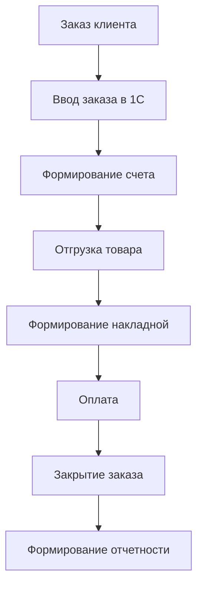

# Техническое задание: Доработка 1С

> **Версия:** 1.0 | **Автор:** Виталий Пиков | **МАСКОМ**
> **Дата:** Июнь 2026
> **Тип проекта:** Доработка системы 1С:Предприятие

---

## 📄 1. Введение

### 1.1 Наименование проекта

**Полное наименование:** Доработка конфигурации 1С:Предприятие 8.3 для автоматизации бизнес-процессов компании [Название компании]

**Краткое наименование:** Доработка 1С

**Код проекта:** [Код проекта]

### 1.2 Основание для разработки

- **Договор:** № [номер] от [дата]
- **Техническое задание от [дата]**
- **Инициатор проекта:** [ФИО, должность]

### 1.3 Заказчик и Исполнитель

#### Заказчик

| Организация | [Название компании] |
|------------|---------------------|
| Адрес | [Юридический адрес] |
| Контактное лицо | [ФИО, должность] |
| Email | [email@company.ru] |
| Телефон | [+7 (XXX) XXX-XX-XX] |

#### Исполнитель

| Организация | [Название компании-исполнителя] |
|------------|---------------------------------|
| Адрес | [Юридический адрес] |
| Контактное лицо | [ФИО, должность] |
| Email | [email@developer.ru] |
| Телефон | [+7 (XXX) XXX-XX-XX] |

### 1.4 Сроки выполнения

| Этап | Дата начала | Дата окончания | Продолжительность |
|------|-------------|---------------|-----------------|
| Анализ текущей системы | 01.06.2026 | 05.06.2026 | 5 дней |
| Проектирование изменений | 06.06.2026 | 10.06.2026 | 5 дней |
| Разработка | 11.06.2026 | 15.07.2026 | 35 дней |
| Тестирование | 16.07.2026 | 20.07.2026 | 5 дней |
| Внедрение | 21.07.2026 | 25.07.2026 | 5 дней |

**Общий срок:** 50 дней (около 2 месяцев)

**Бюджет:** 850,000 ₽

---

## 2. Назначение и цели

### 2.1 Назначение доработки

Доработка системы 1С:Предприятие 8.3 предназначена для:
- ✅ Автоматизации учетных процессов
- ✅ Улучшения производительности работы сотрудников
- ✅ Уменьшения количества ошибок при вводе данных
- ✅ Ускорения формирования отчетности
- ✅ Интеграции с другими системами компании

### 2.2 Цели создания

| № | Цель | Критерии достижения | Срок |
|---|------|---------------------|------|
| 1 | Снизить время на ввод данных | Сокращение времени на 40% | 1 месяц после внедрения |
| 2 | Уменьшить количество ошибок | Снижение на 60% | 1 месяц после внедрения |
| 3 | Автоматизировать формирование отчетов | 100% отчетов формируются автоматически | 1 месяц после внедрения |
| 4 | Улучшить интеграцию с другими системами | Автоматический обмен данными | 1 месяц после внедрения |

---

## 3. Характеристика объекта

### 3.1 Текущая система

**Платформа:** 1С:Предприятие 8.3

**Конфигурация:** [Название конфигурации, например: 1С:Бухгалтерия 3.0, 1С:Управление торговлей 11, 1С:ERP 2.5]

**Версия платформы:** [Версия, например: 8.3.21.1234]

**Количество пользователей:** [Количество]

**Объем данных:** [Описание объема базы данных]

### 3.2 Описание бизнес-процессов



### 3.3 Проблемы текущей системы

| № | Проблема | Влияние | Приоритет |
|---|----------|---------|-----------|
| 1 | Ручной ввод данных | Высокая трудоемкость, ошибки | Высокий |
| 2 | Отсутствие интеграции с CRM | Дублирование данных | Высокий |
| 3 | Сложное формирование отчетов | Затраты времени | Средний |
| 4 | Нет автоматизации бизнес-процессов | Низкая эффективность | Высокий |
| 5 | Устаревшие формы документов | Неудобство работы | Низкий |

---

## 4. Требования

### 4.1 Функциональные требования

#### 4.1.1 Доработки конфигурации

| ID | Название | Описание | Приоритет |
|----|---------|----------|-----------|
| FT-001 | Автоматическое заполнение заказов | Заполнение заказов из CRM | Высокий |
| FT-002 | Интеграция с CRM | Автоматический обмен данными с CRM | Высокий |
| FT-003 | Автоматическое формирование счетов | Формирование счетов по шаблонам | Высокий |
| FT-004 | Автоматическое формирование накладных | Формирование накладных по шаблонам | Высокий |
| FT-005 | Автоматическая рассылка документов | Отправка документов на email | Средний |
| FT-006 | Улучшенные отчеты | Новые отчеты с фильтрами | Средний |
| FT-007 | Дашборды | Визуализация ключевых показателей | Средний |
| FT-008 | Ролевая модель доступа | Разграничение прав доступа | Высокий |
| FT-009 | Журнал изменений | Отслеживание изменений в документах | Средний |
| FT-010 | Архивация данных | Автоматическая архивация старых данных | Низкий |

#### 4.1.2 Новые объекты конфигурации

| ID | Объект | Описание | Приоритет |
|----|--------|----------|-----------|
| OBJ-001 | Новый справочник | Справочник "Типы заказов" | Высокий |
| OBJ-002 | Новый документ | Документ "Заявка на доработку" | Средний |
| OBJ-003 | Новый отчет | Отчет "Анализ продаж" | Средний |
| OBJ-004 | Новая обработка | Обработка "Импорт из Excel" | Высокий |
| OBJ-005 | Новый регистр сведений | Регистр "История изменений" | Средний |

#### 4.1.3 Изменения существующих объектов

| ID | Объект | Изменение | Приоритет |
|----|--------|----------|-----------|
| MOD-001 | Документ "Заказ клиента" | Добавление новых реквизитов | Высокий |
| MOD-002 | Документ "Накладная" | Изменение печатной формы | Средний |
| MOD-003 | Отчет "Продажи" | Добавление новых полей | Средний |
| MOD-004 | Справочник "Номенклатура" | Добавление новых свойств | Высокий |

### 4.2 Нефункциональные требования

#### 4.2.1 Производительность

| Параметр | Значение | Примечания |
|----------|----------|------------|
| Время открытия форм | ≤ 2 с | -
| Время формирования отчетов | ≤ 5 с | Для отчетов до 1000 строк |
| Время выполнения обработок | ≤ 10 с | Для обработки 1000 записей |
| Максимальное количество пользователей | 50 | Одновременно |

#### 4.2.2 Надежность

- [x] Минимальное время наработки на отказ: ≥ 72 часа
- [x] Среднее время восстановления: ≤ 1 час
- [x] Автоматическое резервное копирование: Ежедневно
- [x] Хранение бэкапов: 30 дней

---

## 5. Технические требования

### 5.1 Платформа и конфигурация

**Платформа:** 1С:Предприятие 8.3

**Версия платформы:** 8.3.21.xxxx (или актуальная на момент разработки)

**Конфигурация:** [Название конфигурации]

**Тип конфигурации:**
- [ ] Типовая конфигурация
- [x] Доработанная конфигурация
- [ ] Самостоятельная разработка

### 5.2 Требования к объектам конфигурации

#### 5.2.1 Справочники

| Название | Описание | Количество записей |
|----------|----------|-------------------|
| Типы заказов | Справочник типов заказов | 10 |
| Статусы заказов | Справочник статусов заказов | 5 |
| Категории клиентов | Справочник категорий клиентов | 10 |

#### 5.2.2 Документы

| Название | Описание | Частота использования |
|----------|----------|-----------------------|
| Заявка на доработку | Документ для оформления заявок | Ежедневно |
| Заказ клиента | Документ заказа | Ежедневно |
| Накладная | Документ отгрузки | Ежедневно |

#### 5.2.3 Отчеты

| Название | Описание | Периодичность |
|----------|----------|--------------|
| Анализ продаж | Отчет по продажам | Ежемесячно |
| Анализ заказов | Отчет по заказам | Еженедельно |
| Отчет по клиентам | Отчет по клиентской базе | Ежемесячно |

#### 5.2.4 Обработки

| Название | Описание | Частота использования |
|----------|----------|-----------------------|
| Импорт из Excel | Импорт данных из Excel | Ежедневно |
| Экспорт в Excel | Экспорт данных в Excel | Ежедневно |
| Очистка базы | Очистка устаревших данных | Ежемесячно |

---

## 6. Интеграции

### 6.1 Интеграция с CRM

**Тип интеграции:** Двусторонний обмен данными

**Протокол:** HTTP REST API / COM-соединение

**Обмениваемые данные:**

| Направление | Тип данных | Описание | Частота |
|-------------|------------|----------|---------|
| 1С → CRM | Клиенты | Создание/обновление клиентов | Реал-тайм |
| 1С → CRM | Заказы | Создание заказов | Реал-тайм |
| CRM → 1С | Заявки | Создание заявок | Реал-тайм |
| 1С → CRM | Счета | Создание счетов | Реал-тайм |
| CRM → 1С | Оплаты | Создание платежей | Ежедневно |

### 6.2 Интеграция с email

**Тип интеграции:** Отправка email через SMTP

**Сервер:** [SMTP-сервер]

**Порт:** [Порт]

**Протокол:** [SMTP/SMTPS]

**Типы писем:**
- Счета клиентам
- Накладные клиентам
- Уведомления о статусе заказа
- Отчеты

---

## 7. Состав и содержимое работ

### 7.1 Этапы разработки

| № | Этап | Описание | Сроки | Ответственный |
|---|------|----------|-------|---------------|
| 1 | Анализ текущей системы | Анализ конфигурации, выявление проблем | 01.06-05.06 | Аналитик 1С |
| 2 | Проектирование изменений | Разработка технического проекта | 06.06-10.06 | Архитектор 1С |
| 3 | Разработка справочников | Создание новых справочников | 11.06-15.06 | Программист 1С |
| 4 | Разработка документов | Создание и доработка документов | 16.06-25.06 | Программист 1С |
| 5 | Разработка отчетов | Создание и доработка отчетов | 26.06-05.07 | Программист 1С |
| 6 | Разработка обработок | Создание обработок | 06.07-10.07 | Программист 1С |
| 7 | Интеграция с CRM | Настройка интеграции | 11.07-15.07 | Программист 1С |
| 8 | Тестирование | Тестирование изменений | 16.07-20.07 | Тестировщик 1С |
| 9 | Внедрение | Внедрение изменений в рабочую базу | 21.07-25.07 | DevOps |

### 7.2 Перечень документов

| № | Название документа | Тип | Статус |
|---|-------------------|-----|--------|
| 1 | Техническое задание | Документация | ✅ |
| 2 | Технический проект | Документация | ⬜ |
| 3 | Описание интеграции | Документация | ⬜ |
| 4 | Руководство пользователя | Документация | ⬜ |
| 5 | Руководство администратора | Документация | ⬜ |

---

## 8. Порядок контроля и приемки

### 8.1 Виды испытаний

| Вид испытаний | Описание | Критерии |
|---------------|----------|----------|
| Функциональное тестирование | Проверка всех функций | Все ФТ выполнены |
| Тестирование производительности | Проверка скорости работы | Соответствие НФТ |
| Тестирование интеграций | Проверка обмена данными | Все интеграции работают |
| Приемочное тестирование | Финальная проверка | Все требования выполнены |

### 8.2 Критерии приемки

- [ ] Все функциональные требования реализованы
- [ ] Все изменения в конфигурации работают корректно
- [ ] Все интеграции настроены и работают
- [ ] Все отчеты формируются корректно
- [ ] Система прошла все виды тестирования
- [ ] Документация актуальна и полна
- [ ] Пользователи обучены работе с изменениями

---

## 9. Бюджет

### 9.1 Капитальные затраты (CapEx)

| Категория | Сумма (₽) | Примечания |
|-----------|-----------|------------|
| Лицензии 1С | 200,000 | Лицензии на платформу |
| Сервер (1 год) | 100,000 | Аренда сервера |
| ПО для разработки | 50,000 | Лицензии на ПО |
| **ИТОГО CapEx** | **350,000** | |

### 9.2 Операционные затраты (OpEx)

| Категория | Сумма (₽/мес) | Сумма за проект | Примечания |
|-----------|---------------|------------------|------------|
| Зарплаты | 500,000 | 500,000 | 2 специалиста |
| Обслуживание сервера | 5,000 | 10,000 | -
| **ИТОГО OpEx** | **505,000** | **510,000** | |

### 9.3 Итоговый бюджет

| Категория | Сумма (₽) | % от общего |
|-----------|-----------|-------------|
| CapEx | 350,000 | 41.2% |
| OpEx | 510,000 | 58.8% |
| **ИТОГО** | **860,000** | 100% |

---

## 10. Команда проекта

| Роль | ФИО | Ответственность | Вовлеченность | Ставка (₽/мес) |
|------|-----|----------------|---------------|----------------|
| Руководитель проекта | [ФИО] | Управление проектом, координация | Частичная | 100,000 |
| Аналитик 1С | [ФИО] | Анализ требований, текущей системы | Частичная | 80,000 |
| Архитектор 1С | [ФИО] | Проектирование изменений | Частичная | 100,000 |
| Программист 1С | [ФИО] | Разработка изменений | Полная | 200,000 |
| Тестировщик 1С | [ФИО] | Тестирование изменений | Частичная | 80,000 |
| DevOps | [ФИО] | Настройка сервера, деплой | Частичная | 60,000 |

---

## 11. Требования к серверу

### 11.1 Системные требования

| Ресурс | Минимально | Рекомендуется |
|--------|------------|---------------|
| CPU | 4 ядра | 8 ядер |
| RAM | 8 GB | 16 GB |
| Disk | 100 GB SSD | 200 GB SSD |
| OS | Windows Server 2019 | Windows Server 2022 |

### 11.2 Программные требования

- **Платформа 1С:** 1С:Предприятие 8.3
- **СУБД:** Microsoft SQL Server 2019 / PostgreSQL
- **Версия СУБД:** Последняя стабильная
- **Дополнительное ПО:** [Перечислить]

---

## 12. Приложения

### 12.1 Схема интеграции

```mermaid
graph TD
    A[CRM] <--|API| B[1C:Предприятие]
    B -->|Email| C[SMTP-сервер]
    B -->|Файлы| D[Файловое хранилище]
    E[Пользователи] -->|Web| B
```

### 12.2 Пример кода (об处ботке)

```1c
Процедура ИмпортИзExcel()
    // Код обработки импорта данных из Excel
    // Пример кода для 1С
    Перем Файл, Excel, Лист, Строки, Колонки;
    
    Если ВыбратьФайл(Файл, "Выберите файл Excel", "*.xlsx;*.xls") Тогда
        Excel = Новый COMОбъект("Excel.Application");
        Excel.Workbooks.Open(Файл);
        // ... обработка данных
        Excel.Quit();
    КонецЕсли;
КонецПроцедуры
```

---

## 13. Подписи

**Заказчик:**

|
|------------------------
| [ФИО]
| [Должность]
| [Дата]

**Исполнитель:**

|
|------------------------
| [ФИО]
| [Должность]
| [Дата]

---

**© 2026 [Название компании]. Все права защищены.**
*Документ является конфиденциальным и не подлежит распространению без разрешения.*
