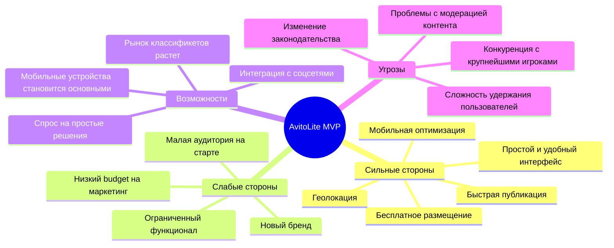
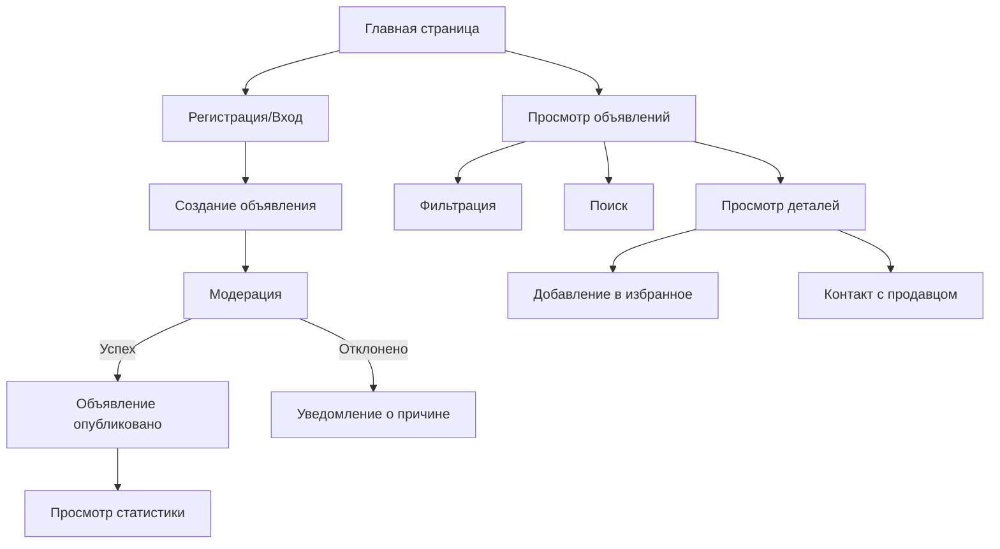
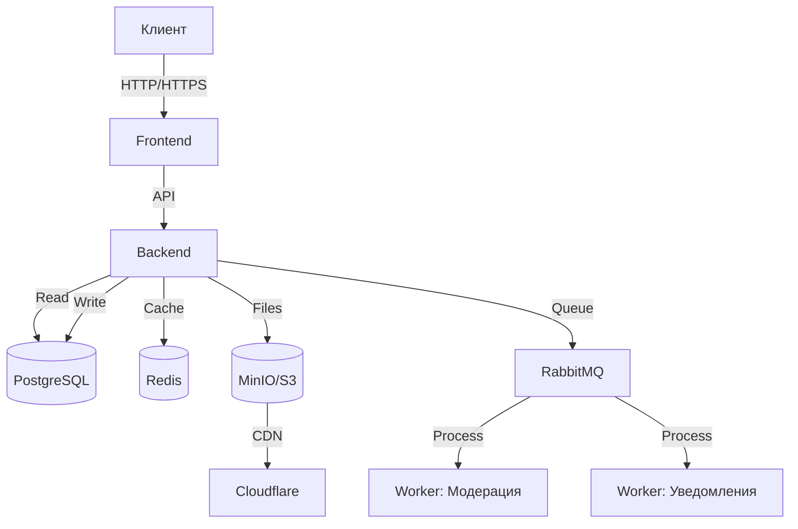
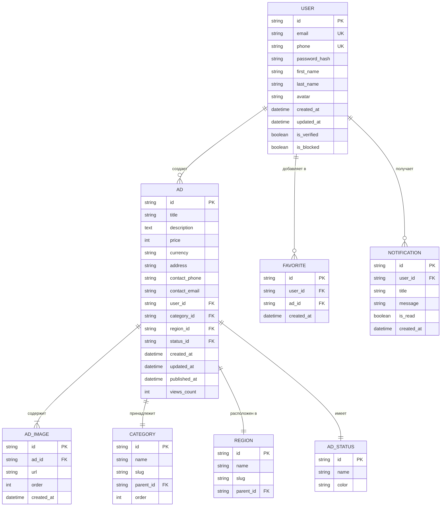

# Техническое задание: MVP сервиса Авито

> **Версия:** 1.0 | **На основе Урока 3** | **Автор:** Виталий Пиков | **МАСКОМ**
> **Дата:** Июнь 2026
> **Тип проекта:** MVP для стартапа

---

## 🚀 1. Описание проекта

### 1.1 Концепция

**Название проекта:** AvitoLite MVP

**Тип:** Классифицированный сервис объвлений (прототип Авито)

**Цель:** Создать минимально жизнеспособный продукт для размещения и поиска объвлений о продаже товаров и услуг в регионе.

### 1.2 Проблема и решение

**Проблема:**
В современном мире люди испытывают трудности с продажей и покупкой подержанных товаров. Существующие платформы либо слишком дорогие для размещения, либо не cover все регионы, либо перегружены ненужным функционалом.

**Решение:**
Создать простой и удобный сервис для размещения объвлений с минимальным набором функций, но с высоким уровнем удобства и безопасности.

### 1.3 Уникальное торговое предложение (УТП)

✅ **Бесплатное размещение** — первые 10 объвлений бесплатно
✅ **Геолокация** — автоматическое определение региона пользователя
✅ **Мгновенная публикация** — объявление появляется на сайте сразу после модерации
✅ **Простой интерфейс** — интуитивно понятный интерфейс без лишних элементов
✅ **Безопасность** — верификация пользователей через телефон

---

## 2. Анализ рынка

### 2.1 Целевая аудитория

| Сегмент | Описание | Размер (оценка) | Потенциальный доход |
|---------|----------|------------------|---------------------|
| Частные лица | Физ.лица, продающие/покупающие бытовые товары | ~10M человек (Москва) | От 50M ₽/год |
| Малый бизнес | Предприниматели, продающие товары/услуги | ~1M организации | От 200M ₽/год |
| Студенты | Продажа/покупка учебных материалов, техники | ~500K человек | От 10M ₽/год |

### 2.2 Конкурентный анализ

| Конкурент | Продукт | Сильные стороны | Слабые стороны | Наше преимущество |
|-----------|----------|-----------------|-----------------|-----------------|
| Avito | avito.ru | Большая аудитория, bekannt brand | Дорогое размещение, сложный интерфейс | Простота, бесплатность |
| Youla | youla.ru | Удобный интерфейс, геолокация | Меньше аудитория, ограниченные категории | Шаблоны, быстрая публикация |
| OLX | olx.kz | Межстрановый сервис | Low trust, много спама | Верификация, безопасность |
| Facebook Marketplace | facebook.com | Интеграция с соцсетью | Ограниченная аудитория | Специализированный сервис |

### 2.3 SWOT-анализ



---

## 3. Функциональные требования

### 3.1 Core Features (MVP)

> **💡 Правило MVP:** Только те функции, без которых продукт не может существовать

#### 3.1.1 основные функции

| ID | Функция | Описание | Приоритет | Сложность | Оценка (SP) |
|----|---------|----------|-----------|-----------|-------------|
| F-001 | Регистрация пользователя | Регистрация через email/телефон | Высокий | Средняя | 8 |
| F-002 | Авторизация | Вход через email/телефон + пароль | Высокий | Средняя | 5 |
| F-003 | Восстановление пароля | Отправка кода на email/телефон | Высокий | Низкая | 3 |
| F-004 | Создание объявления | Форма создания объявления | Высокий | Высокая | 13 |
| F-005 | Просмотр объявлений | Список объявлений с фильтрами | Высокий | Высокая | 13 |
| F-006 | Просмотр деталей объявления | Страница объявления | Высокий | Средняя | 8 |
| F-007 | Поиск объявлений | Поиск по ключевым словам | Высокий | Средняя | 8 |
| F-008 | Фильтрация объявлений | Фильтры по категории, цене, региону | Высокий | Высокая | 13 |
| F-009 | Избранное | Сохранение объявлений в избранное | Средний | Низкая | 5 |
| F-010 | Контакт с продавцом | Просмотр контактов, отправка сообщения | Высокий | Средняя | 8 |
| F-011 | Модерация объявлений | Автоматическая + ручная модерация | Высокий | Высокая | 21 |
| F-012 | Профиль пользователя | Просмотр и редактирование профиля | Средний | Средняя | 8 |
| F-013 | Уведомления | Email/SMS уведомления | Средний | Средняя | 8 |

**Итог:** 16 функций, 110 Story Points

### 3.2 User Flow (Пользовательский путь)



### 3.3 Исключенные функции (Nice-to-have)

| ID | Функция | Описание | Причина исключения | Приоритет для v1.1 |
|----|---------|----------|-------------------|---------------------|
| F-NTH-001 | Чат между пользователями | Онлайн-чат | Высокая сложность | Высокий |
| F-NTH-002 | Рекламные кампании | Платное продвижение | Не критично для MVP | Средний |
| F-NTH-003 | Система рейтингов | Рейтинг продавцов | Высокая сложность | Низкий |
| F-NTH-004 | Оплата через сайт | Интеграция с платежными системами | Требует лицензирования | Средний |
| F-NTH-005 | Мобильное приложение | Native приложение | Дорого на старте | Высокий |
| F-NTH-006 | Геолокация на карте | Показ на карте | Техническая сложность | Средний |
| F-NTH-007 | Multi-language | Поддержка нескольких языков | Не критично для старта | Низкий |

---

## 4. Детализация функциональных требований

### 4.1 Регистрация и авторизация

#### F-001: Регистрация пользователя

**Описание:** Пользователь может зарегистрироваться в системе, указав email и телефон.

**User Story:**
```
Как неавторизованный пользователь
Я хочу зарегистрироваться в системе
Чтобы иметь возможность размещать объявления и контактировать с продавцами
```

**Acceptance Criteria:**
- [x] Пользователь может ввести email
- [x] Пользователь может ввести телефон
- [x] Система отправляет код подтверждения на email/телефон
- [x] Пользователь может ввести код подтверждения
- [x] Система проверяет корректность кода
- [x] При успешной верификации пользователь считается зарегистрированным
- [x] Система отображает сообщение об успешной регистрации
- [x] При неверном коде система отображает сообщение об ошибке

**Технические требования:**
- Валидация email форматы
- Валидация формата телефона (+7 XXX XXX-XX-XX)
- Защита от спима (limit на количество запросов)
- Хранение пароля в захешированном виде (bcrypt)

### 4.2 Создание объявления

#### F-004: Создание объявления

**Описание:** Авторизованный пользователь может создать объявление о продаже товара или услуги.

**User Story:**
```
Как авторизованный пользователь
Я хочу создать объявление о продаже товара
Чтобы другие пользователи могли его увидеть и связаться со мной
```

**Acceptance Criteria:**
- [x] Пользователь может выбрать категорию объявления
- [x] Пользователь может указать заголовок объявления (макс. 100 символов)
- [x] Пользователь может добавить описание (макс. 5000 символов)
- [x] Пользователь может указать цену (число, до 999,999,999)
- [x] Пользователь может загрузить до 10 фотографий
- [x] Пользователь может указать регион
- [x] Пользователь может указать контактную информацию
- [x] Система сохраняет черновик объявления
- [x] Пользователь может опубликовать объявление

**Поля объявления:**

| Поле | Тип | Обязательно | Валидация | Примечания |
|------|-----|-------------|-----------|------------|
| Категория | Select | Да | Выбор из списка | Категории товаров |
| Заголовок | Text | Да | 10-100 символов | Заголовок объявления |
| Описание | Textarea | Да | 10-5000 символов | Детали товара |
| Цена | Number | Нет | 0-999,999,999 | В рублях |
| Валюта | Select | Нет | RUB/USD/EUR | По умолчанию RUB |
| Фото | File | Нет | Max 10, Max 5MB | JPG/PNG |
| Регион | Select | Да | Выбор из списка | Геолокация пользователя |
| Адрес | Text | Нет | Max 200 символов | Уточнение локации |
| Телефон | Text | Нет | +7 XXX XXX-XX-XX | Для связи |
| Email | Text | Нет | Валидный email | Для связи |

### 4.3 Поиск и фильтрация

#### F-007: Поиск объявлений

**Описание:** Пользователь может искать объявления по ключевым словам.

**Acceptance Criteria:**
- [x] Пользователь может ввести поисковый запрос
- [x] Система ищет по заголовкам объявлений
- [x] Система ищет по описаниям объявлений
- [x] Поиск выполняется по вхождению (не точному совпадению)
- [x] Результаты поиска отображаются в виде списка
- [x] Система показывает количество найденных результатов

**Примеры запросов:**
- "iPhone 13" — найдет все объявления с этими словами
- "квартира" — найдет все объявления о недвижимости
- "велосипед" — найдет все объявления о велосипедах

#### F-008: Фильтрация объявлений

**Описание:** Пользователь может фильтровать объявления по различным параметрам.

**Доступные фильтры:**

| Фильтр | Тип | Описание |
|--------|-----|----------|
| Категория | Select | Фильтрация по категории товара |
| Цена (от) | Number | Минимальная цена |
| Цена (до) | Number | Максимальная цена |
| Регион | Select | Фильтрация по региону |
| Дата публикации | Date Range | Период публикации |
| Тип объявления | Select | Продажа/Услуга/Аренда |

---

## 5. Нефункциональные требования

### 5.1 Производительность

| Параметр | Значение | Примечания |
|----------|----------|------------|
| Время загрузки главной страницы | ≤ 2 с | First Contentful Paint |
| Время загрузки списка объявлений | ≤ 1.5 с | С пагинацией |
| Время загрузки страницы объявления | ≤ 1 с | -
| Время отклика API (среднее) | ≤ 200 мс | p95 ≤ 500 мс |
| Время загрузки изображений | ≤ 500 мс | CDN |
| Максимальная нагрузка | 10,000 запросов/с | Пиковая нагрузка |
| Одновременные пользователи | 5,000 | -

### 5.2 Надежность

| Параметр | Значение | Примечания |
|----------|----------|------------|
| Доступность (Availability) | 99.5% | Допустимо для MVP |
| Среднее время наработки на отказ (MTBF) | ≥ 72 часа | -
| Среднее время восстановления (MTTR) | ≤ 1 час | After incident |
| Частота бэкапов | Ежедневно в 02:00 | Автоматически |
| Хранение бэкапов | 30 дней | -
| Время восстановления из бэкапа | ≤ 2 часа | -

### 5.3 Удобство использования (Usability)

**Требования:**
- [x] Адаптивный дизайн (мобильные устройства)
- [x] Соответствие WCAG 2.1 (уровень A)
- [x] Время обучения: ≤ 5 минут
- [x] Коэффициент завершения задачи: ≥ 90%
- [x] NPS (Net Promoter Score): ≥ 40

**Дизайн-система:**
- Цветовая схема: Синий (#2563eb) + Белый + Серый
- Шрифты: Inter (основной), Roboto (запасной)
- Иконки: Material Icons
- Grid: 12-колонная система

### 5.4 Масштабируемость

**Техническая масштабируемость:**
- Горизонтальное масштабирование: Добавление новых серверов без простоев
- Вертикальное масштабирование: Увеличение ресурсов существующих серверов
- Автоматическое масштабирование: При превышении 80% нагрузки

**Функциональная масштабируемость:**
- Возможность добавления новых категорий без изменения архитектуры
- Возможность добавления новых фильтров
- Возможность интеграции с новыми платежными системами

---

## 6. Технические требования

### 6.1 Архитектура системы



### 6.2 Технологический стек

**Frontend:**
- Фреймворк: Next.js 14 (App Router)
- Язык: TypeScript 5.x
- State Management: Zustand
- Стилизация: Tailwind CSS
- UI Kit: ShadCN UI / Radix UI
- Build Tool: Vite / Next.js
- Тестирование: Jest + React Testing Library

**Backend:**
- Язык: Node.js 20.x
- Фреймворк: NestJS
- ORM: TypeORM / Prisma
- База данных: PostgreSQL 15
- Кэш: Redis 7
- Брокер сообщений: RabbitMQ
- Аутентификация: JWT + Passport.js
- Валидация: Zod / class-validator

**File Storage:**
- Основное: MinIO (Self-hosted S3)
- CDN: Cloudflare
- Форматы: JPG, PNG, WebP
- Макс. размер файла: 5 MB
- Макс. количество файлов на объявление: 10

**Infrastructure:**
- Контейнеризация: Docker
- Оркестрация: Docker Compose (для MVP)
- CI/CD: GitHub Actions
- Хостинг: VPS (Hetzner/RU) + Cloudflare
- Мониторинг: Prometheus + Grafana
- Логирование: Loki + Grafana
- Бэкапы: Automated PostgreSQL dump

### 6.3 Схема базы данных



### 6.4 API Endpoints

**Base URL:** `https://api.avitolite.ru/v1`

| Method | Endpoint | Описание | Аутентификация |
|--------|----------|----------|---------------|
| POST | `/auth/register` | Регистрация | No |
| POST | `/auth/login` | Авторизация | No |
| POST | `/auth/refresh` | Обновление токена | Refresh Token |
| POST | `/auth/forgot-password` | Запрос на восстановление | No |
| POST | `/auth/reset-password` | Сброс пароля | Reset Token |
| GET | `/users/me` | Профиль пользователя | Yes |
| PUT | `/users/me` | Обновление профиля | Yes |
| GET | `/ads` | Список объявлений | No |
| POST | `/ads` | Создание объявления | Yes |
| GET | `/ads/{id}` | Детали объявления | No |
| PUT | `/ads/{id}` | Редактирование объявления | Yes (Owner) |
| DELETE | `/ads/{id}` | Удаление объявления | Yes (Owner) |
| POST | `/ads/{id}/publish` | Публикация объявления | Yes (Owner) |
| GET | `/categories` | Список категорий | No |
| GET | `/regions` | Список регионов | No |
| POST | `/favorites` | Добавление в избранное | Yes |
| GET | `/favorites` | Список избранного | Yes |
| POST | `/messages` | Отправка сообщения | Yes |
| GET | `/notifications` | Список уведомлений | Yes |

---

## 7. Команда проекта

### 7.1 Роли и ответственность

| Роль | ФИО | Ответственность | Вовлеченность | Ставка (₽/мес) |
|------|-----|----------------|---------------|----------------|
| Product Owner | Виталий Пиков | Формулировка требований, приоритизация, бизнес-логика | Полная | 200,000 |
| Tech Lead | Иван Петров | Техническое руководство, архитектура, код-ревью | Полная | 180,000 |
| Frontend Developer | Алексей Сидоров | Разработка клиентской части | Полная | 150,000 |
| Backend Developer | Мария Козлова | Разработка серверной части | Полная | 150,000 |
| DevOps Engineer | Дмитрий Новиков | Инфраструктура, деплой, мониторинг | Частичная (50%) | 120,000 |
| QA Engineer | Ольга Смирнова | Тестирование, обеспечение качества | Частичная (50%) | 100,000 |
| UI/UX Designer | Анна Волкова | Дизайн интерфейса | Частичная (30%) | 120,000 |

**Итог:** 920,000 ₽/месяц

### 7.2 Коммуникации

| Вид коммуникации | Частота | Участники | Длительность |
|------------------|---------|------------|-------------|
| Ежедневный stand-up | Ежедневно | Вся команда | 15 минут |
| Планирование спринта | 1 раз в 2 недели | Вся команда | 2 часа |
| Ретроспектива | 1 раз в 2 недели | Вся команда | 1 час |
| Демонстрация результатов | 1 раз в 2 недели | Заказчик + команда | 1 час |
| Backlog Refinement | 1 раз в неделю | PO + Tech Lead + Команда | 1 час |

---

## 8. Сроки и бюджет

### 8.1 Временной план

| Этап | Дата начала | Дата окончания | Продолжительность | Статус |
|------|-------------|---------------|-----------------|--------|
| Сбор требований | 01.06.2026 | 07.06.2026 | 1 неделя | ✅ Завершено |
| Проектирование | 08.06.2026 | 21.06.2026 | 2 недели | ✅ Завершено |
| Sprint 1 | 22.06.2026 | 05.07.2026 | 2 недели | 🟡 В процессе |
| Sprint 2 | 06.07.2026 | 19.07.2026 | 2 недели | ⬜ Планируется |
| Sprint 3 | 20.07.2026 | 02.08.2026 | 2 недели | ⬜ Планируется |
| Sprint 4 | 03.08.2026 | 16.08.2026 | 2 недели | ⬜ Планируется |
| Тестирование | 17.08.2026 | 23.08.2026 | 1 неделя | ⬜ Планируется |
| Запуск | 24.08.2026 | 24.08.2026 | 1 день | ⬜ Планируется |

**Итоговый срок:** 12 недель (3 месяца)

### 8.2 Бюджет

#### 8.2.1 Капитальные затраты (CapEx)

| Категория | Сумма (₽) | Примечания |
|-----------|-----------|------------|
| Хостинг (1 год) | 240,000 | VPS + Cloudflare |
| Домен (1 год) | 5,000 | avitolite.ru |
| Лицензии ПО | 100,000 | PostgreSQL, Redis etc. |
| Оборудование | 300,000 | Ноутбуки для команды |
| **ИТОГО CapEx** | **645,000** | |

#### 8.2.2 Операционные затраты (OpEx) за 3 месяца

| Категория | Сумма (₽/мес) | Сумма за 3 мес. | Примечания |
|-----------|---------------|----------------|------------|
| Зарплаты | 920,000 | 2,760,000 | С按照 таблицы выше |
| Хостинг | 20,000 | 60,000 | VPS |
|Cloudflare | 10,000 | 30,000 | CDN |
| Реклама | 50,000 | 150,000 | Тестовые кампании |
| Прочие | 20,000 | 60,000 | Расходные материалы |
| **ИТОГО OpEx за 3 мес.** | **1,020,000** | **3,060,000** | |

#### 8.2.3 Итоговый бюджет

| Категория | Сумма (₽) | % от общего |
|-----------|-----------|-------------|
| CapEx | 645,000 | 17.3% |
| OpEx | 3,060,000 | 82.7% |
| **ИТОГО** | **3,705,000** | 100% |

---

## 9. Критерии успеха MVP

### 9.1 Метрики успеха

| Метрика | Целевое значение | Срок достижения | Текущее значение |
|---------|------------------|-----------------|------------------|
| Количество пользователей | 5,000 | 1 месяц после запуска | 0 |
| Количество объявлений | 10,000 | 1 месяц после запуска | 0 |
| Коэффициент конверсии (регистрация) | 10% | 1 месяц после запуска | 0% |
| Retention Rate (1 месяц) | 30% | 2 месяц после запуска | 0% |
| NPS (Net Promoter Score) | 40 | 1 месяц после запуска | 0 |
| Среднее время на сайте | 5 минут | 1 месяц после запуска | 0 |
| Количество сессий в день | 1,000 | 1 месяц после запуска | 0 |

### 9.2 Критерии приемки MVP

- [ ] MVP запущен и доступен по адресу https://avitolite.ru
- [ ] Все core functions из раздела 3.1 реализованы
- [ ] Система работает без критических ошибок
- [ ] Время загрузки страниц соответствует требованиям (раздел 5.1)
- [ ] Система прошла нагрузочное тестирование
- [ ] Система прошла тестирование безопасности
- [ ] Документация для пользователей и администраторов готова
- [ ] Команда провела обучение
- [ ] Маркетинговая кампания запущена

---

## 10. Риски и их минимизация

### 10.1 Реестр рисков

| ID | Риск | Вероятность | Влияние | Меры минимизации | Владелец | Статус |
|----|------|-------------|--------|------------------|---------|--------|
| R-001 | Низкий спрос на продукт | Средняя | Высокое | Провести маркетинговое исследование, тестовые кампании | PO | 🟡 |
| R-002 | Технические сложности с масштабированием | Низкая | Высокое | Использовать проверенные технологии, делать load testing | Tech Lead | 🟡 |
| R-003 | Проблемы с модерацией контента | Высокая | Среднее | Автоматическая модерация + ручной контроль | Tech Lead | 🟡 |
| R-004 | Конкуренция с существующими игроками | Высокая | Высокое | Фокус на нише, уникальное предложение | PO | 🟡 |
| R-005 | Нехватка ресурсов | Средняя | Высокое | Привлечение дополнительных инвестиций | PO | 🟡 |
| R-006 | Проблемы с безопасностью | Низкая | Высокое | Регулярные аудиты, защита от OWASP Top 10 | Tech Lead | 🟡 |

### 10.2 План управления рисками

**Высокоприоритетные риски:**
1. **R-004: Конкуренция** — Провести детальный конкурентный анализ, выделить уникальные преимущества
2. **R-001: Низкий спрос** — Провести тестовые маркетинговые кампании до запуска
3. **R-003: Модерация** — Разработать систему автоматической модерации

---

## 11. Roadmap

### 11.1 План развития

| Версия | Дата запуска | Новые функции | Цель |
|--------|--------------|---------------|------|
| MVP | 24.08.2026 | Core функции | Запуск продукта |
| v1.1 | 24.10.2026 | Чат, рейтинг продавцов | Повышение engagement |
| v1.2 | 24.12.2026 | Платное продвижение, premium аккаунты | Монетизация |
| v2.0 | 24.02.2027 | Мобильное приложение, геолокация на карте | Улучшение UX |
| v2.1 | 24.04.2027 | Интеграция с соцсетями, multi-language | Расширение аудитории |

### 11.2 План масштабирования

**Техническое масштабирование:**
- Q1 2027: Миграция на Kubernetes
- Q2 2027: Добавление CDN для статики
- Q3 2027: георепликация базы данных

**Функциональное масштабирование:**
- Q4 2026: Добавление новых категорий
- Q1 2027: Интеграция с платежными системами
- Q2 2027: Добавление API для сторонних разработчиков

**Географическое масштабирование:**
- 2026: Москва и область
- 2027 Q1: Санкт-Петербург и область
- 2027 Q2: Крупные города России
- 2027 Q4: Весь мир

---

## 12. Приложения

### 12.1 User Stories (Подробный список)

#### Эпик: Регистрация и авторизация

| ID | User Story | Acceptance Criteria | Priority | Estimate |
|----|------------|---------------------|----------|----------|
| US-001 | Регистрация через email | Пользователь может зарегистрироваться, указав email и пароль | High | 8 |
| US-002 | Регистрация через телефон | Пользователь может зарегистрироваться, указав телефон | High | 8 |
| US-003 | Верификация email | Пользователь получает код на email для верификации | High | 5 |
| US-004 | Верификация телефона | Пользователь получает SMS с кодом для верификации | High | 5 |
| US-005 | Авторизация | Пользователь может войти в систему | High | 5 |
| US-006 | Восстановление пароля | Пользователь может восстановить пароль | High | 3 |
| US-007 | Выход из системы | Пользователь может выйти из системы | Medium | 2 |

#### Эпик: Управление профилем

| ID | User Story | Acceptance Criteria | Priority | Estimate |
|----|------------|---------------------|----------|----------|
| US-008 | Просмотр профиля | Пользователь может просмотреть свой профиль | Medium | 3 |
| US-009 | Редактирование профиля | Пользователь может изменить данные профиля | Medium | 5 |
| US-010 | Загрузка аватара | Пользователь может загрузить фото профиля | Low | 5 |

#### Эпик: Управление объявлениями

| ID | User Story | Acceptance Criteria | Priority | Estimate |
|----|------------|---------------------|----------|----------|
| US-011 | Создание объявления | Пользователь может создать объявление | High | 13 |
| US-012 | Редактирование объявления | Пользователь может изменить свое объявление | Medium | 8 |
| US-013 | Удаление объявления | Пользователь может удалить свое объявление | Medium | 3 |
| US-014 | Публикация объявления | Пользователь может опубликовать объявление | High | 5 |
| US-015 | Снятие с публикации | Пользователь может снять объявление с публикации | Medium | 3 |
| US-016 | Просмотр своих объявлений | Пользователь может увидеть список своих объявлений | Medium | 5 |

#### Эпик: Поиск и просмотр

| ID | User Story | Acceptance Criteria | Priority | Estimate |
|----|------------|---------------------|----------|----------|
| US-017 | Просмотр списка объявлений | Пользователь видит список объявлений | High | 8 |
| US-018 | Просмотр деталей объявления | Пользователь может просмотреть детали объявления | High | 8 |
| US-019 | Поиск по ключевым словам | Пользователь может искать объявления | High | 8 |
| US-020 | Фильтрация по категории | Пользователь может фильтровать по категории | High | 5 |
| US-021 | Фильтрация по цене | Пользователь может фильтровать по цене | High | 5 |
| US-022 | Фильтрация по региону | Пользователь может фильтровать по региону | High | 5 |
| US-023 | Сортировка по дате | Пользователь может сортировать по дате | Medium | 3 |
| US-024 | Сортировка по цене | Пользователь может сортировать по цене | Medium | 3 |

#### Эпик: Избранное и контакты

| ID | User Story | Acceptance Criteria | Priority | Estimate |
|----|------------|---------------------|----------|----------|
| US-025 | Добавление в избранное | Пользователь может добавить объявление в избранное | Medium | 5 |
| US-026 | Просмотр избранного | Пользователь может увидеть список избранных объявлений | Medium | 3 |
| US-027 | Удаление из избранного | Пользователь может удалить объявление из избранного | Medium | 3 |
| US-028 | Просмотр контактов | Пользователь может увидеть контакты продавца | High | 5 |
| US-029 | Отправка сообщения | Пользователь может отправить сообщение продавцу | High | 8 |

#### Эпик: Модерация

| ID | User Story | Acceptance Criteria | Priority | Estimate |
|----|------------|---------------------|----------|----------|
| US-030 | Автоматическая модерация | Система автоматически проверяет объявления | High | 13 |
| US-031 | Ручная модерация | Администратор может модераровать объявления | High | 8 |
| US-032 | Блокировка пользователя | Администратор может заблокировать пользователя | Medium | 5 |

**Итог:** 32 User Stories, 110 Story Points

### 12.2 Прототипы

[Ссылки на прототипы в Figma]
- [Главная страница](https://figma.com/file/...)
- [Страница объявления](https://figma.com/file/...)
- [Форма создания объявления](https://figma.com/file/...)

### 12.3 Техническая документация

- [API Documentation](https://api.avitolite.ru/docs)
- [Database Schema](https://github.com/avitolite/db-schema)
- [Infrastructure Documentation](https://github.com/avitolite/infra)

---

## 13. Подписи

**Product Owner:** ________________ / Виталий Пиков / 01.06.2026

**Tech Lead:** ________________ / Иван Петров / 01.06.2026

**Заказчик:** ________________ / [ФИО] / [Дата]

---

**© 2026 AvitoLite. Все права защищены.**
*Документ является конфиденциальным и не подлежит распространению без разрешения.*
