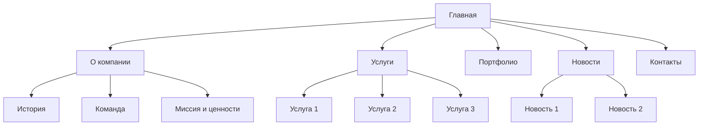
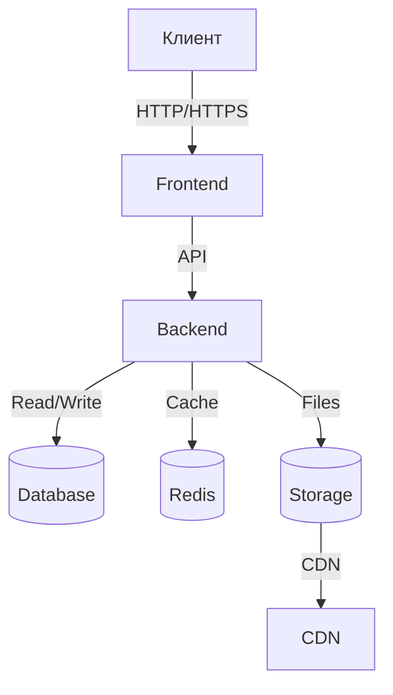
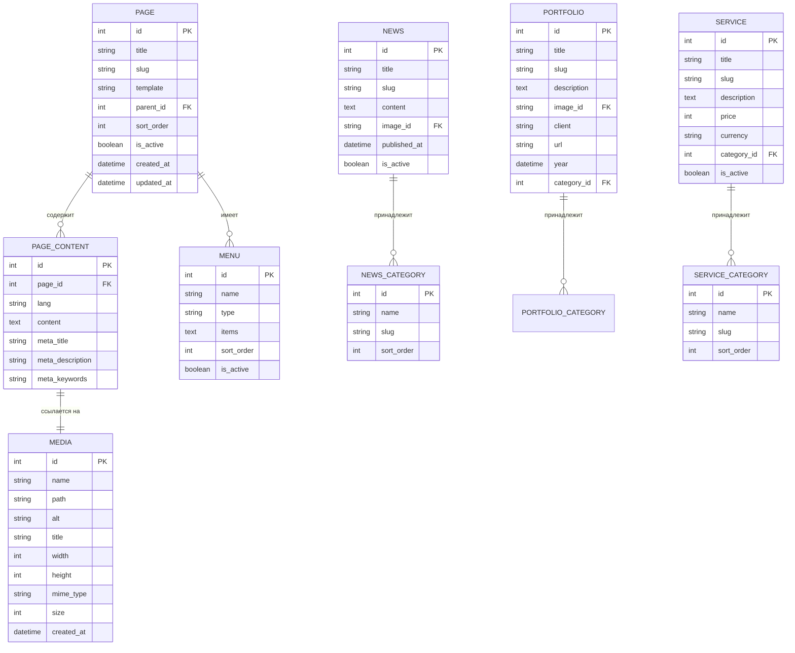

# Техническое задание: Корпоративный сайт

> **Версия:** 1.0 | **Автор:** Виталий Пиков | **МАСКОМ**
> **Дата:** Июнь 2026
> **Тип проекта:** Разработка корпоративного сайта

---

## 📄 1. Введение

### 1.1 Наименование проекта

**Полное наименование:** Корпоративный сайт компании [Название компании]

**Краткое наименование:** [Аббревиатура, если есть]

**Код проекта:** [Код проекта]

### 1.2 Основание для разработки

- **Договор:** № [номер] от [дата]
- **Распорядительный документ:** Приказ № [номер] от [дата]
- **Инициатор проекта:** [ФИО, должность]

### 1.3 Заказчик и Исполнитель

#### Заказчик

| Организация | [Название компании] |
|------------|---------------------|
| Адрес | [Юридический адрес] |
| Контактное лицо | [ФИО, должность] |
| Email | [email@company.ru] |
| Телефон | [+7 (XXX) XXX-XX-XX] |

#### Исполнитель

| Организация | [Название компании-исполнителя] |
|------------|---------------------------------|
| Адрес | [Юридический адрес] |
| Контактное лицо | [ФИО, должность] |
| Email | [email@developer.ru] |
| Телефон | [+7 (XXX) XXX-XX-XX] |

### 1.4 Сроки выполнения

| Этап | Дата начала | Дата окончания | Продолжительность |
|------|-------------|---------------|-----------------|
| Сбор требований | 01.06.2026 | 10.06.2026 | 10 дней |
| Проектирование | 11.06.2026 | 20.06.2026 | 10 дней |
| Дизайн | 21.06.2026 | 30.06.2026 | 10 дней |
| Разработка | 01.07.2026 | 31.07.2026 | 31 день |
| Тестирование | 01.08.2026 | 10.08.2026 | 10 дней |
| Внедрение | 11.08.2026 | 15.08.2026 | 5 дней |

**Общий срок:** 66 дней (около 2.5 месяцев)

**Бюджет:** 1,200,000 ₽

---

## 2. Назначение и цели

### 2.1 Назначение сайта

Корпоративный сайт предназначен для:
- ✅ Представления компании в интернете
- ✅ Информирования клиентов о товарах и услугах
- ✅ Продвижения бренда компании
- ✅ Привлечения новых клиентов
- ✅ Упрощения связи с компанией

### 2.2 Цели создания

| № | Цель | Критерии достижения | Срок |
|---|------|---------------------|------|
| 1 | Увеличить онлайн-видимость компании | Попадание в ТОП-10 поисковых систем по ключевым запросам | 3 месяца |
| 2 | Увеличить количество лидов | 50 лидов в месяц | 2 месяца |
| 3 | Улучшить имидж компании | Положительные отзывы клиентов | 1 месяц |
| 4 | Упростить доступ к информации | Время поиска информации ≤ 30 секунд | Непрерывно |

---

## 3. Характеристика объекта

### 3.1 Общее описание

Корпоративный сайт компании [Название] — это информационный ресурс, предоставляющий информацию о компании, ее товарах, услугах, новостях и контактной информации.

**Тип сайта:** Корпоративный сайт (Corporate Website)

**Целевая аудитория:**
- Потенциальные клиенты
- Существующие клиенты
- Партнеры
- Инвесторы
- СМИ
- Соискатели (для раздела "Карьера")

### 3.2 Структура сайта



---

## 4. Требования

### 4.1 Функциональные требования

#### 4.1.1 Общие требования

| ID | Название | Описание | Приоритет |
|----|---------|----------|-----------|
| FT-001 | Multilingual | Поддержка нескольких языков (русский, английский) | Высокий |
| FT-002 | Adaptive Design | Адаптивный дизайн для всех устройств | Высокий |
| FT-003 | SEO Optimization | Оптимизация для поисковых систем | Высокий |
| FT-004 | Fast Loading | Быстрая загрузка страниц | Высокий |
| FT-005 | Accessibility | Соответствие WCAG 2.1 (уровень AA) | Средний |

#### 4.1.2 Требования по страницам

##### Главная страница

| ID | Название | Описание | Приоритет |
|----|---------|----------|-----------|
| FT-101 | Баннер | Слайдер с главными баннерами | Высокий |
| FT-102 | О компании (кратко) | Краткая информация о компании | Высокий |
| FT-103 | Услуги (превью) | Превью услуг с ссылками на подробности | Высокий |
| FT-104 | Последние новости | Блок последних новостей | Средний |
| FT-105 | Портфолио (превью) | Превью портфолио | Средний |
| FT-106 | Партнеры | Логотипы партнеров | Низкий |
| FT-107 | Отзывы клиентов | Блок с отзывами | Средний |

##### Страница "О компании"

| ID | Название | Описание | Приоритет |
|----|---------|----------|-----------|
| FT-201 | История компании | Timeline с ключевыми событиями | Высокий |
| FT-202 | Миссия и ценности | Описание миссии и ценностей | Высокий |
| FT-203 | Команда | Фото и описание команды | Высокий |
| FT-204 | Сертификаты | Галерея сертификатов | Средний |
| FT-205 | Лицензии | Информация о лицензиях | Средний |

##### Страница "Услуги"

| ID | Название | Описание | Приоритет |
|----|---------|----------|-----------|
| FT-301 | Список услуг | Каталог услуг с описанием | Высокий |
| FT-302 | Детали услуги | Подробное описание каждой услуги | Высокий |
| FT-303 | Цены | Информация о стоимости услуг | Высокий |
| FT-304 | Заказ услуги | Форма заказа услуги | Высокий |

##### Страница "Портфолио"

| ID | Название | Описание | Приоритет |
|----|---------|----------|-----------|
| FT-401 | Список проектов | Каталог реализованных проектов | Высокий |
| FT-402 | Детали проекта | Подробное описание проекта | Высокий |
| FT-403 | Галерея | Фото и видео проекта | Средний |
| FT-404 | Фильтрация | Фильтрация по типам проектов | Средний |

##### Страница "Новости"

| ID | Название | Описание | Приоритет |
|----|---------|----------|-----------|
| FT-501 | Список новостей | Каталог новостей | Высокий |
| FT-502 | Детали новости | Подробное описание новости | Высокий |
| FT-503 | Категории новостей | Категоризация новостей | Средний |
| FT-504 | Поиск новостей | Поиск по новостям | Средний |

##### Страница "Контакты"

| ID | Название | Описание | Приоритет |
|----|---------|----------|-----------|
| FT-601 | Контактная информация | Адрес, телефон, email, график работы | Высокий |
| FT-602 | Карта проезда | Интерактивная карта с отметкой офиса | Высокий |
| FT-603 | Форма обратной связи | Форма для отправки сообщения | Высокий |
| FT-604 | Социальные сети | Ссылки на социальные сети | Средний |

##### Дополнительные страницы

| ID | Название | Описание | Приоритет |
|----|---------|----------|-----------|
| FT-701 | Карьера | Вакансии компании | Средний |
| FT-702 | FAQ | Часто задаваемые вопросы | Средний |
| FT-703 | Блог | Статьи и публикации | Низкий |
| FT-704 | Поиск по сайту | Глобальный поиск по сайту | Средний |

### 4.2 Нефункциональные требования

#### 4.2.1 Производительность

| Параметр | Значение | Примечания |
|----------|----------|------------|
| Время загрузки главной страницы | ≤ 2 с | First Contentful Paint |
| Время загрузки внутренних страниц | ≤ 1.5 с | -
| Скорость загрузки изображений | ≤ 500 мс | CDN |
| Максимальная нагрузка | 5,000 запросов/с | Пиковая нагрузка |
| Одновременные пользователи | 2,000 | -

#### 4.2.2 Надежность

| Параметр | Значение | Примечания |
|----------|----------|------------|
| Доступность (Availability) | 99.9% | -
| Время наработки на отказ (MTBF) | ≥ 72 часа | -
| Среднее время восстановления (MTTR) | ≤ 1 час | -
| Частота бэкапов | Ежедневно | Автоматически |
| Хранение бэкапов | 90 дней | -

#### 4.2.3 Удобство использования

- [x] Адаптивный дизайн (мобильные устройства)
- [x] Соответствие WCAG 2.1 (уровень AA)
- [x] Время обучения: ≤ 5 минут
- [x] Интуитивно понятный интерфейс
- [x] Поддержка клавиатурной навигации

#### 4.2.4 Совместимость

**Браузеры:**
- Google Chrome (последние 3 версии)
- Mozilla Firefox (последние 3 версии)
- Safari (последние 3 версии)
- Microsoft Edge (последние 3 версии)

**Устройства:**
- Десктопы (1920x1080, 1366x768, 1280x1024)
- Планшеты (1024x768, 800x600)
- Смартфоны (375x667, 320x568)

**Операционные системы:**
- Windows 10/11
- macOS (последние 3 версии)
- Linux (популярные дистрибутивы)
- iOS (последние 3 версии)
- Android (последние 3 версии)

---

## 5. Технические требования

### 5.1 Технологический стек

**Frontend:**
- Язык: HTML5, CSS3, JavaScript (ES6+)
- Фреймворк: [React/Vue.js/Next.js]
- CSS-фреймворк: [Bootstrap/Tailwind CSS]
- Анимации: [GSAP/Animate.css]
- Слайдеры: [Slick/Glide.js]

**Backend:**
- Язык: [PHP/Node.js/Python]
- Фреймворк: [Laravel/Express/Django]
- CMS: [WordPress/1C-Bitrix/ModX] (опционально)
- База данных: [MySQL/PostgreSQL]
- Кэш: [Redis/Memcached]

**Infrastructure:**
- Хостинг: [VPS/Облачный хостинг]
- Веб-сервер: [Nginx/Apache]
- CDN: [Cloudflare/Akamai]
- SSL-сертификат: [Let's Encrypt/Paid]
- CI/CD: [GitHub Actions/GitLab CI]

### 5.2 Архитектура



### 5.3 Схема базы данных



---

## 6. Требования к безопасности

### 6.1 Общие требования

- [x] Соответствие ФЗ-152 "О персональных данных"
- [x] Защита от OWASP Top 10 уязвимостей
- [x] SSL-сертификат (HTTPS)
- [x] Защита от DDoS-атаки
- [x] Регулярный аудит безопасности

### 6.2 Аутентификация и авторизация

| Требование | Описание |
|-----------|----------|
| Методы аутентификации | Логин/пароль для админ-панели |
| Минимальная длина пароля | 8 символов |
| Срок действия пароля | 90 дней |
| Модель доступа | RBAC (Role-Based Access Control) |

### 6.3 Защита данных

- **Шифрование данных в покое:** AES-256 (для чувствительных данных)
- **Шифрование данных в движении:** TLS 1.3
- **Резервное копирование:** Ежедневно, хранение 90 дней

---

## 7. Дизайн и контент

### 7.1 Дизайн-концепция

**Цветовая схема:**
- Основной цвет: [#hex-code]
- Дополнительный цвет: [#hex-code]
- Акцентный цвет: [#hex-code]
- Цвет текста: [#hex-code]
- Фон: [#hex-code]

**Шрифты:**
- Основной: [Inter/Roboto/Open Sans]
- Заголовки: [Montserrat/Poppins]
- Размеры: h1: [size], h2: [size], p: [size]

**Стиль:**
- Современный, минималистичный
- Корпоративный стиль
- Соответствие фирменному стилю компании

### 7.2 Контент

| Тип контента | Количество | Источник |
|--------------|------------|----------|
| Страницы | 10-15 | Заказчик |
| Новости | 20-30 | Заказчик |
| Услуги | 5-10 | Заказчик |
| Проекты в портфолио | 10-15 | Заказчик |
| Изображения | 50-100 | Заказчик/Стоки |

---

## 8. Состав и содержимое работ

### 8.1 Этапы разработки

| № | Этап | Описание | Сроки | Ответственный |
|---|------|----------|-------|---------------|
| 1 | Сбор требований | Анализ требований, создание ТЗ | 01.06-10.06 | Аналитик |
| 2 | Проектирование | Проектирование архитектуры, создание прототипов | 11.06-20.06 | Архитектор |
| 3 | Дизайн | Разработка дизайн-концепции, макетов | 21.06-30.06 | Дизайнер |
| 4 | Frontend | Верстка и программирование клиентской части | 01.07-20.07 | Frontend-разработчик |
| 5 | Backend | Разработка серверной части | 21.07-31.07 | Backend-разработчик |
| 6 | Интеграция | Интеграция frontend и backend | 01.08-05.08 | Team |
| 7 | Тестирование | Тестирование функционала и производительности | 06.08-10.08 | QA |
| 8 | Внедрение | Деплой, настройка хостинга | 11.08-15.08 | DevOps |

### 8.2 Перечень документов

| № | Название документа | Тип | Статус |
|---|-------------------|-----|--------|
| 1 | Техническое задание | Документация | ✅ |
| 2 | Прототипы страниц | Дизайн | ⬜ |
| 3 | Дизайн-макеты | Дизайн | ⬜ |
| 4 | Технический проект | Документация | ⬜ |
| 5 | Руководство пользователя | Документация | ⬜ |
| 6 | Руководство администратора | Документация | ⬜ |

---

## 9. Порядок контроля и приемки

### 9.1 Виды испытаний

| Вид испытаний | Описание | Критерии |
|---------------|----------|----------|
| Функциональное тестирование | Проверка всех функций сайта | Все ФТ выполнены |
| Тестирование производительности | Проверка скорости загрузки | Соответствие НФТ |
| Тестирование безопасности | Проверка защиты сайта | Соответствие требованиям безопасности |
| Кроссбраузерное тестирование | Проверка работы в разных браузерах | Работа во всех указанных браузерах |
| Приемочное тестирование | Финальная проверка | Все требования выполнены |

### 9.2 Критерии приемки

- [ ] Все функциональные требования реализованы
- [ ] Все нефункциональные требования выполнены
- [ ] Сайт работает без критических ошибок
- [ ] Дизайн соответствует макетам
- [ ] Контент загружен и отформатирован
- [ ] Сайт прошел все виды тестирования
- [ ] Документация актуальна и полна

---

## 10. Бюджет

### 10.1 Капитальные затраты (CapEx)

| Категория | Сумма (₽) | Примечания |
|-----------|-----------|------------|
| Хостинг (1 год) | 60,000 | VPS |
| Домен (1 год) | 5,000 | [domain.ru] |
| SSL-сертификат (1 год) | 10,000 | -
| Дизайн-макеты | 150,000 | Figma |
| **ИТОГО CapEx** | **225,000** | |

### 10.2 Операционные затраты (OpEx)

| Категория | Сумма (₽/мес) | Сумма за проект | Примечания |
|-----------|---------------|------------------|------------|
| Зарплаты | 750,000 | 975,000 | 4 специалиста |
| Хостинг | 5,000 | 10,000 | -
| Обслуживание | 10,000 | 20,000 | -
| **ИТОГО OpEx** | **765,000** | **995,000** | |

### 10.3 Итоговый бюджет

| Категория | Сумма (₽) | % от общего |
|-----------|-----------|-------------|
| CapEx | 225,000 | 18.8% |
| OpEx | 995,000 | 81.2% |
| **ИТОГО** | **1,220,000** | 100% |

---

## 11. Команда проекта

| Роль | ФИО | Ответственность | Вовлеченность | Ставка (₽/мес) |
|------|-----|----------------|---------------|----------------|
| Руководитель проекта | [ФИО] | Управление проектом, координация | Полная | 120,000 |
| Бизнес-аналитик | [ФИО] | Сбор и анализ требований | Частичная | 80,000 |
| Дизайнер | [ФИО] | Разработка дизайна | Полная | 100,000 |
| Frontend-разработчик | [ФИО] | Верстка и программирование | Полная | 150,000 |
| Backend-разработчик | [ФИО] | Разработка серверной части | Полная | 150,000 |
| QA-инженер | [ФИО] | Тестирование | Частичная | 80,000 |
| DevOps-инженер | [ФИО] | Настройка инфраструктуры | Частичная | 100,000 |
| Контент-менеджер | [ФИО] | Загрузка контента | Частичная | 50,000 |

---

## 12. Приложения

### 12.1 Структура папок

```
project/
├── public/              # Статические файлы
│   ├── images/          # Изображения
│   ├── css/             # CSS файлы
│   ├── js/              # JavaScript файлы
│   └── favicon.ico      # Favicon
├── src/                 # Исходные файлы
│   ├── assets/          # Ассеты
│   ├── components/      # Компоненты
│   ├── pages/           # Страницы
│   └── styles/          # Стили
├── .htaccess            # Конфигурация Apache
├── index.html           # Главная HTML
├── robots.txt           # Robots.txt
└── sitemap.xml          # Карта сайта
```

### 12.2 Примерный контент

[Примеры текстов для страниц]

---

## 13. Подписи

**Заказчик:**

|
|------------------------
| [ФИО]
| [Должность]
| [Дата]

**Исполнитель:**

|
|------------------------
| [ФИО]
| [Должность]
| [Дата]

---

**© 2026 [Название компании]. Все права защищены.**
*Документ является конфиденциальным и не подлежит распространению без разрешения.*
