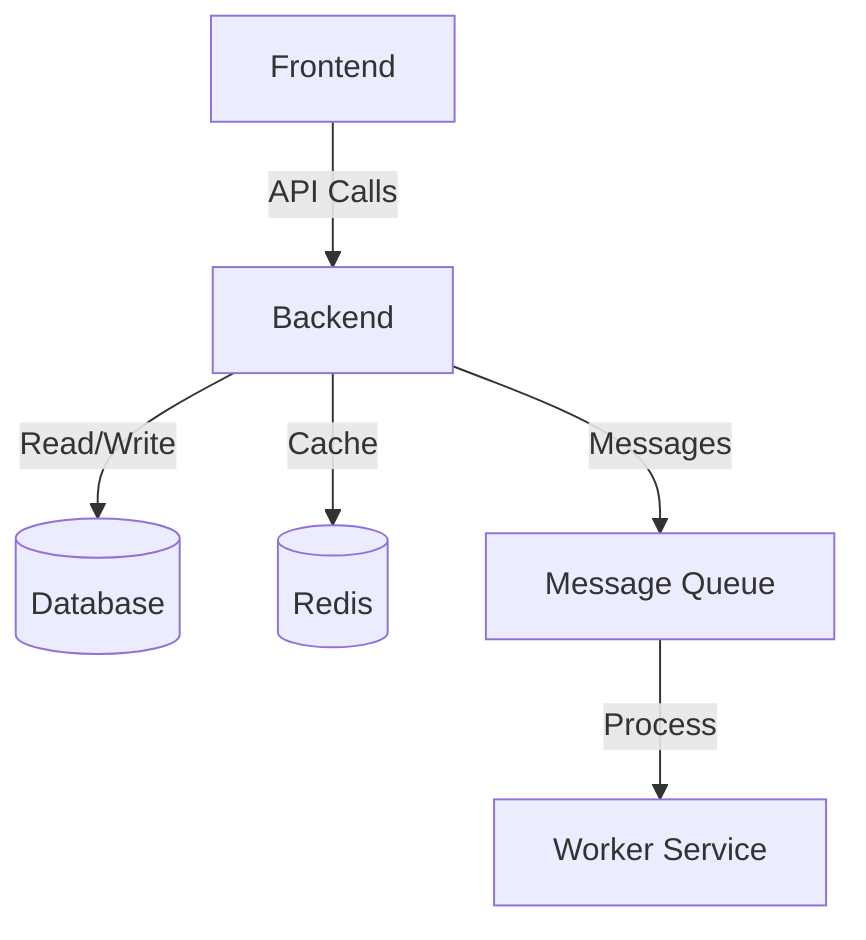
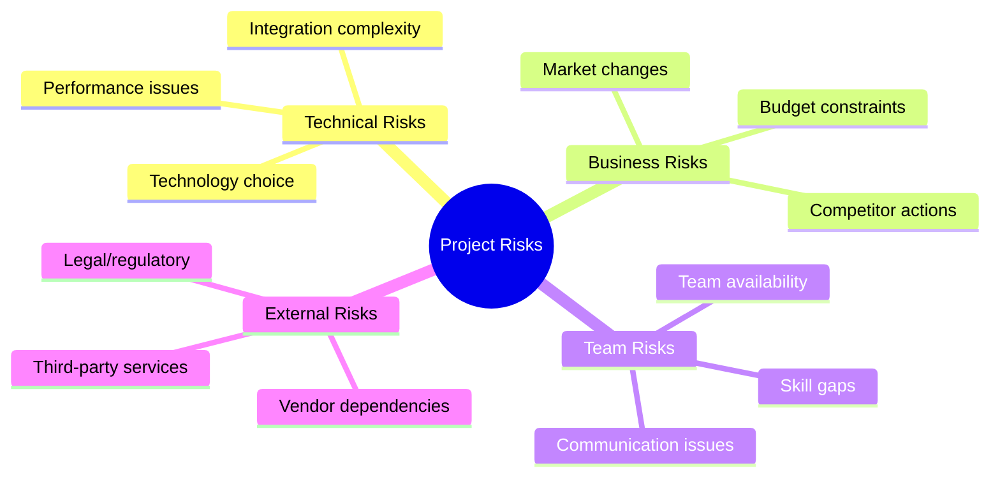
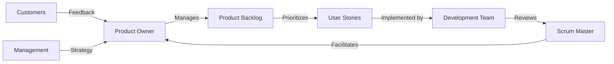

# Шаблон технического задания для Agile-проектов

> **Версия:** 1.0 | **Автор:** Виталий Пиков | **МАСКОМ**
> **Дата:** Июнь 2026

---

## 🚀 Agile Technical Specification

**Product Name:** [Название продукта]

**Product Owner:** [ФИО]

**Scrum Master:** [ФИО]

**Development Team:** [Список участников]

**Date:** [ДД.ММ.ГГГГ]

---

## 1. Product Vision

### 1.1 Vision Statement

> **As a** [целевая аудитория]
> **We want to** [что мы хотим достичь]
> **So that** [какую ценность это принесет]

**Example:**
> As a modern enterprise
> We want to create an intelligent document management system
> So that we can significantly improve team productivity and reduce document processing time

### 1.2 Elevator Pitch

```
For [целевая аудитория]
Who [имеет проблему]
The [название продукта] is a [категория продукта]
That [решает проблему]
Unlike [конкуренты], our product [уникальная ценность]
```

**Example:**
```
For small and medium businesses
Who struggle with document chaos and inefficient workflows
The DocFlow is a cloud-based document management system
That organizes all company documents in one place with intelligent search
Unlike traditional file servers, our product offers AI-powered classification and automatic workflows
```

---

## 2. Product Backlog

### 2.1 Epics

| ID | Epic Name | Description | Priority | Status |
|----|-----------|-------------|----------|--------|
| EP-001 | [Epic Name] | [Brief description] | High | To Do |
| EP-002 | [Epic Name] | [Brief description] | High | In Progress |
| EP-003 | [Epic Name] | [Brief description] | Medium | To Do |

### 2.2 User Stories

#### Epic: [Epic Name]

| ID | User Story | Acceptance Criteria | Priority | Estimate | Status |
|----|------------|---------------------|----------|----------|--------|
| US-001 | As a [role], I want to [action] so that [benefit] | - [Criteria 1]\n- [Criteria 2] | High | [Story Points] | To Do |
| US-002 | As a [role], I want to [action] so that [benefit] | - [Criteria 1]\n- [Criteria 2] | High | [Story Points] | In Progress |

### 2.3 Acceptance Criteria Template

**Given** [Initial context]
**When** [Event/Action]
**Then** [Expected outcome]

**Example:**
```
Given User is on the login page
When User enters valid email and password
And Clicks "Sign In" button
Then User is redirected to the dashboard
And Authentication token is created
And User sees welcome message
```

---

## 3. Release Plan

### 3.1 Release Goals

| Release | Date | Main Features | Business Value |
|---------|------|---------------|----------------|
| Release 1.0 | [ДД.ММ.ГГГГ] | MVP: Core functionality | Validate product hypothesis |
| Release 1.1 | [ДД.ММ.ГГГГ] | User management, Reporting | Expand user base |
| Release 2.0 | [ДД.ММ.ГГГГ] | Advanced features, Integrations | Increase revenue |

### 3.2 Sprint Plan

| Sprint | Dates | Goal | User Stories |
|--------|-------|------|--------------|
| Sprint 1 | [ДД.ММ.ГГГГ] - [ДД.ММ.ГГГГ] | [Sprint Goal] | US-001, US-002 |
| Sprint 2 | [ДД.ММ.ГГГГ] - [ДД.ММ.ГГГГ] | [Sprint Goal] | US-003, US-004 |

---

## 4. Definition of Done (DoD)

### 4.1 General DoD

- [ ] Code is written and reviewed
- [ ] All acceptance criteria are met
- [ ] Unit tests are written and passing
- [ ] Integration tests are passing
- [ ] Code is merged to main branch
- [ ] Documentation is updated
- [ ] Product Owner accepts the increment

### 4.2 Specific DoD by Type

**User Story DoD:**
- [ ] User story meets INVEST criteria
- [ ] Acceptance criteria are clear and testable
- [ ] Estimate is provided
- [ ] Dependencies are identified
- [ ] Story is prioritized

**Feature DoD:**
- [ ] All related user stories are completed
- [ ] Feature is tested end-to-end
- [ ] Performance requirements are met
- [ ] Security requirements are met
- [ ] Feature is documented

---

## 5. Technical Requirements

### 5.1 Architecture Overview



### 5.2 Technology Stack

**Frontend:**
- Framework: [React/Vue/Angular]
- State Management: [Redux/MobX/Zustand]
- Styling: [CSS Modules/Tailwind/Styled Components]
- Testing: [Jest/Cypress]

**Backend:**
- Language: [Node.js/Python/Java/Go]
- Framework: [Express/NestJS/Django/Spring]
- Database: [PostgreSQL/MongoDB]
- Cache: [Redis/Memcached]

**Infrastructure:**
- Containerization: [Docker]
- Orchestration: [Kubernetes/Docker Compose]
- CI/CD: [GitHub Actions/GitLab CI]
- Monitoring: [Prometheus/Grafana]
- Logging: [ELK/Loki]

### 5.3 Non-Functional Requirements

| Category | Requirement | Value |
|----------|-------------|-------|
| Performance | API Response Time | ≤ 200ms (p95) |
| Performance | Page Load Time | ≤ 2s |
| Availability | Uptime | 99.9% |
| Scalability | Concurrent Users | [X] users |
| Security | Authentication | JWT/OAuth 2.0 |
| Security | Data Encryption | AES-256 |

---

## 6. Team Information

### 6.1 Team Composition

| Role | Name | Responsibilities | Availability |
|------|------|-----------------|-------------|
| Product Owner | [Name] | Product vision, Prioritization | Full-time |
| Scrum Master | [Name] | Process facilitation, Team support | Full-time |
| Developer | [Name] | Frontend development | Full-time |
| Developer | [Name] | Backend development | Full-time |
| QA Engineer | [Name] | Testing, Quality assurance | Part-time |
| DevOps Engineer | [Name] | Infrastructure, Deployment | Part-time |

### 6.2 Working Agreements

**Sprint Length:** [1-4 weeks]

**Sprint Events:**
- **Sprint Planning:** [Duration] hours, [Day] at [Time]
- **Daily Scrum:** 15 minutes, every day at [Time]
- **Sprint Review:** [Duration] hours, last day of sprint at [Time]
- **Sprint Retrospective:** [Duration] hours, after sprint review at [Time]
- **Backlog Refinement:** [Frequency] at [Time]

**Definition of Ready (DoR):**
- [ ] User story is clear and understandable
- [ ] Acceptance criteria are defined
- [ ] Dependencies are identified and resolved
- [ ] Story is estimated
- [ ] Story has business value

---

## 7. Risk Management

### 7.1 Risk Register

| ID | Risk | Probability | Impact | Mitigation Strategy | Owner |
|----|------|-------------|--------|---------------------|-------|
| R-001 | [Risk Description] | High/Medium/Low | High/Medium/Low | [Mitigation actions] | [Owner] |
| R-002 | [Risk Description] | High/Medium/Low | High/Medium/Low | [Mitigation actions] | [Owner] |

### 7.2 Risk Categories



---

## 8. Metrics and KPIs

### 8.1 Product Metrics

| Metric | Target | Current | Measurement |
|--------|--------|---------|-------------|
| Velocity | [Story Points/sprint] | [Current] | Average over last 3 sprints |
| Burn-down Rate | [Points/day] | [Current] | Daily measurement |
| Defect Rate | ≤ [X]% | [Current] | % of stories with defects |
| Deployment Frequency | [X] times/month | [Current] | Count of deployments |

### 8.2 Business Metrics

| Metric | Target | Current | Measurement |
|--------|--------|---------|-------------|
| User Growth | [X] users/month | [Current] | Monthly active users |
| Retention Rate | [X]% | [Current] | 30-day retention |
| Conversion Rate | [X]% | [Current] | % of visitors who convert |
| Revenue | [X] ₽/month | [Current] | Monthly recurring revenue |

---

## 9. Stakeholders

### 9.1 Stakeholder Map



### 9.2 Stakeholder Register

| Name | Role | Interest | Influence | Communication |
|------|------|----------|----------|---------------|
| [Name] | [Role] | [Interest] | High/Medium/Low | [Communication method] |

---

## 10. Documentation Standards

### 10.1 User Story Format

```
Type: [Feature/Bug/Technical Debt]
Title: [Brief description]

As a [role]
I want to [action]
So that [benefit]

Acceptance Criteria:
- [Criteria 1]
- [Criteria 2]

Notes:
[Additional information]

Dependencies:
- [Dependency 1]
- [Dependency 2]

Estimate: [Story Points]
Priority: [High/Medium/Low]
```

### 10.2 Definition of Ready Checklist

**User Story:**
- [ ] Clear and concise title
- [ ] Well-defined "As a... I want... So that..." format
- [ ] Clear acceptance criteria
- [ ] Business value is defined
- [ ] Dependencies are identified
- [ ] Estimated by the team
- [ ] Accepted by Product Owner

---

## 11. Appendix

### 11.1 Glossary

| Term | Definition |
|------|------------|
| [Term] | [Definition] |

### 11.2 References

| # | Title | Author | Date |
|---|-------|--------|------|
| 1 | [Reference] | [Author] | [Date] |

---

**Approvals:**

**Product Owner:** ________________ / [Name] / [Date]

**Scrum Master:** ________________ / [Name] / [Date]

**Development Team:** ________________ / [Representative Name] / [Date]

---

**© [Year] [Organization Name]. All rights reserved.**
*This is a living document and will be updated throughout the project.*
