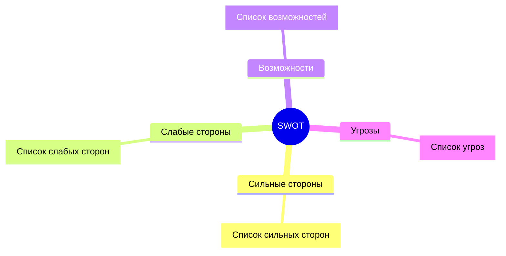
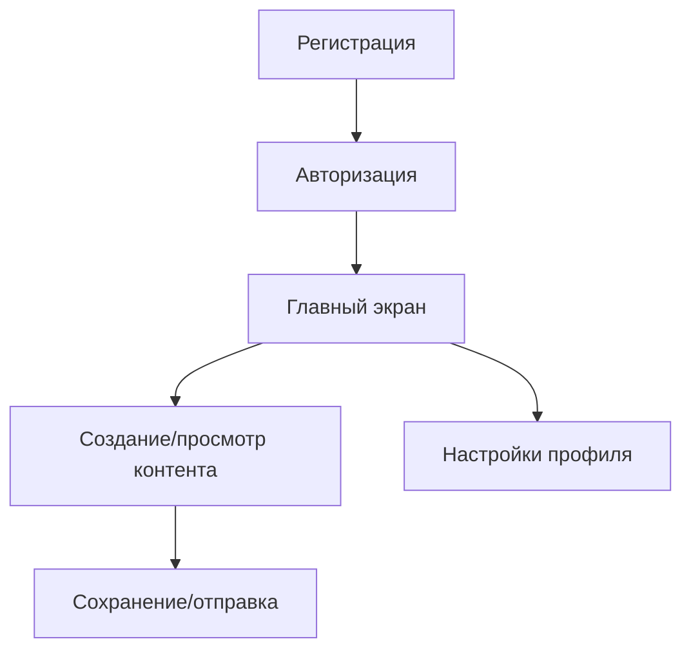
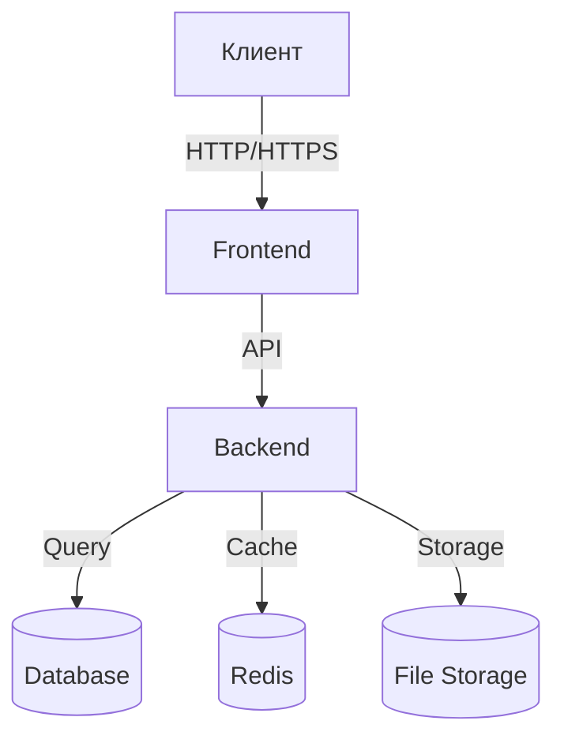

# Шаблон технического задания для MVP

> **Версия:** 1.0 | **На основе Урока 3** | **Автор:** Виталий Пиков | **МАСКОМ**
> **Дата:** Июнь 2026

---

## 🚀 Техническое задание на разработку MVP

**Название проекта:** [Название MVP]

**Тип проекта:**
- [ ] Starup
- [ ] Новый продукт
- [ ] Доработка существующего продукта
- [ ] Пилотный проект

**Целевая аудитория:** [Описание целевой аудитории]

---

## 1. Описание продукта

### 1.1 Концепция MVP

> **📌 Определение MVP:** *Minimum Viable Product (Минимально жизнеспособный продукт) — это версия продукта с минимальным набором функций, достаточным для запуска на рынок и получения обратной связи от пользователей.*

**Цель MVP:**
- ✅ Проверить гипотезу продукта
- ✅ Получить первую обратную связь
- ✅ Привлекть первых пользователей
- ✅ Оценить рынок и спрос

### 1.2 Проблема и решение

**Проблема:**
> [Описание проблемы, которую решает продукт]

**Решение:**
> [Описание, как продукт решает эту проблему]

### 1.3 Уникальное торговое предложение (УТП)

> [Чем продукт отличается от конкурентов? Какую уникальную ценность предлагает?]

---

## 2. Анализ рынка

### 2.1 Целевая аудитория

| Сегмент | Описание | Размер сегмента | Потенциальный доход |
|---------|----------|------------------|---------------------|
| [Сегмент 1] | [Описание] | [Количество пользователей] | [Оценка дохода] |
| [Сегмент 2] | [Описание] | [Количество пользователей] | [Оценка дохода] |

### 2.2 Конкурентный анализ

| Конкурент | Продукт | Сильные стороны | Слабые стороны | Наше преимущество |
|-----------|----------|-----------------|-----------------|-----------------|
| [Конкурент 1] | [Продукт] | [+] | [-] | [Наше преимущество] |
| [Конкурент 2] | [Продукт] | [+] | [-] | [Наше преимущество] |

### 2.3 SWOT-анализ



---

## 3. Функциональные требования

### 3.1 Core Features (Основные функции)

> **💡 Правило:** MVP должен содержать только те функции, без которых продукт не может существовать.

| ID | Функция | Описание | Приоритет | Сложность |
|----|---------|----------|-----------|-----------|
| F-MVP-001 | [Название] | [Описание функции] | Высокий | Высокая |
| F-MVP-002 | [Название] | [Описание функции] | Высокий | Средняя |
| F-MVP-003 | [Название] | [Описание функции] | Высокий | Средняя |
| F-MVP-004 | [Название] | [Описание функции] | Средний | Низкая |

### 3.2 User Flow (Пользовательский путь)



### 3.3 Исключенные функции (Nice-to-have)

> **📌 Важно:** Эти функции не включены в MVP, но могут быть реализованы в последующих версиях.

| ID | Функция | Описание | Причина исключения |
|----|---------|----------|-------------------|
| F-NTH-001 | [Название] | [Описание] | Не критична для MVP |
| F-NTH-002 | [Название] | [Описание] | Высокая сложность |

---

## 4. Нефункциональные требования

### 4.1 Производительность

| Параметр | Значение | Примечания |
|----------|----------|------------|
| Время загрузки приложения | ≤ 3 с |Cold start |
| Время отклика API | ≤ 500 мс |p95 |
| Максимальная нагрузка | [X] пользователей |Оодновременно |

### 4.2 Надежность

- **Доступность:** 99.5% (допустимо для MVP)
- **Время восстановления:** ≤ 1 час
- **Резервное копирование:** Ежедневно

### 4.3 Удобство использования

- [ ] Интуитивно понятный интерфейс
- [ ] Адаптивный дизайн (мобильные устройства)
- [ ] Базовая валидация форм
- [ ] Понятные сообщения об ошибках

---

## 5. Технические требования

### 5.1 Технологический стек

**Frontend:**
- Фреймворк: [React/Vue.js/Angular]
- State Management: [Redux/Zustand/Pinia]
- Стилизация: [CSS Modules/Tailwind/Styled Components]

**Backend:**
- Язык: [Node.js/Python/Java/Go]
- Фреймворк: [Express/FastAPI/Spring Boot]
- База данных: [PostgreSQL/MongoDB/Firebase]

**Infrastructure:**
- Хостинг: [AWS/GCP/Heroku/Vercel]
- База данных: [Управляемая/Самостоятельная]
- CI/CD: [GitHub Actions/GitLab CI]

### 5.2 Архитектура



---

## 6. Команда проекта

### 6.1 Роли и ответственность

| Роль | ФИО | Ответственность | Вовлеченность |
|------|-----|----------------|---------------|
| Product Owner | [ФИО] | Формулировка требований, приоритизация | Полная |
| Tech Lead | [ФИО] | Техническое руководство, архитектура | Полная |
| Backend Developer | [ФИО] | Разработка серверной части | Полная |
| Frontend Developer | [ФИО] | Разработка клиентской части | Полная |
| Designer | [ФИО] | Дизайн интерфейса | Частичная |
| QA Engineer | [ФИО] | Тестирование | Частичная |

### 6.2 Коммуникации

| Вид коммуникации | Частота | Участники |
|------------------|---------|------------|
| Ежедневный stand-up | Ежедневно | Вся команда |
| Планирование спринта | 1 раз в 2 недели | Вся команда |
| Ретроспектива | 1 раз в 2 недели | Вся команда |
| Демонстрация результатов | 1 раз в 2 недели | Заказчик + команда |

---

## 7. Сроки и бюджет

### 7.1 Временной план

| Этап | Сроки | Продолжительность |
|------|-------|-----------------|
| Сбор требований | [ДД.ММ.ГГГГ] - [ДД.ММ.ГГГГ] | [X] недель |
| Проектирование | [ДД.ММ.ГГГГ] - [ДД.ММ.ГГГГ] | [X] недель |
| Разработка | [ДД.ММ.ГГГГ] - [ДД.ММ.ГГГГ] | [X] недель |
| Тестирование | [ДД.ММ.ГГГГ] - [ДД.ММ.ГГГГ] | [X] недель |
| Запуск | [ДД.ММ.ГГГГ] | 1 день |

**Итоговый срок:** [X] месяцев

### 7.2 Бюджет

| Категория | Сумма (₽) | Примечания |
|-----------|-----------|------------|
| Разработка | [Сумма] | Включает backend, frontend |
| Дизайн | [Сумма] | UI/UX дизайн |
| Инфраструктура | [Сумма] | Хостинг, домен, сервисы |
| Тестирование | [Сумма] | Ручное и автоматическое |
| Управление проектом | [Сумма] | 10-15% от бюджета |
| **ИТОГО** | **[Сумма]** | |

---

## 8. Критерии успеха MVP

### 8.1 Метрики успеха

| Метрика | Целевое значение | Срок достижения |
|---------|------------------|-----------------|
| Количество пользователей | [X] пользователей | [X] месяцев |
| Коэффициент конверсии | [X]% | [X] месяцев |
| Retention Rate (1 месяц) | [X]% | [X] месяцев |
| NPS (Net Promoter Score) | [X] | [X] месяцев |
| Доход | [X] ₽/месяц | [X] месяцев |

### 8.2 Критерии приемки

- [ ] MVP запущен и доступен пользователям
- [ ] Все core functions реализованы
- [ ] Система работает без критических ошибок
- [ ] Пользователи могут выполнить основные сценарии
- [ ] Получена первая обратная связь

---

## 9. Риски и их минимизация

| Риск | Вероятность | Влияние | Меры минимизации |
|------|-------------|---------|------------------|
| [Описание риска] | Высокая/Средняя/Низкая | Высокое/Среднее/Низкое | [Меры] |
| [Описание риска] | Высокая/Средняя/Низкая | Высокое/Среднее/Низкое | [Меры] |

---

## 10. Следующие шаги после MVP

### 10.1 Roadmap

| Версия | Планируемые функции | Сроки |
|--------|---------------------|-------|
| MVP | [Список функций] | [ДД.ММ.ГГГГ] |
| v1.1 | [Список функций] | [ДД.ММ.ГГГГ] |
| v1.2 | [Список функций] | [ДД.ММ.ГГГГ] |
| v2.0 | [Список функций] | [ДД.ММ.ГГГГ] |

### 10.2 План масштабирования

- **Техническое масштабирование:** Увеличение мощностей серверов
- **Функциональное масштабирование:** Добавление новых функций
- **Географическое масштабирование:** Выход на новые рынки
- **Командное масштабирование:** Расширение команды

---

## 11. Приложения

### 11.1 User Stories

```
Как [роль]
Я хочу [действие]
Чтобы [результат/цель]
```

**Примеры:**
```
Как неавторизованный пользователь
Я хочу зарегистрироваться в системе
Чтобы получить доступ к функционалу приложения

Как авторизованный пользователь
Я хочу создать новый проект
Чтобы начать работу с продуктами
```

### 11.2 Прототипы

[Ссылки на прототипы интерфейсов в Figma/Adobe XD/Других инструментах]

---

## 12. Подписи

**Product Owner:** ________________ / [ФИО] / [Дата]

**Tech Lead:** ________________ / [ФИО] / [Дата]

**Заказчик:** ________________ / [ФИО] / [Дата]

---

**© [Год] [Название организации]. Все права защищены.**
*Документ является конфиденциальным.*
