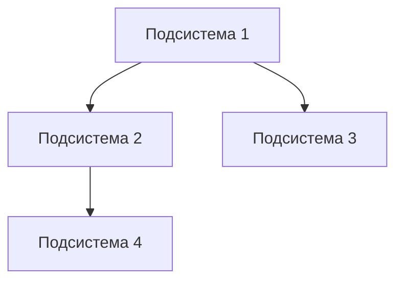
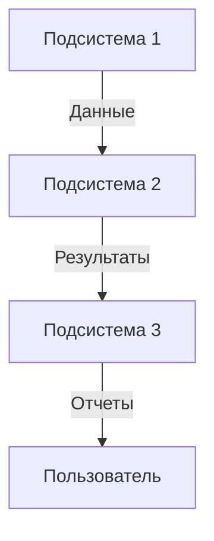

# Шаблон технического задания на создание автоматизированной системы

> **Версия:** 1.0 | **Автор:** Виталий Пиков | **МАСКОМ**
> **Дата:** Июнь 2026
> **Соответствует:** ГОСТ 34.602-2020 "Информационные технологии. Комплекс стандартов на автоматизированные системы. Техническое задание на создание автоматизированной системы"

---

## Форма титульного листа

```
================================================================================
                    УТВЕРЖДАЮ
                    [Должность]
                    ________________ [ФИО]
                    [Дата]

================================================================================

                    ТЕХНИЧЕСКОЕ ЗАДАНИЕ
            на создание автоматизированной системы
                    [Наименование системы]

================================================================================

    Литера: [литера]
    Инв. №: [инвентарный номер]

================================================================================

    СОГЛАСОВАНО:

    Заказчик:                                   Исполнитель:
    [Должность]                                 [Должность]
    ________________ [ФИО]                     ________________ [ФИО]
    [Дата]                                      [Дата]

================================================================================
```

---

## 1. Общие сведения

### 1.1 Полное наименование системы

**Полное наименование:** [Полное наименование автоматизированной системы]

**Краткое наименование:** [Аббревиатура или краткое наименование]

### 1.2 Условное обозначение системы

**Условное обозначение:** [Обозначение согласно документации]

### 1.3 Шифр темы или шифр заказа

**Шифр:** [Шифр темы или заказа]

---

## 2. Основание для создания системы

### 2.1 Документ, на основании которого ведется разработка

| № | Наименование документа | Дата | Номер |
|---|------------------------|------|-------|
| 1 | [Наименование] | [ДД.ММ.ГГГГ] | [Номер] |

### 2.2 Организация, утвердившая документ

**Организация:** [Наименование]

**Дата утверждения:** [ДД.ММ.ГГГГ]

---

## 3. Назначение системы

### 3.1 Цель создания системы

> [Описание цели создания автоматизированной системы]

### 3.2 Назначение системы

> [Описание, для каких задач и в каких областях будет использоваться система]

---

## 4. Характеристика объектов автоматизации

### 4.1 Краткие сведения об объекте автоматизации

> [Описание объекта автоматизации: организация, процесс, система и т.д.]

### 4.2 Сведения об условиях эксплуатации

**Климатические условия:**
- Температура: [Диапазон температур]
- Влажность: [Диапазон влажности]
- Другие условия: [Описание]

**Электромагнитная обстановка:**
- [Описание электромагнитной обстановки]

---

## 5. Требования к системе

### 5.1 Требования к системе в целом

#### 5.1.1 Требования к структуре и функционированию системы

**Структура системы:**


**Функциональные требования:**
| № | Функция | Описание |
|---|---------|----------|
| 1 | [Наименование] | [Описание] |

#### 5.1.2 Требования к числу уровней иерархии и степеней централизации системы

- **Число уровней иерархии:** [Количество]
- **Степень централизации:** [Описание]

#### 5.1.3 Требования к способам информационного обмена

| Тип обмена | Описание | Протокол |
|------------|----------|----------|
| [Тип] | [Описание] | [Протокол] |

#### 5.1.4 Требования к режимам функционирования

- **Режим реального времени:** [Да/Нет]
- **Режим пакетной обработки:** [Да/Нет]
- **Режим диалоговый:** [Да/Нет]

#### 5.1.5 Требования по диагностированию

- [ ] Автоматическое диагностирование
- [ ] Ручное диагностирование
- [ ] Логирование ошибок

#### 5.1.6 Перспективы развития системы

> [Описание возможных направлений развития системы в будущем]

---

### 5.2 Требования к функциям (задачам), выполняемым системой

#### 5.2.1 Перечень подсистем, их назначение и основные функции

| № | Подсистема | Назначение | Основные функции |
|---|------------|------------|-----------------|
| 1 | [Наименование] | [Назначение] | [Функции] |

#### 5.2.2 Перечень функциональных задач

| № | Задача | Описание | Периодичность |
|---|--------|----------|--------------|
| 1 | [Наименование] | [Описание] | [Периодичность] |

---

### 5.3 Требования к видам обеспечения

#### 5.3.1 Требования к информационному обеспечению

**Состав информации:**
- Входная информация: [Описание]
- Выходная информация: [Описание]
- Нормативно-справочная информация: [Описание]

#### 5.3.2 Требования к лингвистическому обеспечению

- **Языки программирования:** [Перечислить]
- **Языки общения:** [Русский/Английский/Другие]
- **Коды и классификаторы:** [Перечислить]

#### 5.3.3 Требования к математическому обеспечению

- **Методы и модели:** [Описание]
- **Алгоритмы:** [Описание]

#### 5.3.4 Требования к программному обеспечению

| № | Вид ПО | Назначение | Требования |
|---|--------|------------|-------------|
| 1 | [Вид] | [Назначение] | [Требования] |

#### 5.3.5 Требования к техническому обеспечению

| № | Вид ТО | Назначение | Характеристики |
|---|--------|------------|----------------|
| 1 | [Вид] | [Назначение] | [Характеристики] |

#### 5.3.6 Требования к организационному обеспечению

- **Структура организации:** [Описание]
- **Регламенты и инструкции:** [Описание]

#### 5.3.7 Требования к метрологическому обеспечению

- **Средства измерения:** [Описание]
- **Методики измерения:** [Описание]

---

## 6. Состав и содержание работ по созданию системы

### 6.1 стадии и этапы создания

| № | Стадия | Этап | Сроки |
|---|--------|------|-------|
| 1 | Формирование требований | Обследование объекта | [ДД.ММ.ГГГГ] |
| 2 | Проектирование | Разработка концепции | [ДД.ММ.ГГГГ] |

### 6.2 Перечень организаций - участников работ

| № | Организация | Роль | Ответственный |
|---|-------------|------|---------------|
| 1 | [Наименование] | [Роль] | [ФИО] |

### 6.3 Формы и методы контроля выполнения работ

- **Формы контроля:** [Перечислить]
- **Методы контроля:** [Перечислить]

---

## 7. Порядок контроля и приемки системы

### 7.1 Виды, composition и объем испытаний

| Вид испытаний | Состав | Объем |
|---------------|--------|-------|
| Предварительные | [Состав] | [Объем] |
| Приемочные | [Состав] | [Объем] |

### 7.2 Общие требования к приемке работ

- [ ] Соответствие требованиям ТЗ
- [ ] Наличие полной документации
- [ ] Успешное прохождение испытаний
- [ ] Подписание акта приемки

---

## 8. Требования к составу и содержанию работ по подготовке объекта автоматизации к вводу системы в действие

### 8.1 Преобразование входной информации

- [ ] Конвертация данных
- [ ] Миграция данных
- [ ] Очистка данных

### 8.2 Создание условий функционирования

- [ ] Подготовка инфраструктуры
- [ ] Обучение персонала
- [ ] Создание эксплутационной документации

### 8.3 Обеспечение элементами систем

- [ ] Поставка оборудования
- [ ] Установка программного обеспечения
- [ ] Настройка системы

---

## 9. Требования к документации

### 9.1 Перечень разрабатываемой документации

| № | Наименование документа | Литера | Примечания |
|---|------------------------|-------|------------|
| 1 | Техническое задание | ТЗ | — |
| 2 | Технический проект | ТП | — |
| 3 | Рабочая документация | РД | — |

### 9.2 Порядок согласования и утверждения документации

- **Согласование:** [Описание процесса]
- **Утверждение:** [Описание процесса]

---

## 10. Источники разработки

| № | Источник | Наименование | Дата |
|---|----------|--------------|------|
| 1 | [Тип] | [Наименование] | [ДД.ММ.ГГГГ] |

---

## Приложения

### Приложение А. Схема системы



### Приложение Б. Глоссарий терминов

| Термин | Определение |
|-------|-------------|
| [Термин] | [Определение] |

---

## Подписи

**Заказчик:**

|
|------------------------
| [ФИО]
| [Должность]
| [Дата]

**Исполнитель:**

|
|------------------------
| [ФИО]
| [Должность]
| [Дата]

---

**© [Год] [Название организации]. Все права защищены.**
*Документ разработан в соответствии с ГОСТ 34.602-2020.*
