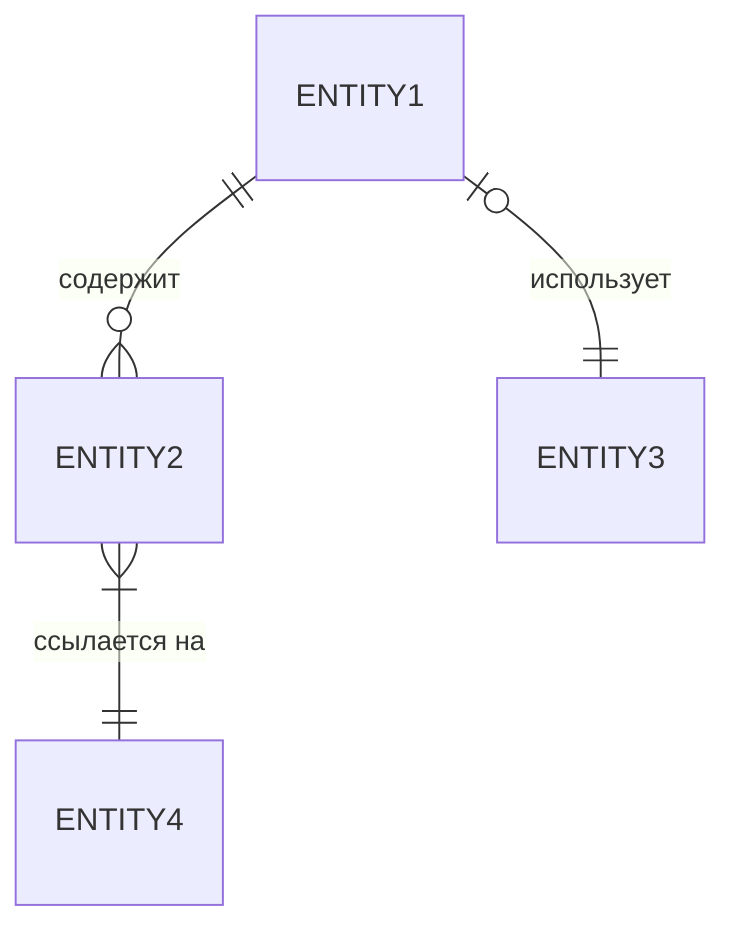
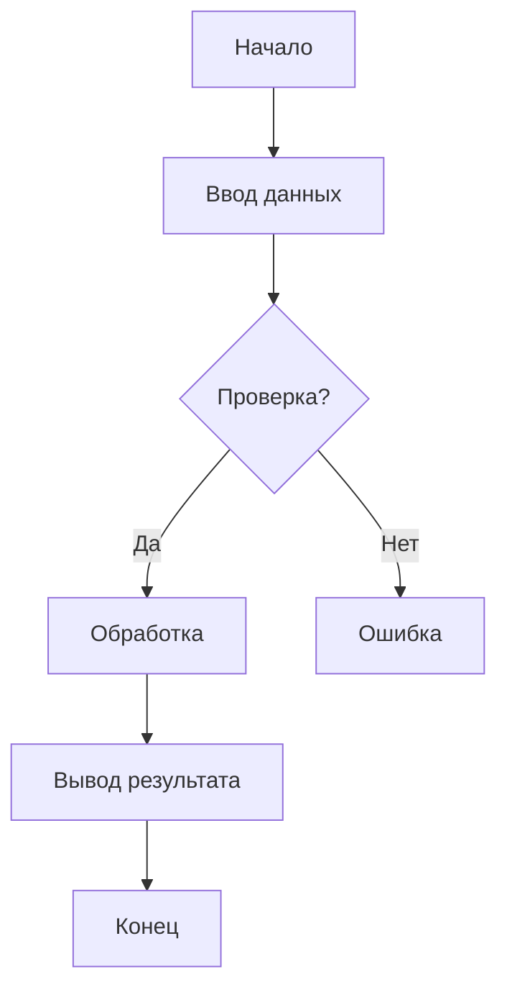

# Шаблон технического задания по ГОСТ 19.201-78

> **Версия:** 1.0 | **Автор:** Виталий Пиков | **МАСКОМ**
> **Дата:** Июнь 2026
> **Соответствует:** ГОСТ 19.201-78 "Единая система программной документации. Техническое задание"

---

## Форма титульного листа

```
================================================================================
                    [Полное наименование организации]
                         [Наименование министерства/ведомства]

================================================================================

                    ТЕХНИЧЕСКОЕ ЗАДАНИЕ

        на [наименование программы или программного изделия]

================================================================================

    Литера: [литера документа, если есть]
    Инв. №: [инвентарный номер]

================================================================================

    Согласовано:                              Утверждаю:
    [должность]                               [должность]
    ____________                              ____________
    [ФИО]                                     [ФИО]
    [дата]                                    [дата]

================================================================================
```

---

## 1. Введение

### 1.1 Наименование программы

**Полное наименование:** [Полное наименование программы]

**Краткое наименование:** [Краткое наименование/аббревиатура]

### 1.2 Перечень документов, на основании которых ведется разработка

| № | Наименование документа | Дата | Номер |
|---|------------------------|------|-------|
| 1 | [Наименование] | [ДД.ММ.ГГГГ] | [Номер] |
| 2 | [Наименование] | [ДД.ММ.ГГГГ] | [Номер] |

### 1.3 Перечень организаций, участвующих в разработке

**Заказчик:**
- [Наименование организации]
- [Адрес]
- [Контактное лицо]

**Исполнитель:**
- [Наименование организации]
- [Адрес]
- [Контактное лицо]

---

## 2. Назначение и цели

### 2.1 Назначение программы

> [Описание назначения программы, для решения каких задач она создается]

### 2.2 Цели создания программы

| № | Цель | Описание |
|---|------|----------|
| 1 | [Цель 1] | [Описание] |
| 2 | [Цель 2] | [Описание] |

---

## 3. Характеристика объекта

### 3.1 Общее описание объекта

> [Подробное описание объекта автоматизации или области применения программы]

### 3.2 Характеристика среды эксплуатации

**Аппаратное обеспечение:**
- Тип ЭВМ: [Указать]
- Минимальные требования:
  - Процессор: [Тип и тактовая частота]
  - ОЗУ: [Объем]
  - Жесткий диск: [Объем и тип]
  -турительные устройства: [Перечислить]

**Программное обеспечение:**
- Операционная система: [Наименование и версия]
- СУБД: [Наименование и версия]
- Дополнительное ПО: [Перечислить]

---

## 4. Требования к программе

### 4.1 Требования к функциональным характеристикам

#### 4.1.1 Состав выполняемых функций

| № | Функция | Описание | Приоритет |
|---|---------|----------|-----------|
| 1 | [Наименование] | [Описание] | Высокий |
| 2 | [Наименование] | [Описание] | Средний |

#### 4.1.2 Организация входных и выходных данных

**Входные данные:**
| № | Наименование | Формат | Источник |
|---|--------------|--------|----------|
| 1 | [Наименование] | [Формат] | [Источник] |

**Выходные данные:**
| № | Наименование | Формат | Потребитель |
|---|--------------|--------|------------|
| 1 | [Наименование] | [Формат] | [Потребитель] |

#### 4.1.3 Временные характеристики

| № | Операция | Время выполнения | Примечания |
|---|----------|-------------------|------------|
| 1 | [Операция] | ≤ [значение] | [Примечания] |

---

### 4.2 Требования к надежности

#### 4.2.1 Требования к обеспечению надежного функционирования

- **Среднее время наработки на отказ:** ≥ [X] часов
- **Вероятность безотказной работы:** ≥ [X]%
- **Среднее время восстановления:** ≤ [X] минут

#### 4.2.2 Контроль входной и выходной информации

- [ ] Контроль формата данных
- [ ] Контроль диапазона значений
- [ ] Логирование ошибок

---

### 4.3 Требования к Composition и структуре данных

#### 4.3.1 Информационная модель



#### 4.3.2 Перечень информационных объектов

| № | Наименование | Описание | Структура |
|---|--------------|----------|-----------|
| 1 | [Наименование] | [Описание] | [Структура] |

---

### 4.4 Требования к интерфейсу

#### 4.4.1 Интерфейс с пользователем

- **Тип интерфейса:** [Командный/меню/графический/веб]
- **Язык интерфейса:** [Русский/Английский/Другие]
- **Требования к эргономике:** [Описание]

#### 4.4.2 Интерфейс с другим программным обеспечением

| № | Наименование | Тип интерфейса | Назначение |
|---|--------------|----------------|------------|
| 1 | [Наименование] | [API/SDK/Другое] | [Назначение] |

---

### 4.5 Требования к программным и техническим средствам

#### 4.5.1 Требования к программным средствам

| № | Наименование | Версия | Назначение |
|---|--------------|--------|------------|
| 1 | [Операционная система] | [Версия] | [Назначение] |
| 2 | [СУБД] | [Версия] | [Назначение] |

#### 4.5.2 Требования к техническим средствам

| № | Наименование | Характеристики | Количество |
|---|--------------|----------------|------------|
| 1 | [Сервер] | [Характеристики] | [Количество] |

---

## 5. Требования к программной документации

### 5.1 Состав документации

| № | Наименование документа | Тип | Примечания |
|---|------------------------|-----|------------|
| 1 | Техническое задание | Документация | — |
| 2 | Пояснительная записка | Документация | — |
| 3 | Программа и методика испытаний | Документация | — |
| 4 | Руководство оператора | Эксплуатационная | — |
| 5 | Руководство программиста | Эксплуатационная | — |

### 5.2 Требования к оформлению

- **Формат:** [PEK/Markdown/Другое]
- **Шрифт:** [Тип и размер]
- **Стиль оформления:** [Согласно ГОСТ/Корпоративный]

---

## 6. Технико-экономические показатели

| Показатель | Значение | Примечания |
|-----------|----------|------------|
| Трудоемкость разработки | [Человеко-часы] | — |
| Срок разработки | [Месяцы] | — |
| Стоимость разработки | [Сумма] | — |

---

## 7. Стадии и этапы разработки

### 7.1 Стадии разработки

| № | Стадия | Сроки | Исполнитель |
|---|--------|-------|-------------|
| 1 | Техническое предложение | [ДД.ММ.ГГГГ] | [Исполнитель] |
| 2 | Эскизный проект | [ДД.ММ.ГГГГ] | [Исполнитель] |
| 3 | Технический проект | [ДД.ММ.ГГГГ] | [Исполнитель] |
| 4 | Рабочая документация | [ДД.ММ.ГГГГ] | [Исполнитель] |

### 7.2 Этапы разработки

| № | Этап | Сроки | Ответственный |
|---|------|-------|---------------|
| 1 | Анализ требований | [ДД.ММ.ГГГГ] | [ФИО] |
| 2 | Проектирование | [ДД.ММ.ГГГГ] | [ФИО] |
| 3 | Программирование | [ДД.ММ.ГГГГ] | [ФИО] |
| 4 | Тестирование | [ДД.ММ.ГГГГ] | [ФИО] |

---

## 8. Порядок контроля и приемки

### 8.1 Виды испытаний

| Вид испытаний | цель | Методика |
|---------------|------|----------|
| Предварительные | Проверка работоспособности | [Описание] |
| Приемочные | Подтверждение соответствия ТЗ | [Описание] |

### 8.2 Критерии приемки

- [ ] Соответствие всем требованиям ТЗ
- [ ] Отсутствие критических ошибок
- [ ] Наличие полной документации
- [ ] Успешное прохождение всех испытаний

---

## 9. Приложения

### 9.1 Технико-экономическое обоснование

> [Текст обоснования]

### 9.2 Схема алгоритма



---

## 10. Подписи

**Заказчик:**

|
|------------------------
| [ФИО]
| [Должность]
| [Дата]

**Исполнитель:**

|
|------------------------
| [ФИО]
| [Должность]
| [Дата]

---

**© [Год] [Название организации]. Все права защищены.**
*Документ разработан в соответствии с ГОСТ 19.201-78.*
