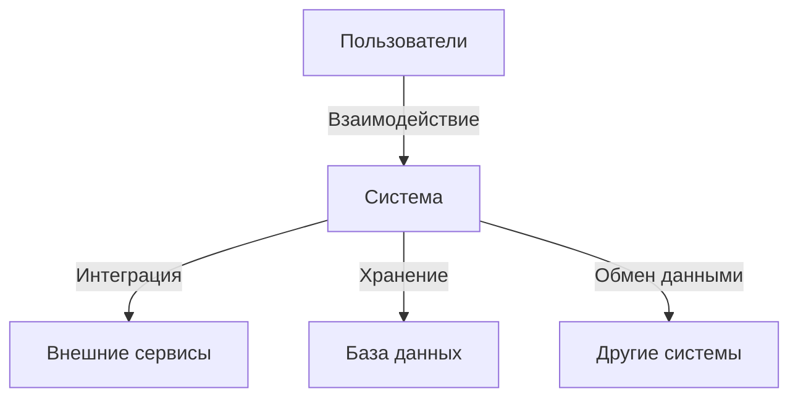
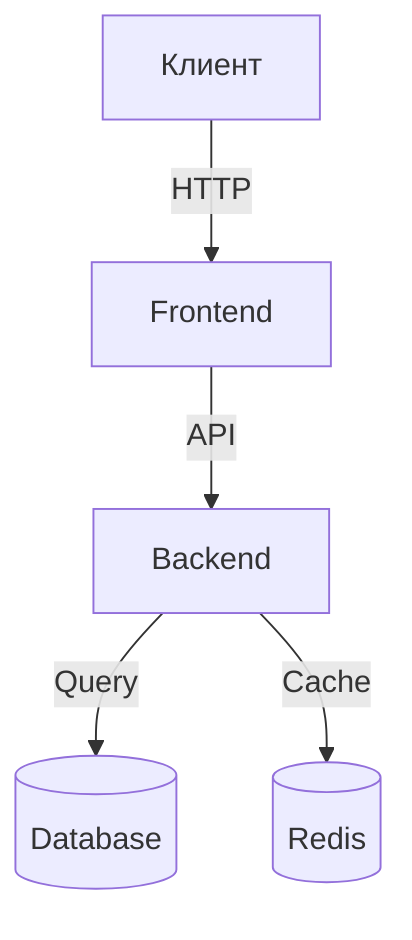

# Универсальный шаблон технического задания

> **Версия:** 1.0 | **Автор:** Виталий Пиков | **МАСКОМ**
> **Дата:** Июнь 2026

---

## 📄 Техническое задание

**Наименование проекта:** [Название проекта]

**Версия документа:** [Версия]

**Дата создания:** [ДД.ММ.ГГГГ]

**Дата последнего обновления:** [ДД.ММ.ГГГГ]

---

## 1. Введение

### 1.1 Наименование объекта

| Поле | Значение |
|------|----------|
| Полное наименование | [Полное название системы/проекта] |
| Краткое наименование | [Аббревиатура или краткое название] |
| Код проекта | [Код проекта, если есть] |

### 1.2 Основание для разработки

- **Договор/контракт:** № [номер] от [дата]
- **Распорядительный документ:** [Приказ/решение, номер и дата]
- **Инициатор проекта:** [ФИО, должность, организация]

### 1.3 Заказчик и Исполнитель

#### Заказчик

| Организация | [Название организации] |
|------------|------------------------|
| Адрес | [Юридический и почтовый адрес] |
| Контактное лицо | [ФИО, должность] |
| Email | [email@zaim.com] |
| Телефон | [+7 (XXX) XXX-XX-XX] |

#### Исполнитель

| Организация | [Название организации] |
|------------|------------------------|
| Адрес | [Юридический и почтовый адрес] |
| Контактное лицо | [ФИО, должность] |
| Email | [email@ispolnit.com] |
| Телефон | [+7 (XXX) XXX-XX-XX] |

### 1.4 Сроки выполнения

| Этап | Дата начала | Дата окончания | Статус |
|------|-------------|---------------|--------|
| Разработка ТЗ | [ДД.ММ.ГГГГ] | [ДД.ММ.ГГГГ] | ✅ |
| Согласование ТЗ | [ДД.ММ.ГГГГ] | [ДД.ММ.ГГГГ] | ⬜ |
| Проектирование | [ДД.ММ.ГГГГ] | [ДД.ММ.ГГГГ] | ⬜ |
| Разработка | [ДД.ММ.ГГГГ] | [ДД.ММ.ГГГГ] | ⬜ |
| Тестирование | [ДД.ММ.ГГГГ] | [ДД.ММ.ГГГГ] | ⬜ |
| Внедрение | [ДД.ММ.ГГГГ] | [ДД.ММ.ГГГГ] | ⬜ |

**Общий срок реализации проекта:** [Количество дней/месяцев]

---

## 2. Назначение и цели

### 2.1 Назначение объекта

> **📌 Описание:** [Краткое описание назначения системы, для чего она создается, какие проблемы решает]

**Ключевые задачи системы:**
- ✅ [Задача 1]
- ✅ [Задача 2]
- ✅ [Задача 3]
- ✅ [Задача 4]
- ✅ [Задача 5]

### 2.2 Цели создания

| № | Цель | Критерии достижения | Срок |
|---|------|---------------------|------|
| 1 | [Цель 1] | [Как измерить достижение цели] | [ДД.ММ.ГГГГ] |
| 2 | [Цель 2] | [Как измерить достижение цели] | [ДД.ММ.ГГГГ] |
| 3 | [Цель 3] | [Как измерить достижение цели] | [ДД.ММ.ГГГГ] |

---

## 3. Характеристика объекта

### 3.1 Общее описание

> [Подробное описание системы: что это, для кого предназначено, в каких условиях будет эксплуатироваться]

**Тип системы:**
- [ ] Веб-приложение
- [ ] Мобильное приложение (iOS)
- [ ] Мобильное приложение (Android)
- [ ] Десктопное приложение
- [ ] Автоматизированная система (АС)
- [ ] Интеграционное решение
- [ ] Инфраструктурный проект
- [ ] Другое: [уточнить]

### 3.2 Контекст использования

**Акторы системы:**
| Актор | Описание | Роль |
|-------|----------|------|
| [Актор 1] | [Описание актора] | [Роль в системе] |
| [Актор 2] | [Описание актора] | [Роль в системе] |
| [Актор 3] | [Описание актора] | [Роль в системе] |

---

## 4. Требования

### 4.1 Функциональные требования (ФТ)

#### 4.1.1 Общие функциональные требования

| ID | Название | Описание | Приоритет | Статус |
|----|---------|----------|-----------|--------|
| FT-001 | [Название] | [Описание требования] | Высокий | ⬜ |
| FT-002 | [Название] | [Описание требования] | Высокий | ⬜ |
| FT-003 | [Название] | [Описание требования] | Средний | ⬜ |
| FT-004 | [Название] | [Описание требования] | Средний | ⬜ |
| FT-005 | [Название] | [Описание требования] | Низкий | ⬜ |

**Приоритеты:**
- **Высокий** — критическое требование, без которого система не может функционировать
- **Средний** — важное требование, но система может работать без него
- **Низкий** — желательное требование, может быть реализовано в последующих версиях

#### 4.1.2 Требования по модулям/подсистемам

##### Модуль 1: [Название модуля]

| ID | Название | Описание | Приоритет |
|----|---------|----------|-----------|
| FT-[M1]-001 | [Название] | [Описание] | Высокий |
| FT-[M1]-002 | [Название] | [Описание] | Высокий |
| FT-[M1]-003 | [Название] | [Описание] | Средний |

##### Модуль 2: [Название модуля]

| ID | Название | Описание | Приоритет |
|----|---------|----------|-----------|
| FT-[M2]-001 | [Название] | [Описание] | Высокий |
| FT-[M2]-002 | [Название] | [Описание] | Средний |

### 4.2 Нефункциональные требования (НФТ)

#### 4.2.1 Производительность

| Параметр | Значение | Примечания |
|----------|----------|------------|
| Время отклика (API) | ≤ [X] мс | p95 |
| Время загрузки страницы | ≤ [X] с | First Contentful Paint |
| Максимальная нагрузка | [X] запросов/с | Пиковая нагрузка |
| Одновременные пользователи | [X] пользователей | -

#### 4.2.2 Надежность

| Параметр | Значение | Примечания |
|----------|----------|------------|
| Доступность (Availability) | [X]% | 99.9% рекомендуется |
| Время восстановления | ≤ [X] минут | После сбоя |
| Частота бэкапов | [Ежедневно/еженедельно] | -
| Хранение бэкапов | [X] дней | -

#### 4.2.3 Удобство использования (Usability)

- [ ] Соответствие WCAG 2.1 (уровень AA)
- [ ] Адаптивный дизайн для всех устройств
- [ ] Поддержка клавиатурной навигации
- [ ] Единый стиль оформления (дизайн-система)
- [ ] Подсказки и тултипы для сложных элементов

#### 4.2.4 Масштабируемость

- [ ] Горизонтальное масштабирование (добавление серверов)
- [ ] Вертикальное масштабирование (увеличение ресурсов)
- [ ] Автоматическое масштабирование при пиковых нагрузках

#### 4.2.5 Совместимость

**Браузеры:**
- [ ] Google Chrome (последние [X] версии)
- [ ] Mozilla Firefox (последние [X] версии)
- [ ] Safari (последние [X] версии)
- [ ] Microsoft Edge (последние [X] версии)

**Устройства:**
- [ ] Десктопы
- [ ] Планшеты
- [ ] Смартфоны

**Операционные системы:**
- [ ] Windows
- [ ] macOS
- [ ] Linux
- [ ] iOS
- [ ] Android

### 4.3 Технические требования

#### 4.3.1 Технологический стек

**Backend:**
- Язык: [Указать язык]
- Фреймворк: [Указать фреймворк]
- База данных: [Указать БД]
- Кэш: [Указать систему кэширования]

**Frontend:**
- Фреймворк: [Указать фреймворк]
- State Management: [Указать]
- Стилизация: [Указать]

**Infrastructure:**
- Контейнеризация: [Docker/Podman]
- Оркестрация: [Kubernetes/Docker Compose]
- CI/CD: [Указать систему]
- Хостинг: [Указать хостинг]

#### 4.3.2 Требования к хостингу

| Ресурс | Минимально | Рекомендуется |
|--------|------------|---------------|
| CPU | [X] ядер | [Y] ядер |
| RAM | [X] GB | [Y] GB |
| Disk | [X] GB SSD | [Y] GB SSD |
| Network | [X] Mbps | [Y] Gbps |

---

## 5. Требования к безопасности

### 5.1 Общие требования

- [ ] Соответствие ФЗ-152 "О персональных данных"
- [ ] Соответствие ГОСТ Р ИСО/МЭК 27001-2022
- [ ] Защита от OWASP Top 10 уязвимостей
- [ ] Регулярный аудит безопасности

### 5.2 Аутентификация и авторизация

| Требование | Описание |
|-----------|----------|
| Методы аутентификации | [Логин/пароль, 2FA, Biometric] |
| Минимальная длина пароля | [X] символов |
| Срок действия пароля | [X] дней |
| Модель доступа | [RBAC/ABAC/Other] |

### 5.3 Защита данных

| Требование | Описание |
|-----------|----------|
| Шифрование данных в покое | [AES-256/Другое] |
| Шифрование данных в движении | [TLS 1.3] |
| Хранение ключей шифрования | [HSM/AWS KMS/Другое] |

### 5.4 Резервное копирование

| Требование | Значение |
|-----------|----------|
| Частота бэкапов | [Ежедневно/еженедельно] |
| Тип бэкапов | [Полные/инкрементальные] |
| Хранение бэкапов | [X] дней |
| Время восстановления | ≤ [X] часов |

---

## 6. Состав и содержимое работ

### 6.1 Этапы разработки

| № | Этап | Описание | Сроки | Ответственный |
|---|------|----------|-------|---------------|
| 1 | Сбор требований | [Описание этапа] | [ДД.ММ.ГГГГ] | [ФИО] |
| 2 | Проектирование | [Описание этапа] | [ДД.ММ.ГГГГ] | [ФИО] |
| 3 | Разработка | [Описание этапа] | [ДД.ММ.ГГГГ] | [ФИО] |
| 4 | Тестирование | [Описание этапа] | [ДД.ММ.ГГГГ] | [ФИО] |
| 5 | Внедрение | [Описание этапа] | [ДД.ММ.ГГГГ] | [ФИО] |

### 6.2 Перечень документов

| № | Название документа | Тип | Статус |
|---|-------------------|-----|--------|
| 1 | Техническое задание | Документация | ✅ |
| 2 | Технический проект | Документация | ⬜ |
| 3 | Руководство пользователя | Документация | ⬜ |
| 4 | Руководство администратора | Документация | ⬜ |
| 5 | Тестовая документация | Документация | ⬜ |

---

## 7. Порядок контроля и приемки

### 7.1 Виды испытаний

| Вид испытаний | Описание | Критерии |
|---------------|----------|----------|
| Функциональное тестирование | Проверка функциональных требований | Все ФТ выполнены |
| Нагрузочное тестирование | Проверка производительности | Соответствие НФТ |
| Тестирование безопасности | Проверка защиты системы | Соответствие требованиям безопасности |
| Приемочное тестирование | Финальная проверка | Все требования выполнены |

### 7.2 Критерии приемки

**Общие критерии:**
- [ ] Все функциональные требования реализованы
- [ ] Все нефункциональные требования выполнены
- [ ] Система прошла все виды тестирования
- [ ] Документация актуальна и полна
- [ ] Пользователи обучены работе с системой

**Критерии приемки по этапам:**
| Этап | Критерии |
|------|----------|
| Сбор требований | ТЗ согласовано и утверждено |
| Проектирование | Технический проект approved |
| Разработка | Код соответствует стандартам качества |
| Тестирование | Все тесты пройдены успешно |
| Внедрение | Система введена в эксплуатацию |

---

## 8. Приложения

### 8.1 Диаграммы

[Разместить диаграммы: архитектура системы, схемы взаимодействия и т.д.]

### 8.2 Схема данных

[Описать структуру базы данных, если требуется]

### 8.3 Словари данных

| Термин | Определение | Примечания |
|-------|-------------|------------|
| [Термин 1] | [Определение] | [Примечания] |
| [Термин 2] | [Определение] | [Примечания] |

---

## 9. История изменений

| Версия | Дата | Автор | Описание изменений |
|--------|------|-------|---------------------|
| 1.0 | [ДД.ММ.ГГГГ] | [ФИО] | Создание документа |
| 1.1 | [ДД.ММ.ГГГГ] | [ФИО] | [Описание изменений] |

---

## 10. Приложения

### 10.1 Подписи

**Заказчик:**

|
|------------------------
| [ФИО]
| [Должность]
| [Дата]

**Исполнитель:**

|
|------------------------
| [ФИО]
| [Должность]
| [Дата]

---

**© [Год] [Название организации]. Все права защищены.**
*Документ является конфиденциальным и не подлежит распространению без разрешения.*
